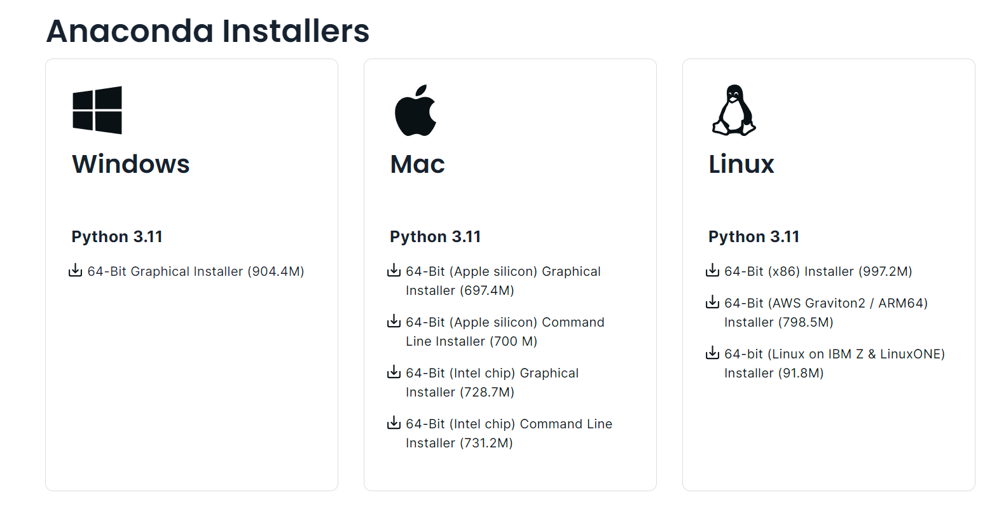
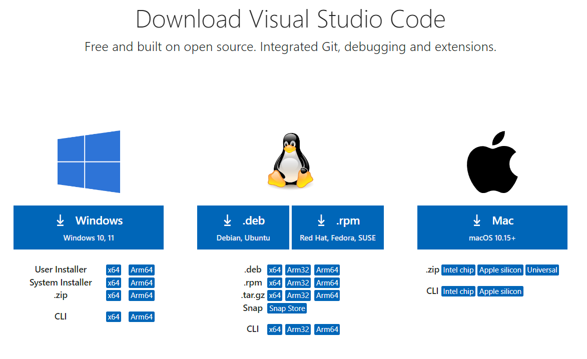

# Python 金融建模：基础与应用

MIT Licensed | Copyright © 2024-present by [Yun Liao ](mailto:james@x.cool)

## Python 基础篇（第1-4章）

第1章：Python 基础

第2章：Python 数据结构

第3章：Python 函数与类

第4章：Python 数据分析库简介

---

### 第1章：Python 基础

Python 编程介绍

#### 1.1 Python 简介

##### 1.1.1 Python 语言历史和演进

Python 的诞生（1989-1992）

Python 的创始人 Guido van Rossum 是荷兰计算机程序员，他创建了 Python 编程语言。他于1958年1月31日出生于荷兰哈勒姆（Haarlem），Guido 从青少年时代就开始学习编程，后来在阿姆斯特丹大学学习数学和计算机科学。他毕业后在阿姆斯特丹国家研究院数学和计算机科学（CWI）工作。Python 的诞生 在 1980年代末期，Guido van Rossum 在 CWI 工作时决定创建一个新的编程语言。他想创造一个易于学习和使用的语言，有着清楚和简洁的语法。他吸收了各种语言的灵感，包括 ABC、Modula-3 和 C。

关于Python的命名：Guido van Rossum 说，他选择名称 "Python" 是因为他是 英国经典喜剧“**巨蟒剧团之飞翔的马戏团**”的粉丝，他想要一个独特且记忆的名称，"Python" 就符合这个要求。Python 的第一个版本，0.9.1 版本，在 1991 年 2 月发布。Python语言很快就流行起来，是由于其易于使用和灵活性。van Rossum 继续工作于 Python，发布新的版本并添加功能。在 1994 年，他创立了 Python 软件基金会（PSF），负责语言的开发和维护。

Guido van Rossum 的创造对编程世界产生了深远的影响。Python 现在是最流行的编程语言之一，应用场景包括 web 开发、数据分析、人工智能和机器学习等。van Rossum 继续参与 Python 社区，担任 PSF 的 BDFL（Benevolent Dictator for Life）。van Rossum 目前住在美国加利福尼亚州，他继续工作于 Python 和其他编程项目。他曾经说过“我不是早上人... 我喜欢睡眠到中午。”

第一个 Python 版本：0.9.1 1991 年 2 月发布的第一个 Python 版本是 0.9.1。这early 版本语言具有以下特点：简单的语法：第一个 Python 版本拥有简单语法，让代码更容易读写。它使用缩进来表示块级结构，使得代码更加可读。解释型语言：Python 0.9.1 是一门解释型语言，意味着代码是在运行时才被翻译成机器语言执行，最“古老”的解释型语言当属1984年出生的matlab。而另一种语言 **编译型** 语言，其代表为C/C++、Pascal/Object Pascal（Delphi）。高级抽象化：语言提供了高级抽象化，对于常见的编程任务，例如数据结构和控制流语句。动态类型：Python 有动态类型，这意味着变量类型是在运行时确定，而不是编译时确定。广泛的库支持：第一个 Python 版本包含了广泛的内置库，提供了对各种任务的支持，例如文件输入/输出和字符串操作。

Python 的主要更新：版本 1.5 和 2.0：Python 自从 1991 年的首次发布以来，已经经历了许多重要的更新和改进。以下是其中一些主要的更新，包括版本 1.5 和 2.0。1997年的版本 1.5具有以下特点：改进的异常处理机制，内建的新模块，例如 math、statistics 和 random，这扩展了语言的能力。加强的正则表达式支持：正则表达式模块（re）得到了改进，使得处理文本数据变得更容易。2000年的版本 2.0具有以下特点：自动垃圾收集：Python 2.0 引入了自动垃圾收集机制，这样可以改善内存管理，减少内存泄漏的风险。加强的 Unicode 支持：2.0 版本包括了对 Unicode 的大幅度改进，使得处理包含非 ASCII 字符的文本数据变得更容易。新语法特性：Python 2.0 添加了一些新的语法特性，例如列表理解、字典理解和 yield 语句，这样可以使代码变得更加简洁和表达式。

Python版本的更新与PEPs（Python Enhancement Proposals）的创建有巨大关系。1996 年，Python 的创始人 Guido van Rossum 发现了需要一个正式的过程来讨论和实现对语言的变化。这最终Python Enhancement Proposal (PEP) 过程。第一个 PEP：PEP 1，于 1996 年 9 月份由 Guido van Rossum 创建。它规范了 PEP 过程的目的是什么和范围是 什么，它旨在为 提供一个正式的机制来提议和讨论对 Python 语言的变化。

PEPs 的关键特征： 1. 结构化过程：PEPs遵循一个结构化的过程，包括： * 提议提交 * 初始审核和反馈 * 修订提议和讨论 * 最终决策和实施 2. 正式提议：PEPs要求正式的提议，包含： * 对所提议变化的明确描述 * 所提议变化的缘故 * 考虑了的alternative * 对现有代码和用户的影响 3. 社区参与：PEPs鼓励社区参与，通过： * 在邮件列表（例如 python-dev）上进行公共讨论 * 由 Python 开发者和用户投票。PEPs 的重要性： 1. 标准化：PEPs 帮助标准化对 Python 语言的变化提议和实施过程。 2. 透明度：PEPs 增加了决策过程的透明度，允许开发者和用户理解所提议变化的缘故。 3. 社区参与：PEPs 鼓励社区参与，为 提供一个正式的机制来让贡献者参与语言的发展。对 Python 发展的影响： 1. 合作：PEPs facilitates 合作中间的开发者，使得变化被充分讨论和审核后实施。 2. 稳定性和可靠性：PEPs 帮助确保 Python 语言的稳定性和可靠性，为 提供一个正式的机制来测试和完善所提议变化。 3. 创新：PEPs 允许社区创新，为 提供一个正式的机制来让开发者提议和实施新的想法和特征。PEPs 的创建对 Python 发展产生了巨大 的影响，使得语言能够演进，同时保持稳定性和可靠性。[PEP的链接](https://peps.python.org/)

2010年，python2.x版本中最后一个版本2.7版发布，Python 2.7 是一款重要的 Python 程式语言版本，它引入了一些新的特征和异常处理的改进，同时保持向后兼容性，使其成为开发和部署 Python-基于项目的一种可靠的选择。早在2008年，Python 发展了 3.0 版本，2011年Python 3.1 (2011)：添加了对 logging 模块的支持、提高了性能和可读性。Python 3.2 (2011)：引入了对 functools 模块的支持、提高了语法分析速度等。Python 3.3 (2012)：添加了对 decimal 模块的支持、提高了性能和可读性。Python 3.4 (2014)：引入了对 asyncio 模块的支持、提高了语法分析速度等。Python 3.5 (2016)：添加了对 typing 模块的支持、提高了性能和可读性。Python 3.6 (2017)：引入了对 async/await 语句的支持、提高了语法分析速度等。Python 3.7 (2018)：添加了对 f-strings 的支持、提高了性能和可读性。Python 3.8 (2020)：引入了对 dataclasses 模块的支持、提高了语法分析速度等。

```python
print("Hello World, I'm Python!")
def fib(n):
    a, b = 0, 1
    while a < n:
          print(a, end=' ')
          a, b = b, a+b
    print()
fib(1000)
```

##### 1.1.2 Python 与人工智能、大数据

大数据是一种描述大量有结构和无结构数据的术语。在数字设备、社交媒体和传感器等领域的普及下，生成的数据量正在急剧增加（Manyika 等人，2011）。这种数据爆炸性的增长促使了对有效地处理、分析和提取大数据的需求。Python 成为了大数据分析的首选语言，这是由于其简单易用性、灵活性和广泛的库支持。根据 KDnuggets 的调查，2020 年，Python 是最常用的数据科学和机器学习语言（KDnuggets，2020）。原因有二：

简单易学： Python 的语法非常简单和易学，使得开发者们可以轻松地分析和视化大数据（Wes McKinney，2012）。

开源支持： Python 提供了大量的库支持，如 NumPy 和 pandas，为处理有结构和无结构数据提供了高效的数据结构和操作（NumPy，2020）。 scikit-learn 提供了一系列机器学习算法（Pedregosa 等人，2011）。

Python 的简单性、灵活性和广泛的库函数同样使得AI 研究和开发理想的选择。语言的简单性允许开发者快速进行原型设计和测试想法，而其灵活性则使得他们能够处理复杂任务。此外，Python 还有许多特定用于 AI 的库函数和框架，例如 Torch、Keras 和 OpenCV。

Python的灵活性

Python常被称为胶水语言，能够把用其他语言制作的各种模块(尤其是C/C++)很轻松地联结在一起, 比如3D游戏中的图形渲染模块，而后封装为Python可以调用的扩展类库。以下为在python中使用ctypes库调用一个C++代码的例子。

```C
// mycppcode.cpp
extern "C" {
    int add(int a, int b) {
        return a + b;
    }
}
```

```python
import ctypes

# Load the C++ library
lib = ctypes.CDLL('./mycppcode.so')  # or .dll on Windows

# Define the function prototype
lib.add.argtypes = [ctypes.c_int, ctypes.c_int]
lib.add.restype = ctypes.c_int

# Call the C++ function
result = lib.add(2, 3)
print(result)  # Output: 5
```

Reference:

* Manyika, J., Chui, M., Bisson, P., Woetzel, J., & Stolyar, K. (2011). Big brother knows best: Harnessing the power of analytics and data science. McKinsey Quarterly.
* NumPy. (2020). NumPy Documentation. Retrieved from [https://numpy.org/doc/](https://numpy.org/doc/) Pedregosa, F., Garcia-Feijoó, G., Correa-Baño, M., Pico, J. M., & Alvarez, M. (2011).
* Scikit-learn: Machine learning in Python. Journal of Machine Learning Research, 12(Oct), 2825-2830. Wes McKinney. (2012). Why Python is the best language for data science. KDnuggets. Retrieved from [https://www.kdnuggets.com/2012/04/why-python-best-language-data-science.html](https://www.kdnuggets.com/2012/04/why-python-best-language-data-science.html)

##### 1.1.3 设置 Python 环境和安装必要的开放工具

以下介绍两种较常见的创建虚拟python环境和IDE设置方法：

###### 为什么要创建虚拟环境？

什么是虚拟环境？

虚拟环境是一个独立的Python解释器，它拥有自己的库和依赖项。这意味着每个项目都可以有自己的孤立环境，而不影响其他项目或系统。虚拟环境在以下情况特别有用：

1. 你同时工作在多个项目之间，每个项目都需要不同的依赖项，例如不同版本的python以及不同版本的第三方库。
2. 你想要确保你的项目的依赖项不要与其他项目冲突。
3. 你需要一个可重复的环境来测试或调试（debug)。

当我们创建了虚拟环境以后，需要设置一个Integrated Development Environment (IDE) 来支持它，这个界面就是我们实际编程的界面，它可以调用虚拟环境的python解释器，甚至是其他语言的解释器，一个好的IDE可以帮助提高我们的生产力。

本手册使用者最常用的两款IDE是anaconda自带的spider和微软公司出品的visual studio code。其他常见的IDE有 eclipse, pycharm等等。以下仅介绍三种操作系统下anaconda+visual studio code的组合，该组合已经能够顺利完成本书所有任务。

Anaconda ([https://www.anaconda.com]()) 是一款优秀的虚拟环境存放器，与之能完成类似工作的还有 miniconda ([https://docs.conda.io/projects/conda/en/stable/]() )同样由Anaconda公司开发。你也可以在安装完python([https://python.org]()) 后通过安装venv模块（pip install venv)进行设置。

Visual studio code 是一款非常全面的IDE，不仅支持python，还支持例如C++等各种语言，并能够安装插件（extensions)提高生产力。要注意的是如果是windows用户，请安装**System installer版本**,可以获得更大的灵活性和自主权。

Anaconda 的下载界面如下：

Visual studio code的下载界面如下（[https://code.visualstudio.com/Download]()）



###### Windows+anaconda+spider

根据安装提示安装完成anaconda之后，还需要指定安装源，即选择安装第三方库的服务器地址，推荐大家使用国内的镜像源例如清华、阿里云等。

以下举例为添加“清华镜像”渠道，在安装完anaconda之后，在执行完环境设置任务后，需要删除初始安装的配置文件，然后以管理员身份在Anaconda Prompt中执行：

```python
####删除原安装源配置文件，一般在C:\Users\用户名XXX.condarc  
conda config --add channels https://mirrors.tuna.tsinghua.edu.cn/anaconda/pkgs/free/
conda config --add channels https://mirrors.tuna.tsinghua.edu.cn/anaconda/cloud/conda-forge/
conda config --add channels https://mirrors.tuna.tsinghua.edu.cn/anaconda/cloud/msys2/
conda config --set show_channel_urls yes
```

检测镜像源是否已经安装成功：

```
conda config --show channels
```

如果成功显示已经安装的镜像源，则安装成功

其他的镜像源例如：阿里云镜像源 （[https://mirrors.aliyun.com/pypi/simple/]())；中科大镜像源 （[https://mirrors.ustc.edu.cn/anaconda/pkgs/free/]()）等均可以作为补充使用。

###### 创建python3.X环境

以管理员身份在Anaconda Prompt中执行：

```python
conda env list   #查看已有环境
conda info -e #列出所有已创建环境
conda create -n XXX python=3.X  #XXX为你设置的环境名，3.X为你所需要安装的python版本 
conda activate XXX  #激活XXX环境
pip install numpy pandas matplotlib    #安装最常用的一些第三方库
```

其他常用conda 命令

```python
#删除一个环境   
conda env remove -n XXX
#手动使用清华源
pip install xxx -i https://pypi.tuna.tsinghua.edu.cn/simple/
#手动使用阿里源
pip install xxx -i https://mirrors.aliyun.com/pypi/simple
#手动使用中科大源
pip install xxx -i https://pypi.mirrors.ustc.edu.cn/simple/
```

###### 使用Anaconda自带的Spider和jupyter notebook

1. 打开spyder(ANACONDA自带的编辑器）： projects --> new project-> 指定你新创建的 .py
2. 指定python 解释器：Tools -->preferences--->python interpreter 指定你创建的环境
3. 按照提示打开console,安装相关版本的spyder-kernels

###### Mac/Ubuntu(linux)+anaconda+visual studio code+spider

#### 1.2 Python 基本语法和数据类型

##### Python 语法结构概述

Python 是一种高级、解释型语言，得到了开发者、数据科学家和研究人员的广泛欢迎，因为它的简单性、灵活性和庞大的库。以下是python语法的几个特点

**缩进和代码块（indent)** Python 中，缩进扮演了重要的角色，用于定义代码块。缩进指的是使用空格或 tab 键来定义代码块的范围。可以使用四个空格为每一级缩进。这样可以保持代码可读性，并使得嵌套代码结构更容易识别。

**空白字符**：用空白字符来分隔 token（例如关键字、标识符、操作符）。

**换行**：用换行符来分隔语句或继续一条语句到多行中。

**注释**：使用 # 表示单行注释，或者使用两个前后呼应的 """ 或 ''' 表示多行注释。

###### 变量和数据类型（variables and  data type)

Python 支持多种数据类型，包括：

整数：int（例如，x = 5）
浮点数：float（例如，y = 3.14）
字符串：str（例如，name = "John"），字符串可以使用单引号 (') 或双引号 (") 包围
布尔值：bool（例如，is_admin = True）
列表：list（例如，fruits = ["apple", "banana", "orange"]
元组：tuple（例如，colors = ("red", "green", "blue")）

这些基本数据类型构成了更复杂的数据类型，如数组、结构体和对象的基础。

变量 ：变量是一种存储位置，可以存储特定的数据类型的值。变量用于存储和操作数据。在程序中，变量有三个主要组成部分：

* 名称：给变量命名的标识符。
* 数据类型：变量可以存储的数据类型，如整数或字符串。
* 值：变量实际存储的值。

赋值语句 赋值语句用于将值赋给变量。它具有以下语法：variable = expression

其中，variable 是变量的名称，expression 是一个算术或逻辑操作，它的结果是一个值。

例如：x = 5   # 将值 5 赋给 x; y = "hello"   # 将字符串 "hello" 赋给 y

操作符 操作符用于在变量和值上执行操作。有多种类型的操作符：

算术操作符：+、-、*、/、 % 等。
比较操作符：==、!=、<、>、 <=、 >= 等。
逻辑操作符：and、or、not 等。
这些操作符用于在变量和值上执行算术操作，如加法、减法、乘法和除法。

基本算术操作

以下是一些基本算术操作：
加法：a + b
减法：a - b
乘法：a * b
除法：a / b
模运算（余数）：a % b
模运算（整数商）：a//b
幂运算：a**b
这些操作可以在变量和值上执行，如整数或浮点数。
以上基本操作符都有与之对应的增强赋值操作符（以上基本算数操作符加上一个=号）,如果用op代表以上基本算数操作符，则有 a op=y 等价于 a = a op y
例如 x+=1 等价于 x =x+1

###### 关于数据类型的一些重要知识点

**数据类型之间的转换**

Python 是一种动态类型语言，这意味着你不需要在使用变量之前显式声明数据类型。然而，在工作不同的数据类型时，你可能会遇到需要将一个数据类型转换为另一个的情况。 以下是常见的类型转换场景：

字符串转换：将数字值转换为字符串（如 int 到 str）。
数值转换：将字符串或其他数据类型转换为数字值（如 str 到 int）。
布尔值转换：将字符串或其他数据类型转换为布尔值（如 "True" 到 True）。

最佳实践 当在 Python 中进行类型转换时，遵循以下最佳实践：

使用 astype() 方法：在转换数据类型时，使用 astype() 方法来确保转换正确。
测试您的代码：对您的代码进行充分的测试，以确保在执行类型转换后一切正常。
避免不必要的转换：尽量减少不必要的类型转换，以提高性能和可读性。

以下是一些数据转换的例子：

```
x = 5
y = str(x)
print(y)   # 输出:'5'
x = "5"
y = int(x)
print(y)   # 输出:5
```

以下是使用astype()进行转换的例子

```python
# 定义一些变量
x = 10.5   # 浮点数
y = "Hello"   # 字符串
z = [1, 2, 3]   # 列表

print("初始值：")
print(f"x：{x}, type(x)：{type(x)}") 
print(f"y：{y}, type(y)：{type(y)}")
print(f"z：{z}, type(z)：{type(z)}")

# 将浮点数转换为整数
x_int = x.astype(int)
print("\n将x转换为int后：")
print(f"x_int：{x_int}, type(x_int)：{type(x_int)}")

# 将字符串转换为布尔值
y_bool = y.lower() == "hello"
print("\n将y转换为bool后：")
print(f"y_bool：{y_bool}, type(y_bool)：{type(y_bool)}")

# 将列表转换为元组
z_tuple = tuple(z)
print("\n将z转换为tuple后：")
print(f"z_tuple：{z_tuple}, type(z_tuple)：{type(z_tuple)}")

#程序运行结果
x：10.5, type(x)：<class 'float'>
y：Hello, type(y)：<class 'str'>
z：[1, 2, 3], type(z)：<class 'list'>
#将x转换为int后：
x_int：11, type(x_int)：<class 'int'>
#将y转换为bool后：
y_bool：True, type(y_bool)：<class 'bool'>
#将z转换为tuple后：
z_tuple：(1, 2, 3), type(z_tuple)：<class 'tuple'>
```

#### 1.3 控制结构

Python 的控制结构用来控制程序的流程。该语言提供了多种控制结构，允许您根据条件或表达式做出决策、重复操作或操作数据。在 Python 中，我们可以使用以下控制结构：，包括：条件语句和循环语句

条件语句
条件语句用于根据条件或表达式做出决策。在 Python 中，您可以使用 if、elif 和 else 语句来实现条件逻辑。

If 语句：如果条件为 true，可以执行一个块级代码。
Elif 语句：如果初始条件为 false，可以检查另一个条件。
Else 语句：如果所有条件为 false，可以执行一个块级代码。

循环语句
循环用于重复操作或操作数据。在 Python 中，我们可以使用 for 和 while 语句来实现循环。

For 语句：用于遍历序列（如列表、元组或字符串）或字典。
While 语句：用于在某个条件为 true时重复一个块级代码。

```python
###### 条件判断语句
x = input("请输入一个数字:")
if int(x) >= 10:
    print("x is greater than 10")
elif int(x) == 5:
    print("x is equal to 5")
else:
    print("x is less than 10")
###### 循环语句
fruits = ["apple", "banana", "orange"]
for fruit in fruits:
    print(fruit)
```

程序示例：条件语句（if-else）

```python
##检查一个数字是否是偶数或奇数
num = int(input("请输入一个数字："))
if num % 2 == 0:
    print(f"{num} 是偶数")
else:
    print(f"{num} 是奇数")
```

程序示例：条件语句（if-elif-else）和循环语句（for）

```python
#找出从 1 到 n 的数字的平方之和
n = int(input("请输入一个数字："))
sum_of_squares = 0
for i in range(1, n+1):
    if i % 2 == 0:
        sum_of_squares += i ** 2
    elif i % 3 == 0:
        sum_of_squares += i ** 2
    else:
        sum_of_squares += i ** 2
print(f"平方之和是：{sum_of_squares}")
```

程序示例：循环语句（while）和跳转语句（break）

```python
#计算一个字符串中的aeiou元音字母个数
word = input("请输入一个单词：")
vowel_count = 0
i = 0
while i < len(word):
    if word[i].lower() in 'aeiou':
        vowel_count += 1
    else:
        break
    i += 1
print(f"字母个数是：{vowel_count}")
```

在第一个程序中，我们使用 if-else 语句来检查给定的数字是否是偶数或奇数。

在第二个程序中，我们使用 if-elif-else 语句在 for 循环中来找出从 1 到 n 的数字的平方之和。在每次迭代中，我们使用 if-elif 语句来检查数字是否可被 2 或 3 整除。

在第三个程序中，我们使用 while 循环来计算一个字符串中的元音字母个数。在循环中，我们使用 if 语句来检查每个字符是否是元音，然后使用 break 语句来跳出循环。

###### 关于控制结构的一些重要知识点

**使用 While True 结构的时机**

While True 是编程中的一个基本概念，理解何时使用它非常重要。在 Python 中，while True 循环用于创建一个无限循环，即直到手动停止或出现异常为止。下面是某些情况可能需要使用 while True 的场景：

监控系统：想象你正在编写一个程序来监控系统的性能或记录系统事件。在这种情况下，你可以使用 while True 来不断地检查系统状态并更新你的程序。
处理用户输入：当你正在编写一个需要持续性用户输入（例如聊天机器人）的程序时，你可以使用 while True 来继续询问用户input 直到用户决定停止与你的程序交互。
模拟无限循环：有时候，你需要模拟一个无限循环来测试或调试目的。在这种情况下，while True 是创建控制环境来模拟真实世界场景的perfect选择。
处理异常：当你正在编写一个robust 的错误处理机制时，你可能需要使用 while True 来不断地尝试执行代码直到它成功或失败为止。
然而，在使用 while True 时，请注意以下几点：

使用 break 或 return 语句：当你需要退出循环时，使用 break 或 return 语句来确保你的程序终止得当。
添加超时机制：实现一个超时机制可以帮助防止无限循环消耗过多资源。
监控系统性能：关注你的程序性能，并根据需要调整循环以避免资源瓶颈。
总之，使用 while True 时机是当你需要创建一个无限循环来持续执行代码或处理异常直到手动停止时。你只需要注意潜在问题并遵循高效编程的基本原则。

**Python 异常处理：捕捉和处理异常的指南**

什么是异常？

在编程中，异常是一种事件，它发生在程序执行过程中，破坏其正常流程。这可能会发生当一个函数或方法尝试执行无法或无效的操作时。例如，尝试用浮点数除以零或访问数组不存在的元素。

为什么是必要？

异常是必要的，因为它们允许您的程序处理和恢复从未预期的事件中。如果没有异常处理，一则程序将在遇到错误时突然终止，这对于复杂系统来说可能是一种灾难。异常处理使您可以编写健壮的代码，即使在面对错误时仍然可以继续执行。

异常类型

Python 有多个内置异常类型：

BaseException：所有异常的父类。
Exception：最常见的异常类型，用于一般性错误处理。
ArithmeticError：在算术操作（例如除以零）失败时抛出。
LookupError：在查找操作（例如字典或列表索引超出了范围）失败时抛出。

以下是使用 try-except 块结构捕捉异常的例子：

```
try:
    # 可能会抛出异常的代码
    pass
except Exception as e:
    # 处理异常
    print(f"捕捉了一个异常：{e}")

```

在这个示例中，如果 try 块中的异常被抛出，except 块将捕捉它。异常对象 (e) 可以访问，以获取关于异常的信息。

示例：使用 try-except-finally 块处理浮点数除以零错误

```python
def divide_numbers(a, b):
    try:
        result = a / b
        print("Result:", result)
    except ZeroDivisionError:
        print("Error: 不能将零作为除数!")
    finally:
        print("Finally 块执行!")
# 测试函数
divide_numbers(10, 2)   # 应该工作正常
divide_numbers(10, 0)    # 将引发一个 ZeroDivisionError
```

这个程序定义了一个 divide_numbers 函数，它们两个参数 a 和 b，并尝试将它们除以。try 块中包含执行除法的代码。如果除法成功，结果将被打印到控制台。但是，如果除法引发一个 ZeroDivisionError（即当 b 等于零时），except 块捕捉错误并打印错误信息。

finally 块无论是否引发了异常都将执行。在这个例子中，它只是打印一条消息来表明 finally 块已经执行。

#### 1.4 练习

1. ##### 根据教程使用自己的电脑分别建立两个python环境（python3.9和python3.11），并指出python3.9和python3.11的区别
2. ##### 以下代码的输出是什么？

   ```python
   x = 5
   y = "hello"
   print(x + y)
   ```
3. ##### 写一个 Python 程序，模拟简单的剪刀石头布游戏。用户可以输入自己的选择（剪刀、石头或布），然后计算机将随机选择。程序应该具有捕捉异常的功能并打印出游戏结果。

MIT Licensed | Copyright © 2024-present by [Yun Liao ](mailto:james@x.cool)
