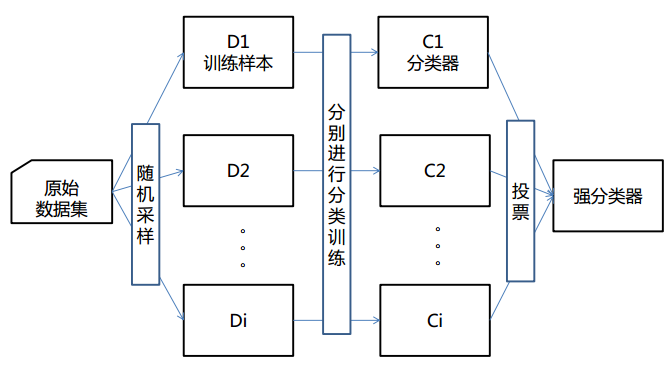
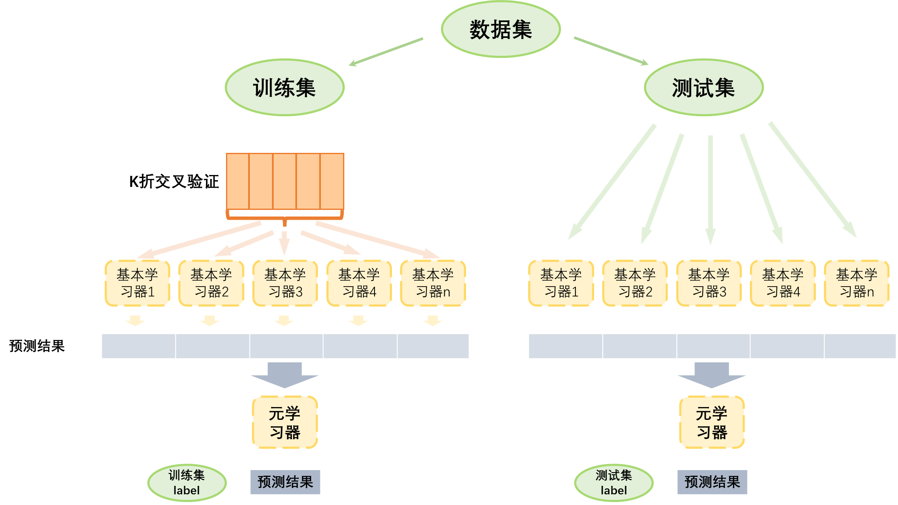

# Python 金融建模：基础与应用

MIT Licensed | Copyright © 2024-present by [Yun Liao ](mailto:james@x.cool)

## Python 进阶篇（第9-12章）

第9章：统计学习基础

第10章：统计学习中的集成算法

第11章：深度学习基础

第12章：大型语言预训练模型（LLMs）和金融知识库

---

### 第10章：统计学习中的集成算法

#### 10.1 集成算法导论

集成算法是一种机器学习技术，它将多个基础模型的预测结果组合成一个更加准确和robust的预测模型。集成算法的目标是利用单个模型的优势，减少它们的劣势，并将其组合成一个更强大的模型。

**集成算法类型：**

1. **Bagging（引导聚合）**
   * 在不同子集的训练数据上训练多个相同模型的实例。
   * 使用投票或平均值来组合每个模型的预测结果。
2. **Boosting**
   * 训练一系列模型，其中每个后续模型集中于检测前一个模型的错误。
   * 使用加权投票来组合每个模型的预测结果。
3. **Stacking（堆叠泛化）**
   * 训练一个元模型，基于多个基础模型的预测结果进行预测。
   * 使用元模型来组合基础模型的预测结果。
4. **Voting**
   * 训练多个模型，并让它们对最终预测进行投票。
   * 使用加权投票或简单投票来确定最终预测结果。
5. **Bayesian 模型组合**
   * 使用 Bayesian 推断来组合多个模型的预测结果。
   * 计算目标变量的后验分布，基于每个模型的预测结果。
6. **Gradient Boosting Machines（GBMs）**
   * 训练一个决策树 ensemble，其中每棵树都是在前一个树的残差上训练的。
   * 使用梯度提升来组合每棵树的预测结果。

**集成算法重要性：**

1. **改进准确性** : 集成算法可以显著地提高机器学习模型的准确性，通过减少过拟合和增加robustness。
2. **处理类不平衡问题** : 集成算法可以有效地处理类不平衡问题，其中一个类具有明显更大的实例数量。
3. **增加模型多样性** : 集成算法可以增加模型多样性，通过组合具有不同架构、超参数或训练数据的模型。
4. **鲁棒性对于噪音和异常值** : 集成算法可以提高机器学习模型对噪音和异常值的鲁棒性。
5. **减少过拟合** : 集成算法可以减少过拟合，通过平均每个模型的效果。

#### 10.2 Bagging 算法

**概念：**

Bagging，也称为 Bootstrap Aggregating，是机器学习中的一种流行的集成学习算法。 Bagging 的思想是将多个相同模型的实例组合起来，每个实例在不同的训练数据子集上进行训练，以提高模型的总体准确性和鲁棒性。

**算法：**

1. **引导采样：** 随机地从训练数据中抽取一个子集，允许重复抽取。
2. **模型训练：** 在抽取的数据子集中训练一个基础模型。
3. **重复：** 重复步骤 1-2 多次，每次抽取一个新的训练数据子集，并训练一个新的基础模型实例。
4. **预测：** 使用每个训练好的模型进行预测。
5. **聚合：** 使用投票或平均值将每个模型的预测结果组合起来。

**Bagging 是如何工作的：**

* 通过在不同的数据子集中训练多个模型，Bagging 减少了过拟合，平均了数据中的噪音。
* 每个模型都在一个稍有不同的一些数据上进行训练，这增加了集成的多样性，并提高了鲁棒性对异常值和噪音数据。
* 最终的预测结果是通过组合每个模型的预测结果来实现的，减少了单个模型错误的影响。



**应用：**

1. **分类：** Bagging 通常用于分类问题，如图像分类、情感分析和生物信息学。
2. **回归：** Bagging 也可以应用于回归问题，如金融、能源或气候模型中的连续值预测。
3. **时间序列预测：** Bagging 对时间序列预测非常有用，可以通过组合多个模型来提高预测的准确性。

**优点：**

1. **提高准确性：** Bagging 通过减少过拟合和提高鲁棒性来提高模型的总体准确性。
2. **增加鲁棒性：** Bagging 增加了模型对噪音数据、异常值和概念漂移的鲁棒性。
3. **简单实现：** Bagging 很易实现，只需要训练多个相同模型的实例。

**缺点：**

1. **计算成本：** 训练多个模型可能是计算密集的。
2. **模型复杂度：** Bagging 可能不适合复杂的模型，它们更容易出现过拟合。

##### Bagging 用于情感分析（sentiment analysis)实例

**问题陈述：**

根据电影评论的文本内容对其进行分类，判断是正面还是负面。

**数据集：**
IMDB 数据集，包含 50,000 条电影评论，其中 25,000 条为正面评论，25,000 条为负面评论。

**Bagging 算法：**

1. **引导采样：** 从训练数据集中随机抽取一个子集。例如，我们可以从训练集中抽取 10,000 条评论。
2. **模型训练：** 在抽取的数据子集中训练一个情感分析模型。我们可以使用简单的词袋表示法，并训练逻辑回归模型。
3. **重复：** 重复步骤 1-2 多次（例如 10 次）。每次，我们抽取新的评论子集，并训练新的模型实例。
4. **预测：** 使用每个训练好的模型对测试数据进行预测。
5. **聚合：** 使用投票或平均值将每个模型的预测结果组合起来。

```python
import pandas as pd
import numpy as np
from sklearn.feature_extraction.text import TfidfVectorizer
from sklearn.linear_model import LogisticRegression
from sklearn.model_selection import train_test_split
from sklearn.ensemble import BaggingClassifier
from sklearn.metrics import accuracy_score
# 加载 IMDB 数据集
df =   pd.read_csv(r'D:\yunpan\工作-课程教学\2024-2025-1-数据风控与信用评分\imdb_datasets.csv')
X = df['review']
y = df['sentiment'].apply(lambda x:1 if x=='positive' else 0)
# 将文本数据转换为特征向量
Vectorizer = TfidfVectorizer()
X_vec = Vectorizer.fit_transform(X)
# 拆分数据集为训练和测试子集
X_train, X_test, y_train, y_test = train_test_split(X_vec, y, test_size=0.2, random_state=42)
# 将训练集初始化索引
y_train = y_train.reset_index()
X_train.index = y_train.index
# 定义 bagging 函数
def bagging(base_estimator, n_estimators, X_train, y_train):
    models = []
    for _ in range(n_estimators):
        # 从原始训练数据集中进行有放回随机采样，创建一个新的训练子集（bootstrap sample),这里分成10份  
        bootstrap_indices = np.random.choice(np.array(y_train.index), size=int(y_train.shape[0]/10), replace=True)
        X_boot = X_train[bootstrap_indices]
        y_boot = y_train.loc[np.array(bootstrap_indices),'sentiment']
        # 训练模型
        model = base_estimator.fit(X_boot, y_boot)
        models.append(model)
    return models
# 使用 bagging 函数训练多个 LogisticRegression 分类器
models = bagging(LogisticRegression(), n_estimators=10, X_train=X_train, y_train=y_train)
# 对测试数据进行预测并聚合结果
test_preds = []
for model in models:
    pred = model.predict(X_test)
    test_preds.append(pred)   
agg_pred = np.array(test_preds).mean(axis=0) > 0.5
# 评估性能
accuracy = accuracy_score(y_test, agg_pred)
print(f'Bagging 准确率：{accuracy:.3f}')
# 输出 Bagging 准确率：0.834
```

该代码片段使用了 BaggingClassifier（一种集成学习技术）来训练一个分类器，用于对IMDB电影评论的情感进行分类。首先，代码导入必要的库和数据集：Pandas、NumPy、Scikit-learn 中的 TfidfVectorizer（用于将文本数据转换为数字特征）、LogisticRegression（线性模型，作为分类器）、train_test_split（用于将数据集拆分为训练和测试子集）以及 accuracy_score（用于评估模型的准确率）。然后，它加载了 IMDB 电影评论数据集并定义了特征变量 X（电影评论文本）和目标变量 y（情感标签）。接下来，代码定义了一个名为 bagging 的函数，该函数使用自引导聚合来训练多个模型。在每次迭代中，函数执行以下操作：

1. 从原始训练数据集中进行有放回随机采样，创建一个新的训练子集（bootstrap sample）。
2. 使用 TfidfVectorizer 将文本数据转换为特征向量。
3. 在引导样本上训练 LogisticRegression 分类器。
4. 重复步骤 1-3，直到创建了所需数量的模型（默认情况下为 10 个）。

然后，代码对数据集进行拆分并使用 bagging 函数训练多个 LogisticRegression 分类器。在测试集上进行预测时，每个模型的预测被存储为一系列预测值。最后，这些预测被聚合起来，如果平均预测大于 0.5，则将其四舍五入到类别 1（正面评价）；否则，将其四舍五入到类别 0（负面评价）。然后，代码计算并打印分类器的准确率。这种 BaggingClassifier 方法是一种集成学习技术，可以提高模型的稳健性和预测精度，但训练和预测过程需要更多时间和资源。

##### Bagging 用于价格预测实例

**问题陈述：**
根据股票的历史数据预测其未来的价格。

**数据集：**
我们将使用一份沪深300（000300）的日股价数据，包含 1000 天的历史价格数据，每个样本具有以下特征：

* 日期
* 开盘价格
* 最高价格
* 最低价格
* 收盘价格

**Bagging 算法：**

1. **引导采样：** 从训练数据集中随机抽取一个子集，以置换方例如，我们可以从整个数据集中抽取 800 天的数据。
2. **模型训练：** 在抽取的数据子集中训练一个价格预测模型。我们可以使用简单的线性回归模型或更复杂的模型，如 LSTM。
3. **重复：** 重复步骤 1-2 多次（例如 10 次）。每次，我们抽取新的数据子集，并训练新的模型实例。
4. **预测：** 使用每个训练好的模型对未来的股价进行预测。
5. **聚合：** 使用投票或平均值将每个模型的预测结果组合起来。

**示例代码：**

```python
import pandas as pd
import numpy as np
from sklearn import tree
from sklearn.metrics import mean_squared_error,mean_absolute_error
import os
os.chdir(r'D:\yunpan\工作-课程教学\2024-2025-1-数据风控与信用评分')
# 加载股票价格数据
df = pd.read_excel(r'D:\yunpan\工作-课程教学\2024-2025-1-数据风控与信用评分\hs300.xlsx')
# 确保日期列被正确解析为datetime对象
df['date'] = pd.to_datetime(df['date'])
#减少变量
df_ret_volume = df[['date','ret','tradevolume']]
#生成每一天前n天的数据（ret/volume)
def ndays_data(n,df):
    d = list(range(1,n+1))
    dfmerge = df.copy()
    for i in d:
        dfshift = df.shift(periods=i, freq=None, axis=0, fill_value=None)
        dfshift = dfshift.drop('date',axis=1)
        suffix = "-"+str(i)+"day"
        dfshift.columns = [col for col in dfshift.columns + suffix]
        dfmerge = pd.concat([dfmerge,dfshift],axis=1)
    dfmerge.dropna(axis=0, how='any',inplace=True)
    return dfmerge
dfmerged = ndays_data(n=10,df=df_ret_volume).reset_index(drop=True)
dfmerged.head()
# 准备数据用于 Bagging
X  = dfmerged.drop(['date', 'ret'], axis=1)
y  = dfmerged['ret']
# 定义 Bagging 函数
def bagging(X, y, num_models,max_depth):
    models  =  []
    for i in range(num_models):
         # 引导采样
        idx  = np.random.choice(len(X), size=len(X)//4, replace=True)
        X_boot  = X.iloc[idx]
        y_boot  = y.iloc[idx]
         # 训练模型在引导数据上
        model  = tree.DecisionTreeRegressor(max_depth=max_depth)
        model.fit(X_boot, y_boot)
        models.append(model)
    return models
# 训练 Bagging 模型
models1  = bagging(X, y, num_models=10,max_depth=10)
models2  = bagging(X, y, num_models=10,max_depth=4)
# 使用每个模型预测未来的股价,使用平均值聚合预测结果
future_ret1  =  []
for model in models1:
    future_ret  = model.predict(X)
    future_ret1.append(future_ret)
agg_future_ret1  = np.mean(future_ret1, axis=0)
future_ret2  =  []
for model in models2:
    future_ret  = model.predict(X)
    future_ret2.append(future_ret)
agg_future_ret2  = np.mean(future_ret2, axis=0)
# 使用均方误差/平均绝对误差评估性能
mse1  = mean_squared_error(y, agg_future_ret1)
print(f'MSE: {mse1:.2f}')
mse2  = mean_squared_error(y, agg_future_ret2)
print(f'MSE: {mse2:.2f}')
mae1  = mean_absolute_error(y, agg_future_ret1)
print(f'MAE: {mae1:.2f}')
mae2  = mean_absolute_error(y, agg_future_ret2)
print(f'MAE: {mae2:.2f}')
#可视化
import matplotlib.pyplot as plt
plt.figure()
plt.scatter(dfmerged['date'], y, s=5, edgecolor="black", c="darkorange", label="data")
plt.plot(dfmerged['date'], agg_future_ret1, color="cornflowerblue", label="max_depth=10", linewidth=2)
plt.plot(dfmerged['date'], agg_future_ret2, color="yellowgreen", label="max_depth=4", linewidth=2)
plt.xlabel("Date")
plt.ylabel("return")
plt.title("Decision Tree Regression with Bagging")
plt.legend()
plt.show()
```

#### 10.3 Boosting 算法

**概念：**
Boosting 是一种流行的ensemble 学习算法，旨在将多个弱模型组合成一个强预测器。该算法的思想是迭代地训练多个模型在同一数据集上，每个模型都专注于前一个模型所犯的错误。

Boosting 是一种常用的机器学习方法，应用广泛且有效。在分类问题中，它通过改变训练样本的权重学习多个弱分类器，由这些弱学习器的预测结果通过加权投票的方式组合，得到最终的预测结果。在每一次所谓的提升（boosting）迭代中，修改每一个训练样本应用于新一轮学习器的权重。初始化时,将所有弱学习器的权重都设置为1/N, 因此第一次迭代仅仅是通过原始数据训练出一个弱学习器。在接下来的连续迭代中，样本的权重逐个地被修改，学习算法也因此要重新应用这些已经修改的权重。在给定的一个迭代中,，那些在上一轮迭代中被预测为错误结果的样本的权重将会被增加，而那些被预测为正确结果的样本的权重将会被降低。随着迭代次数的增加，那些难以预测的样例的影响将会越来越大，每一个随后的弱学习器都将会被强迫更加关注那些在之前被错误预测的样例。

**算法：**
Boosting 算法工作流程如下：

1. **初始化** : 初始化每个训练示例的权重集合。
2. **训练** : 在加权数据上训练一个弱学习器（例如决策树）并获取预测结果。
3. **错误计算** : 计算预测值和实际值之间的误差。
4. **权重更新** : 根据每个示例的误差更新其权重。
5. **重复** : 重复步骤 2-4 多次，每次迭代都专注于前一个模型所犯的错误。
6. **组合** : 将所有弱学习器的预测结果组合成最终预测。

**关键组件：**

* **弱学习器** : 在加权数据上训练的简单模型。
* **权重更新** : 根据每个示例的误差更新其权重的过程。
* **错误计算** : 计算预测值和实际值之间的误差的方法。

**Boosting 算法类型：**

* **AdaBoost** : 自适应 Boosting，使用指数函数更新权重。
* **Gradient Boosting** : 基于梯度下降的 Boosting，用于优化损失函数。
* **XGBoost** : eXtreme Gradient Boosting，一个流行且高效的梯度 Boosting 实现。

**应用：**

* **分类** : Boosting 广泛应用于分类问题，如图像分类、情感分析和生物信息学。
* **回归** : Boosting 可以应用于回归问题，如预测连续值或forecast 时间序列数据。
* **特征选择** : Boosting 可以用于特征选择，通过选择最具信息的特征。

**优点：**

* **提高准确性** : Boosting 可以显著地提高弱模型的准确性。
* **处理不平衡数据** : Boosting 在处理不平衡数据集时尤其有效，即其中一个类别拥有远远多于其他类别的实例。
* **灵活性** : Boosting 可以应用于各种类型的问题和数据集。

**缺点：**

* **计算复杂度** : Boosting 可能具有高计算复杂度，特别是对于大型数据集。
* **过拟合** : Boosting 可能导致过拟合，如果迭代次数太高或学习率太激进。

##### Boosting 算法用于债券违约预测

**示例数据：**

| 信用评级 | 负债权益率 | 利息覆盖率 | 行业分类 | 违约状态 |
| -------- | ---------- | ---------- | -------- | -------- |
| Aa       | 0.5        | 3.2        | 金融业   | 0        |
| Ba       | 1.2        | 2.1        | 工业类   | 1        |
| ...      | ...        | ...        | ...      | ...      |

```python
from sklearn.ensemble import AdaBoostClassifier
from sklearn.tree import DecisionTreeClassifier

# 初始化Adaboost分类器，使用决策树作为弱学习器
clf = AdaBoostClassifier(base_estimator=DecisionTreeClassifier(max_depth=5), 
                          n_estimators=10, learning_rate=0.1)

# 在数据集上训练模型
clf.fit(X_train, y_train)

# 在测试集上预测违约概率
y_pred_proba = clf.predict_proba(X_test)[:, 1]

# 使用AUC-ROC和F1-score评估模型性能
from sklearn.metrics import roc_auc_score, f1_score
auc = roc_auc_score(y_test, y_pred_proba)
f1 = f1_score(y_test, (y_pred_proba >= 0.5).astype(int))
print(f"AUC-ROC: {auc:.4f}, F1-score: {f1:.4f}")

```

#### 10.4 stacking 算法

**概念：**

Stacking 是一种流行的 ensemble 学习技术，它通过组合多个基模型的预测来生成一个更准确和强壮的预测模型。该方法的思想是训练一个元模型在每个基模型的预测上，而不是在原始特征上。这种方法可以特别是在复杂数据集或噪声数据中提高性能。

**算法：**

1. **回归Stacking** ：在这个方法中，每个基模型预测一个连续值，然后元模型被训练来通过组合这些预测来预测最终输出。
2. **分类Stacking** ：这里，每个基模型预测一个类别标签，然后元模型被训练来通过组合这些预测来预测最终类别标签。

一些流行的stacking 算法包括：

1. **线性Stacking** ：元模型是一个基模型预测的线性组合。
2. **非线性Stacking** ：元模型使用一个非线性函数（例如神经网络、决策树）来组合基模型预测。
3. **梯度Boosting Stacking** ：元模型使用梯度boosting 来组合基模型预测。



1. **图像分类** ：Stacking 可以用于组合多个图像分类模型的预测，提高准确性和robustness。
2. **自然语言处理（NLP）** ：Stacking 可以应用于 NLP 任务，如情感分析、实体识别或语言建模。
3. **推荐系统** ：Stacking 可以用于组合多个推荐模型的预测，提高个人化推荐的准确性。

**优点：**

1. **提高准确性** ：Stacking 可以通过组合基模型的优势来提高准确性。
2. **抗噪声能力** ：Stacking 可以帮助减少单个基模型中的噪声或离群值对性能的影响。
3. **灵活性** ：Stacking 允许轻松地集成新的基模型或算法，使其成为一种灵活的方法。

**挑战：**

1. **过拟合** ：元模型可能会过拟合基模型的预测，导致泛化性能不佳。
2. **超参数调整** ：选择正确的超参数对于stacking 算法和单个基模型是很具挑战性的。
3. **可解释性** ：当处理复杂数据集时，Stacking 模型的结果可能难以解释。

##### **Stacking 算法用于EPS 预测**

**引言：**
每股收益（EPS）预测是金融领域中的一项关键任务，对投资者和分析师来说，能够帮助他们估计公司的未来表现。然而，准确预测EPS 可以很具挑战性，因为金融市场复杂且历史数据中存在噪声。Stacking 算法通过组合多个基本模型的预测结果，已经在提高EPS 预测准确性方面显示出较好的结果。

**基本模型：**
用于EPS 预测，可以采用多种基本模型，包括：

1. **线性回归** : 根据历史数据预测EPS 的简单线性模型。
2. **决策树** : 将数据分割成子集以预测EPS 的树型模型。
3. **随机森林** : 一种集成方法，它将多个决策树组合起来提高EPS 预测准确性。
4. **神经网络** : 使用神经网络预测EPS 的非线性模型。

**Stacking 算法：**
Stacking 算法可以按照以下步骤实现：

1. **训练基本模型** : 对每个基本模型进行训练，获得其对应的EPS 预测结果。
2. **创建元模型** : 创建一个元模型，它将每个基本模型的预测结果作为输入，并输出最终预测的EPS 值。
3. **训练元模型** : 使用每个基本模型的预测结果来训练元模型，並使用适当的损失函数优化其性能。

**优势：**
Stacking 算法在EPS 预测方面提供了多种优势：

1. **提高准确性** : 通过组合多个基本模型的优势，Stacking 算法可以提高EPS 预测的准确性。
2. **抗噪声能力** : Stackig 算法可以减少历史数据中的噪声对预测结果的影响，从而获得更robust 的预测结果。
3. **处理非线性关系** : Stackig 算法可以处理金融市场中常见的非线性关系。

**案例研究：**
一项案例研究使用了一个包含100 家公司的数据集，这些公司来自 S&P 500 指数，拥有5 年的历史EPS 数据。四个基本模型被采用：线性回归、决策树、随机森林和神经网络。Stacking 算法使用基于梯度boosting 的元模型实现。

```stacking
import pandas as pd
df  = pd.read_csv('eps_data.csv')
#数据预处理：需要对数据进行预处理，删除 EPS 列，并将其余列作为输入特征。
X  = df.drop(['EPS'], axis=1)
y  = df['EPS']
#拆分训练集和测试集
from sklearn.model_selection import train_test_split
X_train, X_test, y_train, y_test = train_test_split(X, y, test_size=0.2, random_state=42)
#定义四个基本模型：线性回归、决策树、随机森林和神经网络
from sklearn.linear_model import LinearRegression
from sklearn.tree import DecisionTreeRegressor
from sklearn.ensemble import RandomForestRegressor
from sklearn.neural_network import MLPRegressor

base_models = [
    LinearRegression(),
    DecisionTreeRegressor(),
    RandomForestRegressor(n_estimators=100),
    MLPRegressor(hidden_layer_sizes=(50, 50), max_iter=1000)
]
#训练每个基本模型，并使用其对测试集的预测结果
base_model_predictions = []
for model in base_models:
    model.fit(X_train, y_train)
    predictions = model.predict(X_test)
    base_model_predictions.append(predictions)

##  创建一个使用神经网络的元模型，以组合每个基本模型的预测结果
from tensorflow.keras.models import Sequential
from tensorflow.keras.layers import Dense

meta_model = Sequential()
meta_model.add(Dense(64, activation='relu', input_shape=(len(base_models),)))
meta_model.add(Dense(32, activation='relu'))
meta_model.add(Dense(1))
meta_model.compile(loss='mean_squared_error', optimizer='adam')

#需要使用每个基本模型的预测结果来训练元模型
stacking_data = np.array(base_model_predictions).T
meta_model.fit(stacking_data, y_test, epochs=100, batch_size=32)
##评估 stacking 模型
y_pred = meta_model.predict(stacking_data)
mse = np.mean((y_pred - y_test) ** 2)
print(f'MSE: {mse:.4f}')

###最后是预测
new_data = pd.read_csv('new_data.csv')
X_new = new_data.drop(['EPS'], axis=1)
base_model_predictions = []
for model in base_models:
    predictions = model.predict(X_new)
    base_model_predictions.append(predictions)
stacking_input = np.array(base_model_predictions).T
y_pred = meta_model.predict(stacking_input)
print(f'Predicted EPS: {y_pred:.4f}')


```

使用keras库进行stacking算法预测EPS

```python
import pandas as pd
from sklearn.ensemble import RandomForestRegressor
from sklearn.linear_model import LinearRegression
from sklearn.tree import DecisionTreeRegressor
from sklearn.neural_network import MLPRegressor
from keras.models import Sequential
from keras.layers import Dense

# Load the dataset
df = pd.read_csv('eps_data.csv')

# Preprocess the data
X = df.drop(['EPS'], axis=1)
y = df['EPS']

# Split the data into training and testing sets
X_train, X_test, y_train, y_test = train_test_split(X, y, test_size=0.2, random_state=42)

# Define the base models
base_models = [
    LinearRegression(),
    DecisionTreeRegressor(),
    RandomForestRegressor(n_estimators=100),
    MLPRegressor(hidden_layer_sizes=(50, 50), max_iter=1000)
]

# Train each base model on the training data
base_model_predictions = []
for model in base_models:
    model.fit(X_train, y_train)
    predictions = model.predict(X_test)
    base_model_predictions.append(predictions)

# Create a stacking model using Keras
stacking_model = Sequential()
stacking_model.add(Dense(64, activation='relu', input_shape=(len(base_models),)))
stacking_model.add(Dense(32, activation='relu'))
stacking_model.add(Dense(1))
stacking_model.compile(loss='mean_squared_error', optimizer='adam')

# Train the stacking model
stacking_data = np.array(base_model_predictions).T
stacking_model.fit(stacking_data, y_test, epochs=100, batch_size=32)

# Evaluate the stacking model
y_pred = stacking_model.predict(stacking_data)
mse = np.mean((y_pred - y_test) ** 2)
print(f'MSE: {mse:.4f}')

# Use the stacking model for prediction
new_data = pd.read_csv('new_data.csv')
X_new = new_data.drop(['EPS'], axis=1)
base_model_predictions = []
for model in base_models:
    predictions = model.predict(X_new)
    base_model_predictions.append(predictions)
stacking_input = np.array(base_model_predictions).T
y_pred = stacking_model.predict(stacking_input)
print(f'Predicted EPS: {y_pred:.4f}')
```

pytorch 版本

```
import pandas as pd
import torch
import torch.nn as nn
from sklearn.ensemble import RandomForestRegressor
from sklearn.linear_model import LinearRegression
from sklearn.tree import DecisionTreeRegressor
from sklearn.neural_network import MLPRegressor

# Load the dataset
df = pd.read_csv('eps_data.csv')

# Preprocess the data
X = df.drop(['EPS'], axis=1)
y = df['EPS']

# Split the data into training and testing sets
X_train, X_test, y_train, y_test = train_test_split(X, y, test_size=0.2, random_state=42)

# Define the base models
base_models = [
    LinearRegression(),
    DecisionTreeRegressor(),
    RandomForestRegressor(n_estimators=100),
    MLPRegressor(hidden_layer_sizes=(50, 50), max_iter=1000)
]

# Train each base model on the training data
base_model_predictions = []
for model in base_models:
    model.fit(X_train, y_train)
    predictions = model.predict(X_test)
    base_model_predictions.append(predictions)

# Create a stacking model using PyTorch
class StackingModel(nn.Module):
    def __init__(self, input_dim, hidden_dim, output_dim):
        super(StackingModel, self).__init__()
        self.fc1 = nn.Linear(input_dim, hidden_dim)
        self.relu = nn.ReLU()
        self.fc2 = nn.Linear(hidden_dim, output_dim)

    def forward(self, x):
        x = self.relu(self.fc1(x))
        x = self.fc2(x)
        return x

stacking_model = StackingModel(len(base_models), 64, 1)

# Train the stacking model
criterion = nn.MSELoss()
optimizer = torch.optim.Adam(stacking_model.parameters(), lr=0.001)
for epoch in range(100):
    optimizer.zero_grad()
    predictions = []
    for model in base_models:
        predictions.append(model.predict(X_test))
    stacking_input = torch.tensor(np.array(predictions).T, dtype=torch.float32)
    y_pred = stacking_model(stacking_input)
    loss = criterion(y_pred, torch.tensor(y_test, dtype=torch.float32))
    loss.backward()
    optimizer.step()

# Evaluate the stacking model
y_pred = stacking_model(stacking_input)
mse = np.mean((y_pred.detach().numpy() - y_test) ** 2)
print(f'MSE: {mse:.4f}')

# Use the stacking model for prediction
new_data = pd.read_csv('new_data.csv')
X_new = new_data.drop(['EPS'], axis=1)
base_model_predictions = []
for model in base_models:
    predictions = model.predict(X_new)
    base_model_predictions.append(predictions)
stacking_input = torch.tensor(np.array(base_model_predictions).T, dtype=torch.float32)
y_pred = stacking_model(stacking_input)
print(f'Predicted EPS: {y_pred.detach().numpy():.4f}')

```

#### 10.5 Voting算法

##### 硬投票（Hardvoting）

在硬投票中，每个基模型预测一个类标签，最后的预测结果由多数票决定。

```python
from sklearn.ensemble import RandomForestClassifier
from sklearn.linear_model import LogisticRegression
from sklearn.tree import DecisionTreeClassifier
from sklearn.neural_network import MLPClassifier

# 加载数据集
df = pd.read_csv('data.csv')

# 预处理数据
X = df.drop(['target'], axis=1)
y = df['target']

# 将数据拆分为训练集和测试集
X_train, X_test, y_train, y_test = train_test_split(X, y, test_size=0.2, random_state=42)

# 定义基模型
base_models = [
    LogisticRegression(),
    DecisionTreeClassifier(),
    RandomForestClassifier(n_estimators=100),
    MLPClassifier(hidden_layer_sizes=(50, 50), max_iter=1000)
]

# 训练每个基模型在训练数据上
base_model_predictions = []
for model in base_models:
    model.fit(X_train, y_train)
    predictions = model.predict(X_test)
    base_model_predictions.append(predictions)

# 创建一个硬投票ensemble
def hard_voting(predictions):
    votes = np.array([np.bincount(prediction) for prediction in predictions])
    return np.argmax(votes, axis=1)

# 评估硬投票ensemble
y_pred = hard_voting(base_model_predictions)
accuracy = accuracy_score(y_test, y_pred)
print(f'Accuracy: {accuracy:.4f}')

```

##### 软投票（Softvoting）

在软投票中，每个基模型预测一个概率分布在所有类别上，最后的预测结果由加权平均这些分布确定。

```python
from sklearn.ensemble import RandomForestClassifier
from sklearn.linear_model import LogisticRegression
from sklearn.tree import DecisionTreeClassifier
from sklearn.neural_network import MLPClassifier

# 加载数据集
df = pd.read_csv('data.csv')

# 预处理数据
X = df.drop(['target'], axis=1)
y = df['target']

# 将数据拆分为训练集和测试集
X_train, X_test, y_train, y_test = train_test_split(X, y, test_size=0.2, random_state=42)

# 定义基模型
base_models = [
    LogisticRegression(),
    DecisionTreeClassifier(),
    RandomForestClassifier(n_estimators=100),
    MLPClassifier(hidden_layer_sizes=(50, 50), max_iter=1000)
]

# 训练每个基模型在训练数据上
base_model_predictions = []
for model in base_models:
    model.fit(X_train, y_train)
    predictions = model.predict_proba(X_test)
    base_model_predictions.append(predictions)

# 创建一个软投票ensemble
def soft_voting(predictions):
    return np.argmax(np.array(predictions).sum(axis=0), axis=1)

# 评估软投票ensemble
y_pred = soft_voting(base_model_predictions)
accuracy = accuracy_score(y_test, y_pred)
print(f'Accuracy: {accuracy:.4f}')

```

##### 加权投票（weighted-voting）

在加权投票中，每个基模型预测一个类标签，最后的预测结果由加权平均这些预测确定。

```python
from sklearn.ensemble import RandomForestClassifier
from sklearn.linear_model import LogisticRegression
from sklearn.tree import DecisionTreeClassifier
from sklearn.neural_network import MLPClassifier

# 加载数据集
df = pd.read_csv('data.csv')

# 预处理数据
X = df.drop(['target'], axis=1)
y = df['target']

# 将数据拆分为训练集和测试集
X_train, X_test, y_train, y_test = train_test_split(X, y, test_size=0.2, random_state=42)

# 定义基模型
base_models = [
    LogisticRegression(),
    DecisionTreeClassifier(),
    RandomForestClassifier(n_estimators=100),
    MLPClassifier(hidden_layer_sizes=(50, 50), max_iter=1000)
]

# 训练每个基模型在训练数据上
base_model_predictions = []
for model in base_models:
    model.fit(X_train, y_train)
    predictions = model.predict(X_test)
    base_model_predictions.append(predictions)

# 计算每个基模型的权重
weights = []
for i, prediction in enumerate(base_model_predictions):
    accuracy = accuracy_score(y_test, prediction)
    weights.append(accuracy)

# 正则化权重
weights = np.array(weights) / sum(weights)

# 创建一个加权投票ensemble
def weighted_voting(predictions, weights):
    return np.argmax(np.array([weights[i] * prediction for i, prediction in enumerate(predictions)]).sum(axis=0), axis=1)

# 评估加权投票ensemble
y_pred = weighted_voting(base_model_predictions, weights)
accuracy = accuracy_score(y_test, y_pred)
print(f'Accuracy: {accuracy:.4f}')

```

#### 10.6 集成算法实际应用案例

##### XGBOOST和LightGBM库应用

```python
import xgboost as xgb
#记录程序运行时间
import time
start_time = time.time()
#xgb矩阵赋值
xgb_train = xgb.DMatrix(X_train, y_train)
xgb_test = xgb.DMatrix(X_test, label=y_test)
##参数
params = {
    'booster': 'gbtree',
#     'silent': 1,  #设置成1则没有运行信息输出，最好是设置为0.
    #'nthread':7,# cpu 线程数 默认最大
    'eta': 0.007,  # 如同学习率
    'min_child_weight': 3,
    # 这个参数默认是 1，是每个叶子里面 h 的和至少是多少，对正负样本不均衡时的 0-1 分类而言
    #，假设 h 在 0.01 附近，min_child_weight 为 1 意味着叶子节点中最少需要包含 100 个样本。
    #这个参数非常影响结果，控制叶子节点中二阶导的和的最小值，该参数值越小，越容易 overfitting。
    'max_depth': 6,  # 构建树的深度，越大越容易过拟合
    'gamma': 0.1,  # 树的叶子节点上作进一步分区所需的最小损失减少,越大越保守，一般0.1、0.2这样子。
    'subsample': 0.7,  # 随机采样训练样本
    'colsample_bytree': 0.7,  # 生成树时进行的列采样 
    'lambda': 2,  # 控制模型复杂度的权重值的L2正则化项参数，参数越大，模型越不容易过拟合。
    #'alpha':0, # L1 正则项参数
    #'scale_pos_weight':1, #如果取值大于0的话，在类别样本不平衡的情况下有助于快速收敛。
    #'objective': 'multi:softmax', #多分类的问题
    #'num_class':10, # 类别数，多分类与 multisoftmax 并用
    'seed': 1000,  #随机种子
    #'eval_metric': 'auc'
}
plst = list(params.items())
num_rounds = 500  # 迭代次数
watchlist = [(xgb_train, 'train'), (xgb_test, 'val')]
#训练模型并保存
# early_stopping_rounds 当设置的迭代次数较大时，early_stopping_rounds 可在一定的迭代次数内准确率没有提升就停止训练
model = xgb.train(
    plst,
    xgb_train,
    num_rounds,
    watchlist,
    early_stopping_rounds=100,
)
#model.save_model('./model/xgb.model') # 用于存储训练出的模型
print("best best_ntree_limit", model.best_ntree_limit)
y_pred = model.predict(xgb_test, ntree_limit=model.best_ntree_limit)
print('error=%f' %
      (sum(1
           for i in range(len(y_pred)) if int(y_pred[i] > 0.5) != y_test[i]) /
       float(len(y_pred))))
# 输出运行时长
cost_time = time.time() - start_time
print("xgboost success!", '\n', "cost time:", cost_time, "(s)......")
[0]	train-rmse:1.11000	val-rmse:1.10422
[1]	train-rmse:1.10734	val-rmse:1.10182
[2]	train-rmse:1.10465	val-rmse:1.09932
[3]	train-rmse:1.10207	val-rmse:1.09694
……

[497]	train-rmse:0.62135	val-rmse:0.68680
[498]	train-rmse:0.62096	val-rmse:0.68650
[499]	train-rmse:0.62056	val-rmse:0.68624
best best_ntree_limit 500
error=0.826667
xgboost success! 
 cost time: 3.5742645263671875 (s)......

```

使用sklearn的接口做任务评估

```python
from sklearn.model_selection import train_test_split
from sklearn import metrics

from xgboost import XGBClassifier

clf = XGBClassifier(
    #     silent=0,  #设置成1则没有运行信息输出，最好是设置为0.是否在运行升级时打印消息。
    #nthread=4,# cpu 线程数 默认最大
    learning_rate=0.3,  # 如同学习率
    min_child_weight=1,
    # 这个参数默认是 1，是每个叶子里面 h 的和至少是多少，对正负样本不均衡时的 0-1 分类而言
    #，假设 h 在 0.01 附近，min_child_weight 为 1 意味着叶子节点中最少需要包含 100 个样本。
    #这个参数非常影响结果，控制叶子节点中二阶导的和的最小值，该参数值越小，越容易 overfitting。
    max_depth=6,  # 构建树的深度，越大越容易过拟合
    gamma=0,  # 树的叶子节点上作进一步分区所需的最小损失减少,越大越保守，一般0.1、0.2这样子。
    subsample=1,  # 随机采样训练样本 训练实例的子采样比
    max_delta_step=0,  #最大增量步长，我们允许每个树的权重估计。
    colsample_bytree=1,  # 生成树时进行的列采样 
    reg_lambda=1,  # 控制模型复杂度的权重值的L2正则化项参数，参数越大，模型越不容易过拟合。
    #reg_alpha=0, # L1 正则项参数
    #scale_pos_weight=1, #如果取值大于0的话，在类别样本不平衡的情况下有助于快速收敛。平衡正负权重
    #objective= 'multi:softmax', #多分类的问题 指定学习任务和相应的学习目标
    #num_class=10, # 类别数，多分类与 multisoftmax 并用
    n_estimators=100,  #树的个数
    seed=1000  #随机种子
    #eval_metric= 'auc'
)
clf.fit(X_train, y_train)

y_true, y_pred = y_test, clf.predict(X_test)
print("Accuracy : %.4g" % metrics.accuracy_score(y_true, y_pred))
```

lightgbm库的使用

```python


import lightgbm as lgb
from sklearn.metrics import mean_squared_error
# 加载你的数据
# print('Load data...')
# df_train = pd.read_csv('../regression/regression.train', header=None, sep='\t')
# df_test = pd.read_csv('../regression/regression.test', header=None, sep='\t')
#
# y_train = df_train[0].values
# y_test = df_test[0].values
# X_train = df_train.drop(0, axis=1).values
# X_test = df_test.drop(0, axis=1).values

# 创建成lgb特征的数据集格式
lgb_train = lgb.Dataset(X_train, y_train)  # 将数据保存到LightGBM二进制文件将使加载更快
lgb_eval = lgb.Dataset(X_test, y_test, reference=lgb_train)  # 创建验证数据

# 将参数写成字典下形式
params = {
    'task': 'train',
    'boosting_type': 'gbdt',  # 设置提升类型
    'objective': 'regression',  # 目标函数
    'metric': {'l2', 'auc'},  # 评估函数
    'num_leaves': 31,  # 叶子节点数
    'learning_rate': 0.05,  # 学习速率
    'feature_fraction': 0.9,  # 建树的特征选择比例
    'bagging_fraction': 0.8,  # 建树的样本采样比例
    'bagging_freq': 5,  # k 意味着每 k 次迭代执行bagging
    'verbose': 1  # <0 显示致命的, =0 显示错误 (警告), >0 显示信息
}

print('Start training...')
# 训练 cv and train
gbm = lgb.train(params,
                lgb_train,
                num_boost_round=500,
                valid_sets=lgb_eval,
                early_stopping_rounds=5)  # 训练数据需要参数列表和数据集

print('Save model...')

gbm.save_model('model.txt')  # 训练后保存模型到文件

print('Start predicting...')
# 预测数据集
y_pred = gbm.predict(X_test, num_iteration=gbm.best_iteration
                     )  #如果在训练期间启用了早期停止，可以通过best_iteration方式从最佳迭代中获得预测
# 评估模型
print('error=%f' %
      (sum(1
           for i in range(len(y_pred)) if int(y_pred[i] > 0.5) != y_test[i]) /
       float(len(y_pred))))
```

使用sklearn接口和lightgbm集成

```
from sklearn import metrics
from lightgbm import LGBMClassifier

clf = LGBMClassifier(
    boosting_type='gbdt',  # 提升树的类型 gbdt,dart,goss,rf
    num_leaves=31,  #树的最大叶子数，对比xgboost一般为2^(max_depth)
    max_depth=-1,  #最大树的深度
    learning_rate=0.1,  #学习率
    n_estimators=100,  # 拟合的树的棵树，相当于训练轮数
    subsample_for_bin=200000,
    objective=None,
    class_weight=None,
    min_split_gain=0.0,  # 最小分割增益
    min_child_weight=0.001,  # 分支结点的最小权重
    min_child_samples=20,
    subsample=1.0,  # 训练样本采样率 行
    subsample_freq=0,  # 子样本频率
    colsample_bytree=1.0,  # 训练特征采样率 列
    reg_alpha=0.0,  # L1正则化系数
    reg_lambda=0.0,  # L2正则化系数
    random_state=None,
    n_jobs=-1,
    silent=True,
)
clf.fit(X_train, y_train, eval_metric='auc')
#设置验证集合 verbose=False不打印过程
clf.fit(X_train, y_train)

y_true, y_pred = y_test, clf.predict(X_test)
print("Accuracy : %.4g" % metrics.accuracy_score(y_true, y_pred))
```

#### 10.7 练习

**练习1：硬投票**
实现一个使用以下模型的硬投票集成：

* 逻辑回归
* 决策树分类器
* 随机森林分类器
* 多层感知机（MLP）分类器
  使用鸢尾花数据集，并评估每个模型单独和集成的性能

**练习2：堆叠（stacking）**
实现一个使用以下模型的堆叠集成：

* 逻辑回归（基模型）
* 决策树分类器（元模型）
  使用波士顿房价数据集或其他数据集，并评估堆叠集成的性能

:::

MIT Licensed | Copyright © 2024-present by [Yun Liao ](mailto:james@x.cool)
:::
