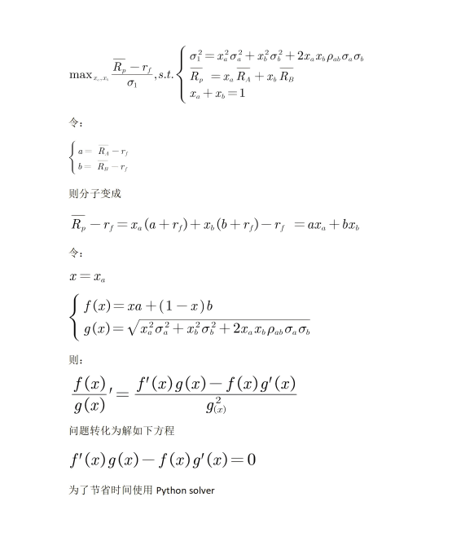

# Python 金融建模：基础与应用

MIT Licensed | Copyright © 2024-present by [Yun Liao ](mailto:james@x.cool)

## Python 应用篇（第13-16章）

第13章：金融风险建模和分析

第14章：效率分析模型（DEA/SFA模型）

第15章：信用评级和信用评分模型

第16章：量化投资策略算法和应用

---

### 第13章：金融风险建模和分析

#### 13.1 金融风险建模导论

**金融风险定义：**

金融风险是与投资决策、业务运营或金融交易相关的不确定性或无法预测的情况，是指组织或个人可能由于金融市场、经济条件或其他因素的波动而遭受损失或获利的一种可能性。它来自多种因素，包括市场波动、经济情况、债权人的信用价值、监管变化和未预见事件。金融风险可以以不同的形式出现，如市场风险、信贷风险、流动性风险、操作风险和名誉风险。

##### 金融风险的类型

市场风险：是指市场价格、利率、汇率或商品价格的波动可能导致的损失或收益。
信用风险：涉及债务人不能按期偿还债务，导致银行等机构蒙受损失。
流动性风险：当一家公司或金融机构无法快速销售回款或交易资产以满足其财务义务时出现的风险。
操作风险：是指内部过程、系统和人为错误可能导致的财务损失或其他损害。
名誉风险：涉及一家公司或金融机构因恶劣业务实践、不道德行为或监管违法而蒙受的名誉损害。

金融风险的重要性

金融风险对经济稳定起着极其关键的作用，因为它可能导致对企业、市场和整个经济体的严重影响。一些关键的后果包括：

业务中断：金融风险可能导致公司破产，迫使企业进行再结构或关门。
市场波动：不确定的市场运动可以为某些投资者创造机会，但对其他投资者造成风险。
经济不稳定：长期的财务压力可能导致经济下滑、减少消费者支出和增加失业率。
监管干预：过高的金融风险可能导致监管机构采取行动，这可能限制业务发展或创新。

金融风险是一个多面性的概念，涵盖了多种不确定性和无法预测的情况。作为经济学和风险专业人士，我们需要对金融风险的定义和影响有深入的理解，以便做出明智的决策并减少潜在损失。通过认识金融风险的重要性。

参考：巴塞尔银行监督委员会 (2019)。 Sound Management of Banks' Securitization Activities；金融稳定理事会 (2020)。 Systemic Risk and Macroprudential Policy ；国际证券交易所协会 (IOSCO) (2018)。 Asset Management Sound practice GUIDE。

##### 基础的风险计量方法

在本节中，我们将探讨一些最流行的方法，包括Value-at-Risk (VaR)、Expected Shortfall (ES)、Credit Value at Risk (CVaR)、蒙特卡罗模拟、历史模拟法和方差-协方差方法，并使用python程序语言去进行基础的模拟。

**流行金融风险建模技术：**

1. **Value-at-Risk（VaR）：**
   VaR是一种广泛使用的衡量指标，它估算投资组合在特定时间跨度内的潜在损失，同时考虑一定的概率。VaR 被用于评估投资组合的市场风险，并已成为银行和金融机构的一项标准要求。估算投资组合在特定时间跨度内可能遭受的最大损失，以一定的置信水平（例如95%或99%）。
2. **Expected Shortfall（ES）：**
   ES是一种替代风险衡量指标，估算超出VaR的平均损失。它提供了对潜在损失的一种更加全面的看法。预期损失是 VaR 的一个扩展版本，它考虑了超出置信区间的潜在损失。ES 提供了一种更全面的风险视图，考虑了潜在损失的规模
3. **Credit Value at Risk（CVaR）：**
   CVaR是一种信用风险衡量指标，估算由于借款人违约或移交而可能遭受的损失。它类似于VaR，但专门关注信用风险。信用价值风险是对信用风险的一种测量工具，它估算对手的默认风险，并考虑潜在损失的可能性和损失给定的概率。
4. **蒙特卡罗模拟：**
   蒙特卡罗模拟涉及使用随机抽样和统计模型生成多种可能结果的场景。这项技术使得能够在不同的市场条件和场景下估算风险衡量指标，如VaR和ES。蒙特卡罗模拟是一种统计技术，用于估算投资组合在特定时间跨度内的价值。它可以涉及生成多个市场走势场景，计算投资组合的价值，并将结果聚合以获取期望值。
5. **历史模拟方法：**
   该方法涉及分析历史数据，以估算潜在损失或获利。它是基于过去事件能够为未来结果提供信息的想法。历史模拟法是一种统计技术，用于估算投资组合在特定时间跨度内的价值。它涉及选择历史期段，计算投资组合的价值，并将结果聚合以获取期望值。
6. **方差-协方差方法：**
   这项方法通过分析投资组合中不同资产的波动率（方差）和相关性（协方差），用于估算投资组合的协方差矩阵。它涉及计算每个资产的方差和协方差，并将其聚合以获取总体协方差矩阵并估算风险衡量指标，如VaR和ES。

**其他流行金融风险建模技术包括：**

* 压力测试
* 敏感度分析
* 场景分析
* 极值理论
* 贝叶斯网络

接下来的章节中我们将分别使用这些基础的计量方法对各类型的风险进行建模。

#### 13.2 市场风险建模

##### 市场风险建模的概念、架构和应用

市场风险建模是一种统计技术，用来估算投资组合因市场变量变化而引起的潜在损失。市场风险建模的目的是提供一个定量框架，用于评估和管理市场风险。

市场风险建模中的关键概念包括：市场风险：因市场变量变化而引起的投资组合价值的风险。Value-at-Risk（VaR）：在给定的置信区间内潜在损失的估算。Expected Shortfall（ES）：VaR 的一个扩展版本，考虑了超出置信区间的潜在损失。

市场风险建模的架构通常涉及以下几个组成部分：

* 数据收集：收集历史数据关于市场变量和投资组合返回。
* 数据准备：对数据进行清洁、转换和聚合，以便进行分析。
* 模型估算：根据统计模型的参数估算，例如方差-协方差矩阵或概率分布函数。
* 风险计算：使用估算的模型参数计算 VaR、ES 或其他风险测量。

市场风险建模可应用于金融领域，包括：

* 投资组合管理：评估和管理单个投资组合或投资策略的市场风险。
* 风险评估：评估投资组合或金融机构整体的市场风险暴露。
* 监管要求：满足监管要求，用于市场风险报告和管理。

##### CAPM/MPT理论简述和数学表示

资本资产定价模型 (CAPM)

CAPM 由 William F. Sharpe 在 1964 年首次提出，是一种尝试解释资产返回行为的模型。该模型假设投资者是合理的，并且拥有市场上所有可用信息。在这些条件下，CAPM 论述说期望回报率是等于无风险利率加上风险溢价。数学表示为：

E(Ri) = Rf + βi (E(Rm) - Rf)

其中：

E(Ri) 是资产 i 的期望回报率
Rf 是无风险利率
βi 是资产 i 的贝塔系数
E(Rm) 是市场组合的期望回报率
贝塔系数（βi）测量资产的系统性风险或波动性。具有高贝塔系数的资产更加 volatile 和拥有更高的期望回报率，而具有低贝塔系数的资产更加稳定和拥有更低的期望回报率。

现代组合理论 (MPT)

MPT 由 Harry Markowitz 在 1950 年首次提出，是一种尝试理解投资者如何分配他们的财富于不同资产的理论。该理论假设投资者是风险规避的，并且旨在最大化他们的期望效用，这是一个包括期望回报率和组合的标准差的函数。

数学表示为：

Maximize: E(Rp) - λσ(P)

Subject to: Σ wi Ri ≤ Rp

其中：

E(Rp) 是组合的期望回报率
λ 是风险回避参数
σ(P) 是组合的标准差
wi 是资产 i 在组合中的权重
Rp 是目标回报率
MPT 模型旨在通过平衡期望回报率和风险来优化组合。风险回避参数（λ）测量投资者愿意采取额外风险以获取更高的回报率。

##### **CAPM和MPT建模计算**

下面是一个使用 Python 实现资本资产定价模型（CAPM）和现代投资组合理论（MPT）计算的示例：

```python
import numpy as np
from scipy.optimize import minimize

# 定义无风险利率、市场回报率和beta系数
Rf = 0.02  # 无风险利率
Rm = 0.08  # 市场回报率
beta = 1.2  # beta系数

# 定义资产协方差矩阵
cov_matrix = np.array([[0.001, 0.005], [0.005, 0.01]])

# 定义个别资产的预期回报率和标准差
E_R_asset1 = 0.06
sigma_asset1 = 0.15
E_R_asset2 = 0.10
sigma_asset2 = 0.20

# 计算CAPM预期回报率
def capm_expected_return(Rf, Rm, beta):
    return Rf + beta * (Rm - Rf)
E_R_CAPM = capm_expected_return(Rf, Rm, beta)
print("CAPM 预期回报率:", E_R_CAPM)

# 计算MPT投资组合方差
def mpt_portfolio_variance(weights, cov_matrix):
    return np.dot(weights.T, np.dot(cov_matrix, weights))

# 定义目标函数以最小化投资组合方差
def objective_function(weights):
    return mpt_portfolio_variance(weights, cov_matrix)

# 定义优化问题的约束条件
n_assets = 2
bounds = [(0, 1) for _ in range(n_assets)]
constraints = ({'type': 'eq', 'fun': lambda x: np.sum(x) - 1})

# 运行优化算法以找到最优投资组合权重
result = minimize(objective_function, n_assets*[1.0/n_assets], method='SLSQP', bounds=bounds, constraints=constraints)
optimal_weights = result.x
print("最优投资组合权重:", optimal_weights)

# 计算MPT预期回报率和标准差
E_R_MPT = np.sum(optimal_weights * [E_R_asset1, E_R_asset2])
sigma_MPT = np.sqrt(mpt_portfolio_variance(optimal_weights, cov_matrix))
print("MPT 预期回报率:", E_R_MPT)
print("MPT 标准差:", sigma_MPT)

```

该代码使用 NumPy 和 SciPy 库实现了 CAPM 和 MPT 计算。它首先计算了资产的预期回报率使用 CAPM 公式，然后使用 MPT 框架计算了最优投资组合权重以最小化投资组合方差。最后，它计算了最优投资组合的预期回报率和标准差。注意，这只是一个简单的示例，在实际应用中您需要考虑更多的资产、更复杂的协方差结构、以及其他约束条件或目标函数。

##### 多个不相关资产已知回报计算最小方差权重

已知资产组合由三种资产构成，

三种资产的期望回报和回报标准差如下图，试计算要获得13%的最小方差的各资产权重

| 资产A | 资产B | 资产C |        |
| ----- | ----- | ----- | ------ |
| 0.1   | 0.12  | 0.15  | return |
| 0.15  | 0.18  | 0.25  | STD    |

```python
#############多个不相关资产已知组合回报计算最小方差权重
import sympy
from sympy import symbols
from sympy.abc import *
from sympy.solvers import solve
w1,w2,w3,a,b,s1,s2,s3,r1,r2,r3 = sympy.symbols('w1 w2 w3 a b s1 s2 s3 r1 r2 r3')
fx = (w1*s1)**2+(w2*s2)**2+(w3*s3)**2-a*(w1*r1+w2*r2+w3*r3)-b*(w1+w2+w3)
rp = 0.13
gx = w1*r1+w2*r2+w3*r3-rp
hx = w1+w2+w3-1
h = solve([fx.diff(w1),fx.diff(w2),fx.diff(w3),gx,hx],(a,b,w1,w2,w3))
h[0].evalf(subs={r1:0.1,r2:0.12,r3:0.15,s1:0.15,s2:0.18,s3:0.25})

import sympy as sp

# Define variables
w1, w2, w3, a, b, s1, s2, s3, r1, r2, r3 = sp.symbols('w1 w2 w3 a b s1 s2 s3 r1 r2 r3')

# Define functions
fx = (w1*s1)**2 + (w2*s2)**2 + (w3*s3)**2 - a*(w1*r1 + w2*r2 + w3*r3) - b*(w1 + w2 + w3)
rp = 0.13
gx = w1*r1 + w2*r2 + w3*r3 - rp
hx = w1 + w2 + w3 - 1

# Solve the system of equations
h = sp.solve([fx.diff(w1), fx.diff(w2), fx.diff(w3), gx, hx], (a, b, w1, w2, w3))
# Evaluate the solution at specific values for the variables
result = h[0].evalf(subs={r1: 0.1, r2: 0.12, r3: 0.15, s1: 0.15, s2: 0.18, s3: 0.25})
print(result)
```

##### 两种资产的MPT符号形式求解



```python
import sympy
from sympy import symbols
from sympy.abc import *
from sympy.solvers import solve
x,a,b,sa,sb,c = sympy.symbols('x a b sa sb c')
f = x*a+(1-x)*b
g = sympy.sqrt((x**2)*(sa**2)+(1-x)**2*(sb**2)+2*(1-x)*x*sa*sb*c)
g
h = solve(f.diff(x)*g-f*(g.diff(x)),x)
print(h)
print(sympy.latex(h))
solvedresults = str(sympy.latex(h))
latexre = '$'+ solvedresults+'$' 
from matplotlib import pyplot as plt
fig = plt.figure(linewidth=1, facecolor="white", layout="tight")
fig.text(0.2, 0.5, latexre)
fig.savefig("equation.png",dpi=600,bbox_inches = 'tight')
```

##### 市场风险建模：计算VAR

数据准备：将某个指数的每日价格整合成为一个csv文件或excel文件

```python
import pandas as pd
# 加载股票价格数据（例如 S&P 500）
stock_ prices = pd.read_csv('stock_prices.csv', index_col='Date', parse_dates=['Date'])
# 计算每日回报率
returns = stock_prices.pct_change()
import numpy as np
# 设置时间范围（例如 1 天）
horizon = 1
# 设置自信水平（例如 95%）
confidence_level = 0.95
# 使用历史模拟方法计算 VaR
var = np.percentile(returns, q=100 - confidence_level, axis=0)
print(f"VaR for {horizon} days at {confidence_level*100}% confidence level: ${var:.2f}")
```

#### 13.3 流动性风险建模

流动性风险是金融机构在无法轻易买卖资产时可能遭受的潜在损失或收益。近年来，流动性风险已经成为金融机构、监管机构和投资者关注的主要问题。这是因为流动性风险可能对机构的盈利能力、偿付能力和总体稳定性产生重要影响。

**概念**
流动性风险建模涉及到量化市场流动性的缺乏可能导致的潜在损失。有几种关键概念支撑着流动性风险建模：

1. **市场流动性** ：快速买卖资产的能力。
2. **流动所需时间** ：机构预计变现其资产的时间段。
3. **流动性成本** ：买卖资产所产生的成本，包括bid-ask spread、佣金和其他交易成本。
4. **流动性风险指标** ：流动性风险的定量衡量，如liquidity-adjusted value-at-risk（LVaR）和cash flow-at-risk（CFaR）。

**架构**
有多种架构可以用来建模流动性风险：

1. **理论模型** ：基于数学框架的流动性风险模型，如Kyle-Obizhaeva模型。
2. **仿真-based模型** ：例如 Monte Carlo 仿真，涉及生成多个市场结果场景并估算所产生的流动性成本。
3. **机器学习模型** ：例如神经网络，可以根据历史数据预测流动性成本。

**应用**
流动性风险建模在金融领域有多种应用：

1. **风险管理** ：流动性风险建模可以帮助机构更好地识别和管理其流动性风险。
2. **监管资本要求** ：监管机构可能使用流动性风险模型来确定机构必须持有的资本金额，以对抗其流动性风险。
3. **投资组合优化** ：流动性风险建模可以用来优化投资组合的构建和资产配置决策。
4. **压力测试** ：流动性风险建模可以用来测试机构在潜在流动性冲击下的偿付能力。

**挑战**
流动性风险建模是一项复杂的任务，存在多种挑战：

1. **数据质量问题** ：市场流动性数据的可获得性和质量可能有限。
2. **模型复杂度** ：流动性风险模型可以非常复杂，需要大量计算资源。
3. **模型校准和验证** ：流动性风险模型的校准和验证可能具有挑战性，因为缺乏可观察的市场数据。

##### 流动性风险python实例

本实例假设你有一个 CSV 文件，其中包含历史市场数据的日期、收盘价和其他相关字段。该脚本计算每日收益率，定义一个基于平均每日收益率和标准差的流动性成本函数，然后计算历史数据中的每日流动性成本。接下来，该脚本使用历史模拟方法计算流动性调整后的风险价值（LVaR）作为每日损失调整流动性成本的 95th 分位数。LVaR 的结果将被打印到控制台，保留两位小数。

```python
import pandas as pd
import numpy as np

# 加载历史市场数据
data = pd.read_csv('market_data.csv', index_col='Date', parse_dates=['Date'])

# 计算每日收益率
returns = data['Close'].pct_change()

# 定义流动性horizon（例如 1 天，5 天等）
liquidity_horizon = 5

# 定义流动性成本函数（例如 bid-ask spread，佣金等）
def liquidity_cost_function(returns, liquidity_horizon):
    # 计算流动性horizon 内的平均每日收益率
    avg_return = returns.rolling(window=liquidity_horizon).mean()
  
    # 计算流动性horizon 内的标准差
    std_dev = returns.rolling(window=liquidity_horizon).std()
  
    # 计算流动性成本作为平均收益率和标准差的函数
    liquidity_cost = np.abs(avg_return) * std_dev
  
    return liquidity_cost

# 计算历史数据中的每日流动性成本
liquidity_costs = []
for i in range(len(returns)):
    liquidity_cost = liquidity_cost_function(returns.iloc[i-liquidity_horizon:i], liquidity_horizon)
    liquidity_costs.append(liquidity_cost)

# 创建一个 pandas Series 来存储流动性成本
liquidity_costs_series = pd.Series(liquidity_costs, index=data.index)

# 使用历史模拟方法计算流动性调整后的风险价值（LVaR）
def calculate_lvár(returns, liquidity_costs_series):
    # 计算每日损失（或收益）在历史数据中的
    daily_losses = returns * -1
  
    # 计算 LVaR 作为每日损失调整流动性成本的 95th 分位数
    lvár = np.percentile(daily_losses * liquidity_costs_series, 95)
  
    return lvár

# 使用历史模拟方法计算 LVaR
lvár = calculate_lvár(returns, liquidity_costs_series)
print(f'LVaR: {lvár:.2f}')

```

##### kyle-obizhaeva 模型python实现

```python
import numpy as np
import pandas as pd
class KyleObizhaevaModel:
    def  __init__(self, alpha, beta, gamma, delta):
        self.alpha  = alpha   # 市场影响参数
        self.beta  = beta    # 库存风险厌恶参数
        self.gamma  = gamma   # 无风险利率
        self.delta  = delta   # 流动性参数

    def calculate_optimal_inventory(self, Q, S, sigma):
         """
        使用 Kyle-Obizhaeva 模型计算最佳库存水平。

        参数：
        Q (float)：当前库存水平
        S (float)：股票价格
        sigma (float)：股票波动率

        返回：
        float：最佳库存水平
         """
        num  = self.alpha  * Q  + self.beta  * S
        denom  = self.gamma  * sigma**2  + self.delta  * S**2
        return num  / denom

    def calculate_market_impact(self, Q, S, sigma):
         """
        使用 Kyle-Obizhaeva 模型计算交易的市场影响。

        参数：
        Q (float)：当前库存水平
        S (float)：股票价格
        sigma (float)：股票波动率

        返回：
        float：市场影响
         """
        return self.alpha  * Q  /  (self.gamma  * sigma**2  + self.delta  * S**2)

# 示例使用
model  = KyleObizhaevaModel(alpha=0.01, beta=0.05, gamma=0.02, delta=0.1)
Q  = 1000   # 当前库存水平
S  = 50.0    # 股票价格
sigma  = 0.2   # 股票波动率

optimal_Q  = model.calculate_optimal_inventory(Q, S, sigma)
print(f"最佳库存水平：{optimal_Q:.2f}")
market_impact  = model.calculate_market_impact(Q, S, sigma)
print(f"市场影响：{market_impact:.4f}")

```

#### 13.4 操作风险建模

操作风险建模是现代风险管理实践的关键组件。它涉及到识别、评估和缓解操作风险，这些风险可能对组织的财务表现、声誉和合规性产生显著影响。在本文中，我们将概述操作风险建模，包括其概念、架构和应用。

**概念**
操作风险是指由于内部流程、系统和人员不充分或失败，而导致损失的风险，也可能来自外部事件。它可以来自以下几种来源：

1. **人为错误** ：员工、承包商或第三方供应商犯下的错误。
2. **流程故障** ：业务流程中断，包括交易处理、会计和合规性。
3. **系统故障** ：技术系统的故障，包括硬件、软件和网络基础设施。
4. **外部事件** ：自然灾害、恐怖主义、网络攻击和其他可能干扰业务运营的外部事件。
   操作风险建模涉及到使用统计模型和技术来识别、评估和量化操作风险。目标是为组织提供一个全面的操作风险配置，实现知情决策和有效的风险缓解策略。

**架构**
典型的操作风险建模架构由以下组件组成：

1. **数据收集** ：收集有关操作损失、近miss事件和其他相关事件的数据。
2. **风险评估** ：使用技术如场景分析、敏感性分析和专家判断来识别和评估操作风险。
3. **模型开发** ：开发统计模型以量化操作风险，包括频率-严重性模型、贝叶斯网络和蒙特卡罗模拟。
4. **模型验证** ：使用技术如回测和压力测试来验证操作风险模型的性能。
5. **风险报告** ：提供有关操作风险敞口的regular报告，包括风险指标、仪表盘和热图。

**应用**
操作风险建模在各种行业中具有广泛的应用，包括：

1. **金融机构** ：银行、保险公司和资产管理者使用操作风险建模来管理交易处理、合规性和网络安全相关的风险。
2. **医疗组织** ：医院、诊所和医疗系统使用操作风险建模来识别和缓解与病人安全、医疗错误和网络攻击相关的风险。
3. **制造和供应链公司** ：这些公司使用操作风险建模来管理生产中断、供应链故障和物流中断相关的风险。
4. **政府机构** ：政府机构使用操作风险建模来识别和缓解与网络安全、数据泄露和物理安全相关的风险。
   总之，操作风险建模是现代风险管理实践的关键组件。通过理解操作风险建模的概念、架构和应用，组织可以更好地管理其操作风险，实现其战略目标。

##### 操作风险python实例

这个示例假设你有一个 CSV 文件 `operational_losses.csv`，其中包含了历史操作损失的数据。该脚本定义了一个操作风险模型，具有频率和严重性的参数，使用蒙特卡罗模拟来模拟操作损失，计算预期操作风险损失，并绘制模拟损失的分布图。

注意，这只是一个非常简化的示例，在实际中，你需要考虑许多其他因素，如：

* 更高级的概率分布（例如，广义帕累托分布）
* 不同类型操作风险之间的相关性
* 频率和严重性的依赖关系
* 模型验证使用回测和压力测试
* 与其他风险管理框架和系统的集成

此外，这个示例使用了**简单的泊松分布**来模拟频率和标准正态分布来模拟严重性，但在实际中，你可能需要使用更高级的分布来捕捉操作风险的复杂性。

```python
import pandas as pd
import numpy as np
from scipy.stats import norm, poisson

# 加载操作损失数据
loss_data = pd.read_csv('operational_losses.csv')

# 定义操作风险模型参数
lambda_param = 0.05  # 频率参数
mu_param = 10000  # 严重性参数
sigma_param = 2000  # 严重性标准差

# 定义频率和严重性的概率分布
freq_dist = poisson(lambda_param)
sev_dist = norm(mu_param, sigma_param)

# 使用蒙特卡罗模拟来模拟操作损失
num_simulations = 10000
loss_simulations = np.zeros((num_simulations,))
for i in range(num_simulations):
    freq = freq_dist.rvs()
    sev = sev_dist.rvs(size=freq)
    loss_simulations[i] = np.sum(sev)

# 计算预期操作风险损失
expected_loss = np.mean(loss_simulations)
print(f'Expected Operational Risk Loss: {expected_loss:.2f}')

# 绘制模拟损失的分布图
import matplotlib.pyplot as plt
plt.hist(loss_simulations, bins=50)
plt.xlabel('Loss Amount')
plt.ylabel('Frequency')
plt.title('Distribution of Simulated Operational Risk Losses')
plt.show()

```

#### 13.5 系统性风险金融建模

系统性风险是指可能对整个金融体系或市场产生影响的风险，这些风险可能来自各种来源，如宏观经济环境、市场情绪、政策变化、自然灾害等。系统性风险金融建模是指使用数学和计算机模型来分析和评估这些风险的技术。

**架构**

系统性风险金融建模通常包括以下几个组件：

1. **数据收集** ：收集关于宏观经济环境、市场情绪、政策变化等的历史数据。
2. **模型选择** ：选择合适的数学和计算机模型来描述系统性风险，如随机过程、网络分析、agent-based 模型等。
3. **模型参数估计** ：使用历史数据来估计模型参数，以便模拟系统性风险的行为。
4. **风险评估** ：使用模型来评估系统性风险的可能性和影响程度。
5. **结果解释** ：对模型结果进行解释和分析，以了解系统性风险的原因和影响。

**应用**

系统性风险金融建模有很多实际应用，如：

1. **风险管理** ：帮助银行和其他金融机构识别和评估系统性风险，以便制定风险管理策略。
2. **投资组合** ：帮助投资者构建投资组合，以免受系统性风险的影响。
3. **监管政策** ：帮助监管机构制定政策，以防止系统性风险的发生和蔓延。
4. **金融稳定** ：帮助维护整个金融体系的稳定，防止系统性风险的蔓延。

**技术**

系统性风险金融建模中使用了多种技术，如：

1. **随机过程** ：用于描述系统性风险的不确定性和随机性。
2. **网络分析** ：用于描述系统性风险在金融体系中的传播和影响。
3. **agent-based 模型** ：用于描述金融市场中各种参与者的行为和互动。
4. **机器学习** ：用于识别和评估系统性风险的模式和趋势。

**挑战**

系统性风险金融建模面临着多种挑战，如：

1. **数据质量** ：历史数据的质量和可靠性对模型结果有很大影响。
2. **模型复杂度** ：模型需要足够复杂以捕捉系统性风险的特征，但也不能太复杂，以免出现过拟合的问题。
3. **解释性** ：模型结果需要能够被解释和理解，以便决策。
4. **计算能力** ：模型需要强大的计算能力，以便快速处理大量数据。

##### 系统风险python建模实例

这个示例中，我们定义了三个模型：

1. 随机过程模型 `SystemicRiskModel`，用于模拟系统性风险的因子返回。
2. 网络模型 `SystemicRiskNetwork`，用于描述代理人之间的关系和行为。
3. 机器学习模型 `SystemicRiskClassifier`，用于预测系统性风险的可能性。

然后，我们使用这些模型来模拟系统性风险，包括：

1. 模拟因子返回。
2. 构建网络模型。
3. 模拟网络行为。
4. 训练机器学习模型。
5. 预测系统性风险。

```python
import pandas as pd
import numpy as np
from scipy.stats import norm
from sklearn.ensemble import RandomForestClassifier
from networkx import *

# 加载数据
data  = pd.read_csv('systemic_risk_data.csv')

# 定义模型参数
num_factors  = 5   # 因子数量
num_agents  = 100  # 代理人数量

# 构建随机过程模型
class SystemicRiskModel:
    def __init__(self, num_factors, num_agents):
        self.num_factors  = num_factors
        self.num_agents  = num_agents
        self.factors  = np.random.normal(size=(num_factors, num_agents))
        self.weights  = np.random.uniform(size=(num_agents, num_factors))

    def simulate(self, timesteps):
        factor_returns  = np.zeros((timesteps, self.num_factors))
        for t in range(timesteps):
            factor_returns[t]  = np.dot(self.factors, self.weights) + np.random.normal(scale=0.1, size=self.num_factors)
        return factor_returns

# 构建网络模型
class SystemicRiskNetwork:
    def __init__(self, num_agents):
        self.num_agents  = num_agents
        self.G  = nx.Graph()
        for i in range(num_agents):
            self.G.add_node(i)

    def add_edge(self, agent1, agent2):
        self.G.add_edge(agent1, agent2)

    def simulate(self, timesteps):
        for t in range(timesteps):
            for agent in self.G.nodes():
                # 仿真代理人的行为
                pass
        return self.G

# 构建机器学习模型
class SystemicRiskClassifier:
    def __init__(self, num_factors):
        self.num_factors  = num_factors
        self.clf  = RandomForestClassifier(n_estimators=100)

    def fit(self, X, y):
        self.clf.fit(X, y)

    def predict(self, X):
        return self.clf.predict_proba(X)

# 模拟系统性风险
timesteps  = 100
model  = SystemicRiskModel(num_factors, num_agents)
factor_returns  = model.simulate(timesteps)

# 构建网络模型
network  = SystemicRiskNetwork(num_agents)
for i in range(10):
    network.add_edge(i, (i+1)%num_agents)

# 模拟网络行为
G  = network.simulate(timesteps)

# 训练机器学习模型
X  = pd.DataFrame(factor_returns).iloc[:, :-1]
y  = pd.Series(factor_returns.iloc[:, -1])
clf  = SystemicRiskClassifier(num_factors)
clf.fit(X, y)

# 预测系统性风险
predict_probs  = clf.predict(X)
print(predict_probs)
```

#### 13.6 练习


##### **练习 1：预期亏损（ES）计算**

实现一个 Python 函数来计算投资组合的预期亏损（ES），使用历史数据。

* 输入：
  * `returns`：一个 pandas 数据框，包含投资组合的日收益率
  * `confidence_level`：一个介于 0 和 1 之间的浮点数，例如 0.95 表示 95% 置信水平
* 输出：
  * `es`：预期亏损（ES）的值

提示：使用 `numpy` 和 `pandas` 库来实现计算。


##### **练习 2：风险中性估值**


实现一个 Python 函数来计算选择权的风险中性估值，使用 Black-Scholes 模型。

* 输入：
  * `stock_price`：当前股票价格
  * `strike_price`：选择权的执行价格
  * `volatility`：股票的年化波动率
  * `risk_free_rate`：无风险利率
  * `time_to_maturity`：选择权的到期日
* 输出：
  * `option_value`：选择权的风险中性估值


##### **练习 3：信用风险模型**


实现一个 Python 函数来计算贷款的违约概率（PD）和违约损失（LGD）。

* 输入：
  * `loan_amount`：贷款金额
  * `interest_rate`：贷款利率
  * `credit_score`：借款人的信用评分
  * `default_probability`：贷款的违约概率
* 输出：
  * `pd`：违约概率（PD）
  * `lgd`：违约损失（LGD）

提示：使用 `numpy` 和 `pandas` 库来实现计算。


:::

MIT Licensed | Copyright © 2024-present by [Yun Liao ](mailto:james@x.cool)
:::
