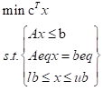
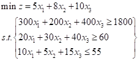
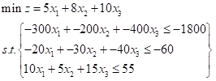

# Python 金融建模：基础与应用

MIT Licensed | Copyright © 2024-present by [Yun Liao ](mailto:james@x.cool)

## Python 应用篇（第13-16章）

第13章：金融风险建模和分析

第14章：效率分析模型（DEA-马尔奎斯特模型）

第15章：信用评级和信用评分模型

第16章：金融常用数学模型

### 第16章：常用经济数学模型

#### 16.1 线性规划与动态规划

线性规划是一种优化线性目标函数的方法，受限于一组线性约束条件。它是运筹学和管理科学中一个基本概念。python中有两个常见库可用于解决线性规划问题：

1. **SciPy** : SciPy 提供了一个名为 `scipy.optimize` 的模块，其中有一个名为 `linprog` 的函数，可以用来解决线性规划问题。
2. **PuLP** : PuLP 是一个专门设计的数学优化库，包括线性规划。

线性规划模型是指一种特殊形式的数学规划模型，即目标函数和约束条件是待求变量的线性函数、线性等式或线性不等式的数学规划模型。根据问题背景，经过对问题的分析，通过三个步骤建立数学模型：1.确定决策变量，2.建立目标函数，3.指定约束条件。由于目标函数和约束条件都是由决策变量组成的线性函数表达式，由此可以表示为下图所示形式。



##### 示例1：营养摄入问题

假设我们想找到满足营养需求的最便宜膳食。我们有三种食品，A、B 和 C，每种食品具有不同的价格和营养价值。营养需求是：

* 卡路里：每天至少 1800大卡
* 蛋白质：每天至少 60 克
* 脂肪：每天最多 55 克

各食品的价格和营养价值是：

| 食品 | 价格（元） | 卡路里 | 蛋白质（克） | 脂肪（克） |
| ---- | ---------- | ------ | ------------ | ---------- |
| A    | 5          | 300    | 20           | 10         |
| B    | 8          | 200    | 30           | 5          |
| C    | 10         | 400    | 40           | 15         |

首先转化为数学式子：



linprog 只能求最小值，且不等式约束只能是小于等于限制，所以要求最大值或存在大于等于约束时要在处理前转化一下，以上式子转化后变成



代码示例：

```python
from scipy.optimize import linprog
# 定义目标函数的系数（价格）
c = [5, 8, 10]
# 定义不等式约束的系数（营养价值）
A_ub = [[-300, -200, -400], [-20, -30, -40], [10, 5, 15]]
b_ub = [-1800, -60, 55]
# 定义变量的边界（非负性）
bounds = [(0, None), (0, None), (0, None)]
# 解 LP 问题
res = linprog(c, A_ub=A_ub, b_ub=b_ub, bounds=bounds)
print("最优解：", res.x)
print("最小成本：", res.fun)
# 最优解： [4. 3. 0.]
# 最小成本： 44.0

```

| 参数     | 意义                                                                                                                                |
| -------- | ----------------------------------------------------------------------------------------------------------------------------------- |
| c        | 目标函数的决策变量对应的系数向量(行列向量都可以，下同)                                                                              |
| A_ub     | 不等式约束组成的决策变量系数矩阵                                                                                                    |
| b_ub     | 由A_ub对应不等式顺序的阈值向量                                                                                                      |
| A_eq     | 等式约束组成的决策变量系数矩阵                                                                                                      |
| b_eq     | 由A_ub对应等式顺序的阈值向量                                                                                                        |
| bounds   | 表示决策变量x连续的定义域的n×2维矩阵，None表示无穷                                                                                 |
| methods  | 调用的求解方法,例如 ['simplex', 'revised simplex', 'interior-point','highs', 'highs-ds', 'highs-ipm']，建议用户选择highs的三个方法 |
| callback | 选择的回调函数                                                                                                                      |
| options  | 求解器选择的字典                                                                                                                    |
| x0       | 初始假设的决策变量向量，若可行linprog会对方法优化                                                                                   |

##### 示例2：动态规划方法解决背包问题

**动态规划（Dynamic Programming）是一种算法设计技术，用于解决复杂的问题通过拆分问题成更小的子问题，然后逐步解决这些子问题，并利用之前所得结果来解决更大的问题。**

1. **状态** ：问题的当前情况，例如一个背包问题中的项目数量和容量。
2. **决策** ：在当前状态下，可以采取的操作或选择，例如选择某个项目放入背包或不放入。
3. **价值函数** ：计算当前状态下的价值或利益，例如总价值或利润。
4. **优化问题** ：寻找一个最优决策来maximize或minimize价值函数。

**动态规划步骤**

1. **定义状态空间** ：确定问题的所有可能状态，例如项目数量和容量。
2. **定义决策规则** ：确定在每个状态下可以采取的操作或选择。
3. **计算价值函数** ：计算当前状态下的价值或利益。
4. **构建DP表格** ：创建一个表格来存储每个状态下的价值或利益。
5. **填充DP表格** ：通过递归关系或迭代方式填充表格，例如使用之前所得结果来计算当前状态下的价值。
6. **读取最优解** ：从DP表格中读取最优决策和对应的价值。

**动态规划优点**

1. **避免重复计算** ：通过存储中间结果，可以避免重复计算同一个子问题。
2. **提高效率** ：可以快速计算出最优解，尤其是在解决具有最优解的问题时。
3. **适应各种问题** ：动态规划方法可以应用于解决许多类型的问题，例如背包问题、最短路径问题和计划问题。

**动态规划缺点**

1. **空间复杂度高** ：DP表格的大小可能会很大，占用大量内存。
2. **计算时间长** ：填充DP表格可能需要很长时间，尤其是在解决具有大量状态的问题时。

总之，动态规划方法是一种强大的算法设计技术，可以用于解决许多复杂的问题。但是，它也存在一些缺点，例如空间复杂度高和计算时间长。

以背包问题为例，背包问题（knapsack）是一个经典的计算机科学和运筹学问题，涉及到找到一种方式将不同重量和价值的项目放入一个有限容量的背包，以使总价值最大化，同时不超过背包的容量。

**问题公式**
给定：

* 一个包含 `n` 个项目的集合，每个项目具有重量 `w_i` 和价值 `v_i`
* 一个容量为 `W` 的背包
  目标：找到一组项目来包括在背包中，以使总价值最大化，同时不超过背包的容量。

**动态规划方法**
我们可以使用动态规划来解决这个问题，通过构建一个表 `dp` 的大小为 `(n+1) x (W+1)`，其中 `dp[i][w]` 代表在 `i` 个项目和容量为 `w` 的情况下可以获得的最大价值。

递归公式用于填充表格是：

* `dp[0][w] = 0` （基础案例：无项目，无价值）
* `dp[i][w] = max(dp[i-1][w], dp[i-1][w-w_i] + v_i)` （选择包括或排除项目 `i`）
  第一个项 `dp[i-1][w]` 代表在不包括项目 `i` 的情况下可以获得的最大价值。第二个项 `dp[i-1][w-w_i] + v_i` 代表通过包括项目 `i` 可以获得的最大价值。

```python
def knapsack(weights, values, capacity):
    n = len(weights)
    dp = [[0 for _ in range(capacity+1)] for _ in range(n+1)]

    for i in range(1, n+1):
        for w in range(1, capacity+1):
            if weights[i-1] <= w:
                dp[i][w] = max(dp[i-1][w], dp[i-1][w-weights[i-1]] + values[i-1])
            else:
                dp[i][w] = dp[i-1][w]

    return dp[n][capacity]

# 示例用法
weights = [2, 3, 5, 7]
values = [10, 20, 30, 40]
capacity = 10
result = knapsack(weights, values, capacity)
print("最大价值:", result)

```

动态规划方法（算法）还可以解决例如以下问题：

1. **背包问题（Knapsack Problem）** ：给定一个容量为 `W` 的背包和 `n` 个项目，每个项目具有重量 `w_i` 和价值 `v_i`，目标是找到一组项目来包括在背包中，以使总价值最大化，同时不超过背包的容量。
2. **最短路径问题（Shortest Path Problem）** ：给定一个有向图和两个节点 `s` 和 `t`，目标是找到从 `s` 到 `t` 的最短路径。
3. **矩阵链乘（Matrix Chain Multiplication）** ：给定一个由 `n` 个矩阵组成的链式结构，目标是找到最优的矩阵乘法顺序，以使计算时间最少。
4. **活动选择问题（Activity Selection Problem）** ：给定一组活动，每个活动具有开始时间和结束时间，目标是选择一个活动子集，使得活动之间不冲突且总价值最大化。
5. **最长公共子序列（Longest Common Subsequence）** ：给定两个字符串 `X` 和 `Y`，目标是找到它们的最长公共子序列。
6. **Scheduling Problem** ：给定一组任务，每个任务具有开始时间和结束时间，目标是找到一个任务执行顺序，使得总执行时间最少。

#### 16.2 AHP 层次分析法

层次分析法（analytic hierarchy process），简称AHP，是指将与决策总是有关的元素分解成目标、准则、方案等层次，在此基础之上进行定性和定量分析的决策方法。该方法是美国运筹学家匹茨堡大学教授萨蒂于20世纪70年代初，在为美国国防部研究"根据各个工业部门对国家福利的贡献大小而进行电力分配"课题时，应用网络系统理论和多目标综合评价方法，提出的一种层次权重决策分析方法。传统定性分析方法类似专家打分、专家判断等，仅能将指标简单地划分为几个层级（类似非常重要、比较重要、一般、比较不重要、非常不重要），这样导致部分存在差别但是不大的指标得到了同样的权重，受主观因素影响，无法对最终决策做出更好的帮助。层次分析法将不同指标间一一比对，主观与客观相结合，很好地解决了以上问题。

层次分析法根据问题的性质和要达到的 **总目标** ，将问题分解为不同的组成因素，并按照因素间的**相互关联影响**以及**隶属关系**将因素按不同层次聚集组合，形成一个**多层次**的分析结构模型，从而最终使问题归结为 **最低层** （供决策的方案、措施等）相对于 **最高层** （总目标）的**相对重要权值的确定**或 **相对优劣次序的排定** 。

将决策的目标、考虑的因素(决策准则)和决策方案，按它们之间的相互关系分为 **最高层** 、**中间层**和 **最低层** ，绘出层次结构图。

 **最高层：** 决策的目的、要解决的问题。

 **中间层：** 考虑的因素、决策的准则。

 **最低层：** 决策时的备选方案。

**对于相邻的两层，称高层为目标层，低层为因素层。**

从层次结构模型的第2层开始，对于从属于(或影响)上一层每个因素的同一层诸因素，构造判断矩阵，直到最下层。在确定各层次各因素之间的权重时，如果只是定性的结果，则常常不容易被别人接受，因而Saaty等人提出： **一致矩阵法** ，即：1.不把所有因素放在一起比较，而是两两相互比较。2.对此时采用相对尺度，以尽可能减少性质不同的诸因素相互比较的困难，以提高准确度。判断矩阵是表示本层所有因素针对上一层某一个因素的相对重要性的比较。判断矩阵的元素用Saaty的1-9标度方法给出。**心理学家认为成对比较的因素不宜超过9个，即每层不要超过9个因素。**

判断矩阵量化值参照表：

|    因素i比因素j    |                      量化值                      |
| :----------------: | :----------------------------------------------: |
|      同等重要      |                        1                        |
|      稍微重要      |                        3                        |
|      较强重要      |                        5                        |
|      强烈重要      |                        7                        |
|      极端重要      |                        9                        |
| 两相邻判断的中间值 |                    2，4，6，8                    |
|        倒数        | 假设因素i相比因素j重要程度量化值为3，相反就是1/3 |

运用层次分析法构造系统模型时，大体可以分为以下四个步骤：

* 1.建立层次结构模型
* 2.构造判断矩阵(也叫成对比较矩阵)
* 3.层次单排序及其一致性检验
* 4.层次总排序及其一致性检验

##### 示例3：层次分析法解决多标准决策问题

**问题描述**

假设我们需要选择一个最佳的投资项目，考虑五个标准：风险、回报、难度、技术要求和环境影响。我们有四个备选项：A、B、C 和 D。

步骤1.构建层次结构模型和判断矩阵，在这个步骤里，一般由专家打分，具有一定主观性

```python
import numpy as np

# 定义决策矩阵
criteria_weights = np.array([
    [1, 3, 5, 2, 4],  # 风险
    [3, 1, 2, 5, 3],  # 回报
    [5, 2, 1, 4, 2],  # 难度
    [2, 5, 4, 1, 3],  # 技术要求
    [4, 3, 2, 3, 1]   # 环境影响
])


```

步骤2.计算相对重要性权重和一致性

```python
import numpy as np
def calculate_criteria_weights(criteria_weights):
    n = criteria_weights.shape[0]
    weights = np.zeros(n)
    for i in range(n):
        row_sum = np.sum(criteria_weights[i, :])
        weights[i] = row_sum / np.sum(criteria_weights[:, i])
    return weights

criteria_weightsnormalized = calculate_criteria_weights(criteria_weights)
print("相对重要性权重:", criteria_weights_normalized)

judgment_matrix = criteria_weightsnormalized

def calculate_consistency_ratio(judgment_matrix):
    n = judgment_matrix.shape[0]
    eigenvalues, eigenvectors = np.linalg.eig(judgment_matrix)
    lambda_max = np.max(eigenvalues)
    return (lambda_max - n) / (n - 1)

def calculate_consistency_index(judgment_matrix):
    n = judgment_matrix.shape[0]
    eigenvalues, eigenvectors = np.linalg.eig(judgment_matrix)
    lambda_max = np.max(eigenvalues)
    return (lambda_max - 1) / (n - 2)


cr = calculate_consistency_ratio(judgment_matrix)
ci = calculate_consistency_index(judgment_matrix)
print("一致性比率:", cr)
print("一致性指数:", ci)

# 在表格中查找 RI 值或使用预先计算的值
ri = 0.58  # 例如，RI 值为 4x4 矩阵
if cr <= ri:
    print("判断是一致的。")
else:
    print("判断是不一致的。")

```

Analytic Hierarchy Process（AHP）中，一致性是一个关键方面，以确保决策者的判断是可靠和值得信赖的。以下是在 AHP 方法中验证一致性的步骤：

**一致性比率（CR）**
一致性比率（CR）衡量两个元素之间比较的不一致性。它可以使用以下公式计算：

CR = (λmax - n) / (n - 1)

其中：

* λmax 是判断矩阵的最大特征值
* n 是被比较的标准或备选项的数量

**一致性指数（CI）**
一致性指数（CI）衡量判断的一致性。它可以使用以下公式计算：

CI = (λmax - 1) / (n - 2)

**随机指数（RI）**
随机指数（RI）衡量判断的随机性。它可以根据相同大小的随机矩阵进行计算。

**一致性验证**
要验证一致性，需要计算 CR 和 CI 值，并将其与 RI 值进行比较。步骤如下：

1. 使用判断矩阵计算 λmax。
2. 使用公式计算 CR。
3. 使用公式计算 CI。
4. 在表格中查找相同大小的随机矩阵的 RI 值
5. 将 CR 与 RI 进行比较：
   * 如果 CR ≤ RI，则判断是一致的。
   * 如果 CR > RI，则判断是不一致的。

Saaty's Random Index Table

| **Matrix Size** | **Random Index (RI)** |
| --------------------- | --------------------------- |
| 3x3                   | 0.58                        |
| 4x4                   | 0.90                        |
| 5x5                   | 1.12                        |
| 6x6                   | 1.24                        |
| 7x7                   | 1.32                        |
| 8x8                   | 1.41                        |
| 9x9                   | 1.45                        |
| 10x10                 | 1.49                        |

步骤3：构建判别矩阵（即各个方案之间的比较，也现需要专家打分）

```python
# 定义判别矩阵
judgment_matrices = [
    np.array([
        [1, 3, 5, 2],  # A
        [1/3, 1, 2, 4],  # B
        [1/5, 1/2, 1, 3],  # C
        [1/2, 1/4, 1/3, 1]   # D
    ]),
    np.array([
        [1, 2, 4, 3],  # A
        [1/2, 1, 3, 5],  # B ->
        [1/4, 1/3, 1, 2],  # C ->
        [1/3, 1/5, 1/2, 1]   # D ->
    ]),
    np.array([
        [1, 4, 2, 5],  # A ->
        [1/4, 1, 3, 2],  # B ->
        [1/2, 1/3, 1, 4],  # C ->
        [1/5, 1/2, 1/4, 1]   # D ->
    ]),
    np.array([
        [1, 5, 3, 4],  # A ->
        [1/5, 1, 2, 3],  # B ->
        [1/3, 1/2, 1, 5],  # C ->
        [1/4, 1/3, 1/5, 1]   # D ->
    ]),
    np.array([
        [1, 2, 3, 4],  # A ->
        [1/2, 1, 4, 5],  # B ->
        [1/3, 1/4, 1, 2],  # C ->
        [1/4, 1/5, 1/2, 1]   # D ->
    ])
]

```

步骤4： 计算局部权重和全局权重，根据全局权重选择最佳方案

```python
def calculate_local_weights(judgment_matrix):
    n = judgment_matrix.shape[0]
    local_weights = np.zeros(n)
    for i in range(n):
        row_sum = np.sum(judgment_matrix[i, :])
        local_weights[i] = row_sum / np.sum(judgment_matrix[:, i])
    return local_weights

local_weights_A = calculate_local_weights(judgment_matrices[0])
local_weights_B = calculate_local_weights(judgment_matrices[1])
local_weights_C = calculate_local_weights(judgment_matrices[2])
local_weights_D = calculate_local_weights(judgment_matrices[3])

global_weights = np.zeros(4)
for i in range(4):
    global_weights[i] = local_weights_A[i] * criteria_weightsnormalized[0] + \
                         local_weights_B[i] * criteria_weightsnormalized[1] + \
                         local_weights_C[i] * criteria_weightsnormalized[2] + \
                         local_weights_D[i] * criteria_weightsnormalized[3]

print("全局权重:", global_weights)

best_option = np.argmax(global_weights) + 1
print("最佳备选项:", best_option)

```

#### 16.3 BP神经网络评估资产价值

在最近几年中，神经网络在金融领域中的应用越来越多，用于模型复杂的变量关系并预测资产价值。下面是一个通用的神经网络方法评估资产价值的概述：

**问题公式化**
给定一组输入特征（例如财务比率、市场数据、经济指标）和目标变量（例如资产价值），目标是训练一个神经网络根据输入特征预测资产价值。

**神经网络架构**
典型的神经网络架构评估资产价值包括：

1. **输入层** ：输入层接收标准化或正规化后的特征值。
2. **隐藏层** ：一个或多个隐藏层用于捕捉输入和目标变量之间的复杂关系。隐藏层的数量和神经元可以根据问题的复杂度进行调整。
3. **输出层** ：输出层产生预测的资产价值。

**激活函数**
常用的激活函数包括：

1. **ReLU（修正线性单元）** ：引入非线性关系到模型中的一种广泛使用的激活函数。
2. **Sigmoid** ：用于输出层，生成可能的资产价值概率分布。
3. **Tanh** ：与sigmoid相似，但具有更渐进的过渡。

**训练**
神经网络通过历史资产价值和对应输入特征的大型数据集进行训练。训练过程包括：

1. **前向传播** ：将输入数据feeding到网络中，产生预测的资产价值。
2. **反向传播** ：计算预测和实际资产价值之间的误差，并调整模型参数以最小化损失函数。
3. **优化算法** ：使用随机梯度下降（SGD）、Adam或RMSProp等算法更新模型参数。

**损失函数**
常用的损失函数包括：

1. **均方误差（MSE）** ：测量预测和实际资产价值之间的平均平方差。
2. **均绝对误差（MAE）** ：测量预测和实际资产价值之间的平均绝对差。

**评估指标**
为了评估神经网络的性能，常用的指标包括：

1. **均绝对百分误差（MAPE）** ：计算预测和实际资产价值之间的平均百分比差。
2. **平方根均方百分误差（RMSPE）** ：计算预测和实际资产价值之间的平方根平均平方百分比差。

**优势**
神经网络在资产价值评估中提供了多种优势，包括：

1. **处理非线性关系** ：神经网络可以捕捉输入特征和资产价值之间的复杂、非线性关系。
2. **可扩展性** ：神经网络可以处理大型数据集，并随着数据量的增加而扩展。
3. **灵活性** ：神经网络可以根据新的特征或修改现有的特征进行调整。

**挑战**
虽然神经网络在资产价值评估中显示出了一定的优势，但仍然存在一些挑战：

1. **数据质量** ：高质量、一致和相关的数据是训练准确神经网络所必需的。
2. **过拟合** ：神经网络可能会过拟合训练数据，从而在未见数据上表现不佳。
3. **可解释性** ：神经网络可以难以解释，使得输入和输出之间的关系难以理解。
   通过仔细地解决这些挑战并充分利用神经网络的优势，资产价值评估可以得到改善，从而使投资决策更加明智。

##### 示例4：使用BP神经网络评估资产价值

在这个示例中，我们假设数据集存储在名为 `asset_data.csv` 的 CSV 文件中，并且包含特征和目标变量 `asset_value`。我们对数据进行预处理，使用 scikit-learn 的 `StandardScaler` 对特征进行缩放。
然后，我们定义了一个 BP 神经网络模型，其中包括三个层：一个输入层具有 64 个神经元、一个隐藏层具有 32 个神经元和一个输出层具有一个神经元。我们使用均方误差损失函数和 Adam 优化器编译模型。
接下来，我们使用 `fit` 方法训练模型，传入缩放后的特征和目标变量，以及 epochs、批处理大小和详细级别。
训练后，我们使用 `evaluate` 方法评估模型，计算均方误差（MSE） 预测值和实际值。我们还使用训练的模型进行预测，并计算平均绝对误差（MAE）和均方百分误差（MSPE）。
请注意，这只是一个示例，你可能需要根据你的具体数据集和问题调整神经网络架构、超参数和预处理步骤。

```python
import pandas as pd
import numpy as np
from sklearn.preprocessing import StandardScaler
from keras.models import Sequential
from keras.layers import Dense

# 加载数据集
df = pd.read_csv('asset_data.csv')

# 预处理数据
X = df.drop(['asset_value'], axis=1)  # 特征
y = df['asset_value']  # 目标变量
scaler = StandardScaler()
X_scaled = scaler.fit_transform(X)

# 定义 BP 神经网络模型
model = Sequential()
model.add(Dense(64, input_dim=X_scaled.shape[1], activation='relu'))
model.add(Dense(32, activation='relu'))
model.add(Dense(1, activation='linear'))

# 编译模型
model.compile(loss='mean_squared_error', optimizer='adam')

# 训练模型
model.fit(X_scaled, y, epochs=100, batch_size=128, verbose=2)

# 评估模型
mse = model.evaluate(X_scaled, y)
print(f'均方误差（MSE）：{mse:.2f}')

# 使用模型进行预测
predictions = model.predict(X_scaled)

# 计算平均绝对误差（MAE）和均方百分误差（MSPE）
mae = np.mean(np.abs(predictions - y))
mspe = np.mean((predictions - y) ** 2 / y ** 2)
print(f'平均绝对误差（MAE）：{mae:.2f}')
print(f'均方百分误差（MSPE）：{mspe:.2f}')

```

#### 16.4 量化交易模型

量化交易是一种依赖于先进的数学模型和计算机技术的交易方式，旨在制定能带来超额收益的多种“大概率”事件策略。这个过程从大量的历史数据中筛选，极大地减少了投资者情绪波动的影响，避免了在市场极度狂热或悲观的情况下作出非理性的投资决策。这种交易方式不依赖人的主观判断，而是以数学模型替代，通过分析数据和趋势来制定交易策略。量化交易就是利用计算机从庞大的历史数据中筛选出能带来超额收益的事件以制定策略并进行交易的过程。

量化交易策略模型是量化交易的核心，而一些经典的量化交易策略更是被视为量化交易的基石。

常见的量化交易策略包括：

一、市场中性策略：

市场中性策略是一种投资策略，旨在通过同时构建多头和空头头寸以对冲市场风险，从而实现无论市场上涨或下跌环境下都能获得稳定收益。这种策略不依赖市场的上涨或下跌来赚钱，而是通过对整体收益的保护来获取利润。中性策略的构建方式多种多样，其主要分为股票多头端、对冲端及中性三部分。其中，股票多头端通常采用量化多头策略，这是因为在当前市场环境下，主观多头策略所采用的主要投资方式（中长周期、集中持仓等）难以通过对冲有效获取稳定收益，不符合股票中性策略设计的初衷。对冲端则是利用各类对冲工具建立空头头寸进行对冲，以达到对系统性风险的敏感度为0的目标。目前市场上股票中性策略所使用的对冲工具主要为股指期货及场内外融券两类。

二、均值回归策略：

均值回归策略是一种广泛应用于量化交易中的策略，**它依赖于一个假设，即股票价格无论高于或低于价值中枢都会以很高的概率向价值中枢回归的趋势**，即当标的价格由于波动而偏离移动的均线时，它将调整并重新归于均线。这是一种赌趋势反转的策略，与趋势跟踪策略——赌趋势的继续不同。均值回归策略的运行方式可以有多种。

例如，可以利用股票每天的平均回报率来找出股票回报率的分布，然后找出标准差（即均值），设定交易策略，如当回报率高于+5σ时卖出，低于-5σ时买入等。另外，相对强弱指数（RSI）也是一个重要的工具，它是利用14天股票数据计算出来的，由0-100，超过70时为超买，低于30时为超卖。通过计算RSI和股价的pct_change，可以帮助我们找出市场在指定RSI数值下的情绪及表现，从而制定有效的交易策略。

三、套利策略：

套利策略是一种广泛应用在金融市场中的交易方式，它依赖于同一种资产在不同市场或不同时间的价格差异，即“一价定律”。投资者通过低买高卖的方式，利用这些价格差异获取收益。套利策略的种类繁多，主要包括期货套利、统计套利和期权套利等。期货套利策略是最常见的一种，它利用期货市场上不同合约之间的价差进行套利的交易行为。根据具体的合约选择与策略构建，通常可以分为跨期套利、跨品种套利、跨市场套利三类策略。跨期套利策略是同一市场中相同品种的不同月份期货合约之间的套利交易；跨市场套利策略是不同市场内相同品种或高相关性品种期货合约之间的套利交易；跨品种套利策略是高相关性品种间同一到期月份期货合约之间的套利交易。

此外，统计套利和期权套利也是重要的套利策略。统计套利是通过分析历史数据，找出金融资产价格之间的关系，从而制定交易策略。而期权套利则是利用期权价格与标的资产价格之间的关系进行套利。统计套利是一种量化交易策略，这种策略依赖于数学模型和历史数据分析，而不依赖于市场环境。它的基本操作方法是将股票价格与模型预测的理论价值进行对比，然后根据这个对比结果构建证券投资组合的多头和空头，从而获取稳定的无风险超额收益率。

统计套利最常见的策略是配对交易策略。在配对交易中，投资者会选择两只股票（或更多）进行交易，其中一只股票被买入，而另一只则被卖空，从而建立起一个市场中性的头寸。如果这两只股票的价格发生同幅度的涨跌，那么无论市场走势如何，这个策略都能带来利润。

四、趋势跟踪策略：

趋势跟踪策略是一种主流且盈利能力强的交易策略，它的基本思想是“顺势而为”，即在市场存在趋势时，通过跟随趋势方向来获取收益。这种策略通常遵循非常明确的准则：当进入信号出现时买入，退出信号出现时卖出；价格是最重要的因素，同时资产管理和风险控制也是非常重要的组成部分。

五、事件驱动策略：

事件驱动策略是一种主流且成熟的对冲基金投资策略，它依赖于重大的公司事件或转变来获取投资收益。这种策略的运作方式通常涉及到并购套利、定向增发、大宗交易和复合策略等多种子策略。并购套利是其中的一种常见形式，它是通过利用企业合并前后的价格差异来获取利润。在实际操作中，投资者会在预测到两家公司可能会合并的情况下，购买其中一家公司的股票，并卖空另一家公司的股票。如果这个预测成真，那么无论合并后的公司股票价格上涨还是下跌，投资者都能从中获利。

六、量价分析策略：

量价分析是一种主流的交易策略，它依赖于对价格、交易量以及持仓量三者之间关系的深入理解。这种策略的目标是通过对市场价格走势和交易量的观察来预测未来的价格变化。在具体应用时，投资者会密切关注成交量这一重要指标，因为它是股票市场供求关系的表现形式，反映了买卖双方对某只股票即时价格的认可度。交易量的大小表明了交易者在不同价位上买卖股票的数量，代表了股票的活跃程度和流通性，并由此透露出市场的人气买卖意愿。根据股价与成交量的不同关系，投资者将量价之间的关系进行了详细的分类，总结出了六种基本形式：量增价跌、量增价平、量增价涨、量缩价跌、量缩价平、量缩价涨。此外，还有如无量涨停（一字板）、无量跌停、底部放量、地量地价、天量天价等六种特殊的情况。

七、质量轮动策略：

质量轮动策略是一种投资策略，其基本理念是通过对市场上不同资产的质量进行评估和比较，进而发现并利用价值被低估的资产。这种策略通常涉及对股票、债券等多类资产的全面研究，包括企业的财务健康状况、经营业绩、市场地位以及行业前景等多个方面。在实际操作中，质量轮动策略的构建首先需要确定候选池，即待分析的股票或其他资产列表。然后，投资者会对这些资产进行详细的质量评估，并将它们按照质量的高低进行排序。接下来，投资者会选择质量最高的若干资产进行投资，同时定期对已投资产进行再评估，以确保投资组合内的资产始终是市场上最优质的。

八、风险平价策略：

风险平价策略是一种投资策略，旨在平衡投资组合中各资产类别的风险贡献度，以实现投资组合风险的最优化。这种策略的核心理念是通过对不同类别资产的权重进行平衡配置，将整个投资组合的风险均匀地分配到各个资产中去。在实施风险平价策略时，投资者首先需要确定候选池，即待分析的股票或其他资产列表。然后，对这些资产进行详细的风险评估，并将它们按照风险的大小进行排序。接下来，投资者会选择风险最高的若干资产进行投资，同时定期对已投资产进行再评估，以确保投资组合内的资产始终保持均衡的风险分布。

##### 量化交易策略中的常见指标

相对强弱指标（RSI）是一种用于衡量股票或其他资产的超买和超卖程度的指标

RS 表示相对强度，用来衡量一段时间内上涨日和下跌日的平均涨幅与平均跌幅之比

市盈率（PE）是衡量股票价格与每股收益之间关系的指标，它可以帮助投资者评估一只股票的估值水平。

市净率（PB）和托宾Q（Tobin's Q）是衡量股票价格与每股净资产之间关系的指标，用于评估股票的估值水平。

MA(T)衡量T时间内的股票价格平均值

非流动性指标 ILLIQ，非流动性指标可以验证交易金额对价格变动的影响程度

夏普比例：由威廉夏普发明的使用超额回报率除以回报率的标准差

ATR真实波动率均值：average true range,即每日的最高点和最低点之间的幅度的均值

TR=Max(H1-L1,H1-C0,C0-L1); 其中H1代表当日最高点，L1代表当日最低点，C0代表昨日收盘价。

平均复合增长率（geometric average return）

MAR比率：由Managed Accounts Reports公司发明的一个指标，等于年均回报率除以最大的回撤比率，这个比率是风险回报比率的一个快捷而直接的衡量指标。

##### 海龟交易法则以及python示例

1983年，著名的商品投机家理查德.丹尼斯与他的老友比尔.埃克哈特进行了一场辩论，这场辩论是关于伟大的交易员是天生造就还是后天培养的。理查德相信，他可以教会人们成为伟大的交易员。比尔则认为遗传和天性才是决定因素。为了解决这一问题，理查德建议招募并培训一些交易员，给他们提供真实的帐户进行交易，看看两个人中谁是正确的。他们在《巴伦氏》、《华尔街期刊》和《纽约时报》上刊登了大幅广告，招聘交易学员。广告中称，在一个短暂的培训会后，新手将被提供一个帐户，100万美元的头寸进行交易。应聘者达到了上千人，而最终仅有13个人获得了邀约，他们被称为海龟，这些海龟们在四年半的时间内实现了80%以上的年平均收益率，而他们的交易法则也被统称为海龟交易法则（way of the turtle)，该交易法则内容比较丰富，包含了市场选择、头寸规模（仓位控制）、入市、止损、退出（盈利）、战术方面的全套法则。

ATR通道系统：350日移动平均收盘价加上7个波动平均值为通道顶部，减去3个ATR为通道底部，如果前一日收盘价穿越通道顶部则在开盘时做多，反之则做空

布林格突破系统：布林线（bollinger band)   350日移动平均收盘价加减2.5倍标准差，如果前一日收盘价穿越通道顶部则在开盘时做多，反之则做空

唐奇安趋势系统：包含三个部分,20日突破入市策略，10日突破退出策略，350日/25日指数移动平均趋势过滤器，止损点位在2ATR

350日/25日指数移动平均趋势过滤器：25日均线在350日均线以上只做多，25日均线在350日均线以下只做空

双重移动均线系统：只在100日均线穿越350日均线时买入或卖出，是一个相当长期的趋势跟踪系统，交易频率比其他大多数系统要低

三重移动均线系统：150日、250日、350日均线。交易者在150日均线穿越250日均线时买入或卖出，最长期的350日均线扮演的是趋势过滤器作用和，只有150日和250日均线在350日均线的同一侧才交易，即两者都高于350日均线则只做多，如果两者都低于350日均线只能做空。

海龟交易系统分为两个版本：第一个是20日突破入市策略（唐奇安短期系统），第二个是55日突破为基础的长期系统。

海龟们首先在突破点建立一个单位的头寸，然后按照0.5个ATR的价格间隔逐步扩大头寸，这个过程继续下去直到头寸上限

ATR与仓位管理：

1、如果标的价格跌破"持仓均价-0.5（1、1.5、2）倍的ATR"，则平仓至原始仓位的75%（50%，25%，0%）。

2、如果标的价格跌破唐奇安通道下轨，则全平仓。

###### 交易法则的一些弱点：

● 交易者效应：如果一种方法在近期赚了很多钱，那么其他交易者很可能会注意到它，开始用类似的方法模仿它，这很容易导致这种方法的效果不再像一开始那样好。

● 随机效应(random effect):历史测试的结果夸大了系统的内在优势也可能是纯随机性的现象。

●·最优化矛盾(optimization paradox):选择特定参数的过程(比如选择25日移动均线而不是30日移动均线)可能降低事后测试的预测价值。

●过度拟合(overfitting)或曲线拟合：系统可能太过复杂，以至于失去了预测价值。由于它与历史数据的吻合度太高，市场行为的一个轻微变化就会造成效果的明显恶化。

###### Python示例

该示例需要根据自身数据进行调整, 以下为20日均线突破入市的海龟交易策略。

```python
import sys
import numpy as np
import pandas as pd
try:
    import talib
except:
    print('请安装TA-Lib库')
    sys.exit(-1)
def init(context):
    # context.parameter分别为唐奇安开仓通道.唐奇安平仓通道.短ma.长ma.ATR的参数
    context.parameter = [20, 10, 5, 20, 20]
    context.tar = context.parameter[4]
    # context.goods交易的品种
    context.goods = ['CZCE.FG801', 'SHFE.rb1801']
    # 订阅context.goods里面的品种, bar频率为1min
    subscribe(symbols=context.goods, frequency='1d', count=51)
    # 止损的比例区间
def on_bar(context, bars):
    bar = bars[0]
    symbol = bar['symbol']
    recent_data = context.data(symbol=symbol, frequency='1d', count=51, fields='close,high,low')
    close = recent_data['close'].values[-1]
    # 计算ATR
    atr = talib.ATR(recent_data['high'].values, recent_data['low'].values, recent_data['close'].values,
                    timeperiod=context.tar)[-1]
    # 计算唐奇安开仓和平仓通道
    context.don_open = context.parameter[0] + 1
    upper_band = talib.MAX(recent_data['close'].values[:-1], timeperiod=context.don_open)[-1]
    context.don_close = context.parameter[1] + 1
    lower_band = talib.MIN(recent_data['close'].values[:-1], timeperiod=context.don_close)[-1]
    # 若没有仓位则开仓
    position_long = context.account().position(symbol=symbol, side=PositionSide_Long)

    position_short = context.account().position(symbol=symbol, side=PositionSide_Short)
    if not position_long and not position_short:
        # 计算长短ma线.DIF
        ma_short = talib.MA(recent_data['close'].values, timeperiod=(context.parameter[2] + 1))[-1]
        ma_long = talib.MA(recent_data['close'].values, timeperiod=(context.parameter[3] + 1))[-1]
        dif = ma_short - ma_long
        # 获取当前价格
        # 上穿唐奇安通道且短ma在长ma上方则开多仓
        if close > upper_band and (dif > 0):
            order_target_volume(symbol=symbol, volume=80, position_side=PositionSide_Long, order_type=OrderType_Market)
            print(symbol, '市价单开多仓8手')
        # 下穿唐奇安通道且短ma在长ma下方则开空仓
        if close < lower_band and (dif < 0):
            order_target_volume(symbol=symbol, volume=80, position_side=PositionSide_Short, order_type=OrderType_Market)
            print(symbol, '市价单开空仓8手')
    elif position_long:
        # 价格跌破唐奇安平仓通道全平仓位止损
        if close < lower_band:
            order_close_all()
            print(symbol, '市价单全平仓位')
        else:
            # 获取持仓均价
            vwap = position_long['vwap']
            # 获取持仓的资金
            band = vwap - np.array([200, 2, 1.5, 1, 0.5, -100]) * atr
            # 计算最新应持仓位
            grid_volume = int(pd.cut([close], band, labels=[0, 10, 20, 30, 40])[0]) * 2
            order_target_volume(symbol=symbol, volume=grid_volume, position_side=PositionSide_Long,
                                order_type=OrderType_Market)
            print(symbol, '市价单平多仓到', grid_volume, '手')
    elif position_short:
        # 价格涨破唐奇安平仓通道或价格涨破持仓均价加两倍ATR平空仓
        if close > upper_band:
            order_close_all()
            print(symbol, '市价单全平仓位')
        else:
            # 获取持仓均价
            vwap = position_short['vwap']
            # 获取平仓的区间
            band = vwap + np.array([-100, 0.5, 1, 1.5, 2, 200]) * atr
            # 计算最新应持仓位
            grid_volume = int(pd.cut([close], band, labels=[0, 10, 20, 30, 40])[0]) * 2
            order_target_volume(symbol=symbol, volume=grid_volume, position_side=PositionSide_Short,
                                order_type=OrderType_Market)
            print(symbol, '市价单平空仓到', grid_volume, '手')


def on_backtest_finished(context, indicator):
    print ("Test finished")
    print (indicator)

if __name__ == '__main__':
    '''
    strategy_id策略ID,由系统生成
    filename文件名,请与本文件名保持一致
    mode实时模式:MODE_LIVE回测模式:MODE_BACKTEST
    token绑定计算机的ID,可在系统设置-密钥管理中生成
    backtest_start_time回测开始时间
    backtest_end_time回测结束时间
    backtest_adjust股票复权方式不复权:ADJUST_NONE前复权:ADJUST_PREV后复权:ADJUST_POST
    backtest_initial_cash回测初始资金
    backtest_commission_ratio回测佣金比例
    backtest_slippage_ratio回测滑点比例
    '''
    run(strategy_id='XXX',
        filename='turtle.py',
        mode=MODE_BACKTEST,
        token='XXX',
        backtest_start_time='20XX-06-01 09:15:00',
        backtest_end_time='20XX-12-11 15:00:00',
        backtest_adjust=ADJUST_PREV,
        backtest_initial_cash=10000000,
        backtest_commission_ratio=0.0001,
        backtest_slippage_ratio=0.0001)
```

#### 16.5 练习

以下练习2选1（团队任务）

##### 基于LLM智能问答系统学习赛

https://tianchi.aliyun.com/competition/entrance/532172

本次比赛要求选手基于大语言模型LLM构建一个问答系统，问答内容涉及基金/股票/债券/招股书等不同数据来源。不限制选手的模型使用，选手可以选择商业化模型或者开源模型，可以结合多个模型，可以采用公开访问的外部数据进行微调模型，也可以采用LangChain、向量数据库等相关技术。
为减轻选手数据清洗的负担，本次比赛由主办方提供相应的结构化数据和文本数据，如涉及PDF文本，会将解析好的数据以txt的方式进行保存，并提供下载链接。
本次比赛赛题为统一的问题格式，但包含两类任务，数据查询任务和文本理解任务，分别考察选手基于大语言模型的结构化数据检索能力和长文本理解能力，赛事主办方并不会提供任务的具体类型，选手需要自行判断任务的类别，采用不同的技术方案，或者同时构建查询任务并汇总结果。

##### 时序预测学习赛

https://tianchi.aliyun.com/competition/entrance/532224/

任务介绍

蚂蚁财富面向海量用户，每天都存在大量的基金申购和赎回行为。作为平台，既需要联合机构为基金设置短期库存额度，避免短期内单只基金进量过大，从而增加基金经理投资难度、带来投资风险，影响用户投资产品收益率和稳定性，也需要保障基金库存供给，最大化满足市场需求，因此，基金的申赎预测及库存运筹规划对风控管理和基金销售都具有重要意义。

与普通的时序预测任务不同的是，基金申赎预测不仅需要考虑基金收益表现等产品特征变化，更需要考虑到金融营销场景下的特殊属性，财富场景碎片化，用户行为周期长且受到金融行情的波动影响，产品间存在着挤压和替代等复杂关系。

:::

MIT Licensed | Copyright © 2024-present by [Yun Liao ](mailto:james@x.cool)
:::
