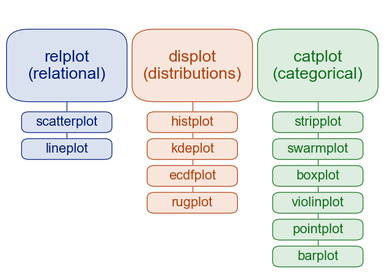

# Python 金融建模：基础与应用

MIT Licensed | Copyright © 2024-present by [Yun Liao ](mailto:james@x.cool)

## Python 基础篇（第1-4章）

第1章：Python 基础

第2章：Python 数据结构

第3章：Python 函数与类

第4章：Python 数据分析库简介

---

### 第4章：Python 数据分析常用库简介

#### 4.1 Python 文件结构和文件操作

文件结构 在 Python 中，文件被表示为一个对象，可以使用内置的 open() 函数创建。文件结构包括目录（文件夹）中包含多个文件的特定扩展名。在一个较成熟的 Python 项目中，一般的目录结构如下：

project_name/：
__init__.py(可选）：使目录成为 Python 包的一种特殊文件。
models.py：包含数据模型或类。
controllers.py：包含控制器函数或类，处理请求。
views.py：包含视图函数或类，负责呈现模板。
utils.py：包含utility 函数或类，用于项目中的多个地方。
main.py：应用程序的入口点，程序开始执行的起点

创建新的文件 要创建一个新的文件，在 Python 中，可以使用 open() 函数与 'w'(写)模式，从现有文件中读取 要从现有文件中读取，可以使用 open() 函数与 'r'(读)模式：。例如：

```python
#这段代码创建了一个名为 new_file.txt 的新文本文件，并将字符串 'Hello, World!' 写入其中。
with open('new_file.txt', 'w') as f:
    f.write('Hello, World!')
#这段代码从名为 existing_file.txt 的文本文件中读取内容，并打印
with open('existing_file.txt', 'r') as f:
    content = f.read()
print(content)
```

向文件写入 要向现有文件中写入或创建新的文件，可以使用 open() 函数与 'a'(追加)或 'w'(写)模式：

```
with open('file_to_write.txt', 'w') as f:
    f.write('This is a new line.')
```

###### Python中的路径名和转义符（/正斜杠和\反斜杠）

在 Python 中，在 Windows 操作系统上， / 和 \ 都有自己的用法。

/ 正斜杠的应用

在windows和python的路径名中，/ 是一个文件分隔符，可以用来将文件夹和文件分开。例如："C:/Windows"。
在 URL 中，/ 是一个目录分隔符，用于分开不同的目录层级。例如："http://example.com/path/to/resource/"。

反斜杠 (\\)

反斜杠是用于表示正斜杠本身的字符。例如：

在字符串中，如果你想要表示一个正斜杠，你需要使用**两个反斜杠**，例如："C:\\\Windows"。
在路径名中，如果你想要表示一个反斜杠，你需要使用**三个反斜杠**，例如：r"C:\Windows\"。

反斜杠作为转义符

在 Python 中，反斜杠 () 可以用作转义符（escape character），用于转义特殊字符或表示换行符。

转义特殊字符

在字符串中，使用 \ 可以转义特殊字符，如：
\n 表示换行符
\t 表示制表符
\\ 表示反斜杆本身
\r 表示回车符
\f 表示进纸符
在正则表达式中，使用 \ 可以转义特殊字符，如：
\d 表示数字
\w 表示单词字符（字母、数字或下划线）

```python
print("Hello\nWorld")
```

##### 4.1.1 OS库和SYS库

在 Python 中，os 库和 sys 库都是操作系统相关的库，可以用于获取和设置系统相关信息、处理文件和目录、执行 shell 命令等。

os 库

os.name: 返回当前操作系统的名称（例如：'Windows'、'Mac'、'Linux'）。
os.getcwd(): 获取当前工作目录。
os.chdir(path): 更改当前工作目录到指定路径。
os.listdir(path): 列出指定目录中的文件和子目录。
os.path.join(a, *b): 将多个路径组合成一个路径。
os.path.split(path): 将路径分割成目录和文件名。

```python
import os
print(os.name)  # prints the current OS name (e.g. 'Windows', 'Darwin', 'Linux')
print(os.getcwd())  # prints the current working directory
os.chdir('/path/to/new/directory')  # changes the current working directory
print(os.listdir('/path/to/directory'))  # lists the files and subdirectories in '/path/to/directory'
```

sys 库

sys.platform: 返回当前操作系统的平台名称（例如：'win32'、'darwin'、'linux2'）。
sys.version: 返回 Python 的版本号。
sys.exit([arg]): 退出当前程序，传入的参数将作为错误信息。
示例：

```python
import sys
print(sys.platform)  # prints the current platform name (e.g. 'win32', 'darwin', 'linux2')
print(sys.version)  # prints the current Python version
sys.exit(1)  # exits the program with an error code of 1

```

os 库和 sys 库都是操作系统相关的库，可以用于获取和设置系统相关信息、处理文件和目录、执行 shell 命令等。

##### 4.1.2 实例：如何遍历文件夹读取特定文件

以下示例为遍历某个文件夹并将其中包含有代码，例如股票代码的文件进行处理的案例

```python
import pandas as pd
import os
import re
####path 为要读取的文件所在windows路径
path= "E://tmp/董事会"
os.chdir(path)
filelist1 = []
filelist2 = []
filelist3 = []
for root, dirs, files in os.walk(path): #读取文件夹路径
    for file in files:  
        if file.endswith('.xlsx'):   ###只读取以xlsx结尾的文件
           filelist1.append(root +'/'+ file)    #####filelist1 是文件包含路径的全名
           filelist2.append(file)    #####filelist2是文件的名称

####使用正则方法抽取代码
def extractnum(char):   
    chars=re.search(r"\d+",char)
    if chars==None:
        charsnum= 0
    else:
        charsnum=chars.group() 
    return charsnum

####逐一读取并合并文件
for i in range(len(filelist2)):
    dfx =  pd.read_excel(filelist2[i],skipfooter=3)  
    dfx1=  dfx.dropna(axis=0, how='all')
    codenow = int(extractnum(str(filelist2[i])))
```

#### 4.2 使用 Pandas 进行数据处理和分析

##### 4.2.1对 Pandas 的介绍及加载和manipulation 数据集

什么是 Pandas?

Pandas是一个开源库，它为 Python 提供高性能、易于使用的数据结构和数据分析工具。它允许您高效地处理有结构化数据，如电子表格和 SQL 表。使用 Pandas，您可以执行各种数据操作任务，例如 filtering、排序、分组和合并数据。

Pandas 的关键特性

数据结构：Pandas 提供两个主要数据结构：Series（1-维标签数组）和 DataFrame（2-维标签数据结构，其中列可以具有不同类型）。
数据操作：Pandas 提供了一系列方法来操作数据，包括过滤(filtering)、排序（sort）、分组（groupby）、合并和重塑数据(merge/concat/reshape)。
数据分析：Pandas 提供了各种工具来分析数据，例如计算统计信息、执行分组操作和创建 pivot 表。
与其他库集成：Pandas 与其他流行 Python 库，包括 NumPy、Matplotlib 和 Scikit-learn，紧密集成。

要使用 Pandas，您需要使用 pip 安装它：

pip install pandas

安装后，您可以在 Python 脚本或 Jupyter  notebook 中导入库：

```python
import pandas as pd
```

让我们从简单示例开始。假设我们有一个名为 "students.csv" 的 CSV 文件，其中包含一些基本信息关于学生：

```csv
StudentID,Name,Age,Grade
1,Jane Doe,19,12
2,John Smith,20,11
3,Mary Johnson,18,13
...
```

我们可以使用 Pandas 读取这个数据，并将其转换为 DataFrame：

```python
df = pd.read_csv('students.csv')
print(df.head())   # 打印 DataFrame 的前几行
```

**Pandas 数据结构**

Pandas Series 与 NumPy 数组类似，但具有额外的标签数据特性。Dataframe 是一个 2 维数据结构，可以被视为一系列 Series 对象的集合。

以下是一个创建 Series 的示例：

```python
import pandas as pd
s = pd.Series([1, 2, 3, 4], index=['a', 'b', 'c', 'd'])
print(s)
```

输出：

```a
b    2
c    3
d    4
dtype: int64
```

以下是一个创建 DataFrame 的示例：

```python
df = pd.DataFrame({'Name': ['Jane Doe', 'John Smith', 'Mary Johnson'], 
                    'Age': [19, 20, 18], 
                    'Grade': [12, 11, 13]})
print(df)
```

输出：

```Name
0     Jane Doe   19     12
1    John Smith   20     11
2  Mary Johnson   18     13
```

**Pandas 数据操作**

Pandas 提供了各种方法来操作数据，包括：

* 过滤：根据条件选择特定的行或列。
* 排序：按一列或多列排序数据。
* 分组：根据一个或多个列分组数据，并执行聚合操作。
* 合并：将两个或更多 DataFrames 组合起来，基于共同的列。

这些只是 Pandas 的基础，但是我希望这篇文章已经激发了您对使用它进行数据科学项目的兴趣。在未来的文章中，我们将更深入探索 Pandas 的特性和应用。

**参考文献**

* [Pandas 文档](https://pandas.pydata.org/pandas-docs/stable/)
* [Python 数据科学手册](https://jakevdp.github.io/PythonDataScienceHandbook/)（第 2-4 章）

##### 4.2.2 分组、排序和过滤数据

使用 Pandas 分组数据

假设您拥有一个包含学生信息的数据集，包括姓名、年龄和成绩。您想根据年龄组别分析每个年龄组的平均成绩。这是分组的作用。Pandas 允许您按照一或多列将数据分组，并对分组后的数据执行聚合操作，然后遍历组别。

以下是一个示例：

```python
import pandas as pd

# 创建一个 sample 数据集
data  = {'Name': ['John', 'Mary', 'Jane', 'Bob', 'Alice'], 
         'Age': [25, 30, 20, 35, 22], 
         'Grade': [85, 90, 78, 92, 88]}
df  = pd.DataFrame(data)

# 按年龄组别分组并计算平均成绩
grouped_df  = df.groupby('Age')['Grade'].mean()
print(grouped_df)
"""
输出
Age
20    78.0
25    85.0
30    90.0
35    92.0
Name: Grade, dtype: float64

```

使用 Pandas 排序数据

现在，让我们说您想对数据集排序，以便按照学生的年龄在降序排序。Pandas 提供了一个简单的方法来实现这个操作，即 sort_values 方法。

以下是一个示例：

```python
#对数据框排序，以便按照年龄在降序排序
sorted_df  = df.sort_values(by='Age', ascending=False)
print(sorted_df)
```

使用 Pandas 过滤数据

假设您想过滤数据集，只包含年龄超过 25 的学生。Pandas 提供了一个简单的方法来实现这个操作，即 query 方法。

以下是一个示例：

```
# 对数据框过滤，以便只包含年龄超过 25 的学生
filtered_df  = df.query('Age > 25')
print(filtered_df)
```

##### 4.2.3 合并和连接数据集

合并（join）是一种将多个数据集组合成一个数据集的方法，基于公共列或键。例如，想象您拥有两个数据集：一个包含客户信息另一个包含订单信息。您想将这些数据集组合成一个数据集，以便分析客户购买行为。Pandas 提供了 merge 函数来实现这个操作。

```
import pandas as pd
# 创建 sample 数据集
customers  = {'Name': ['John', 'Mary', 'Jane'], 
              'Age': [25, 30, 20]}
orders  = {'Customer': ['John', 'Mary', None], 
           'Order Date': ['2020-01-01', '2020-02-15', None]}
customers_df  = pd.DataFrame(customers)
orders_df  = pd.DataFrame(orders)

# 使用 Customer 列将数据集组合成一个数据集
merged_df  = pd.merge(customers_df, orders_df, on='Customer')
print(merged_df)

```

连接(combine)是一种相关的概念到合并，但是它允许您将数据集组合成一个数据集，而不修改原始数据集。这技术对于当您想保留原始数据集的完整性时非常有用。例如，想象您拥有两个数据集：一个包含客户信息另一个包含订单信息。您想将这些数据集连接起来，以便分析购买行为。Pandas 提供了 merge 函数，具有多种连接选项（inner、left、right、outer），来实现这个操作。

```python
import pandas as pd
# 创建 sample 数据集
customers  = {'Name': ['John', 'Mary', 'Jane'], 
              'Age': [25, 30, 20]}
orders  = {'Customer': ['John', 'Mary', None], 
           'Order Date': ['2020-01-01', '2020-02-15', None]}
customers_df  = pd.DataFrame(customers)
orders_df  = pd.DataFrame(orders)

# 使用 inner 连接将数据集组合成一个数据集
joined_df  = pd.merge(customers_df, orders_df, how='inner', on='Customer')
print(joined_df)

```

在这个示例中，how='inner' 选项指定我们想要执行一个 inner 连接，即仅包含两个数据集都存在匹配的行。

四种连接方式：inner，outer，left，right的具体解释
inner：内连接，取交集，只有相同的键才会连接且显示出来
outer：外连接，取并集，只要存在就连接并显示出来，空值填充不存在的值。
left：左连接，左边取全部，右边取部分，空值填充不存在的值。
right：右连接，右边取全部，左边取部分，空值填充不存在的值。

##### 4.2.4 reshape 和 Pivot 表操作

Pandas 提供了 melt 函数将我们的数据从宽格式转换到长格式，这在分析时更有用处。

假设我们有一个包含学生成绩的数据集:

```python
data = {'Student': ['Alice', 'Bob', 'Charlie'],
        'Math': [90, 80, 70],
        'Science': [95, 85, 75]}

df = pd.DataFrame(data)

# 将数据转换到长格式，以便每个成绩为单独的一行
melted_df = pd.melt(df, id_vars='Student', value_name='Grade')
print(melted_df)
```

或者从长格式转为宽格式

以及多重索引列表转为长格式

##### 4.2.5 pandas数据预处理案例

以pandas 读取数据和写入时间序列数据为例

读取金融数据 金融数据通常以各种格式存储，如 CSV 文件或 Excel 电子表格。使用 pandas 读取这些数据，可以使用 read_ csv/read_excel 函数, 写入时间序列数据 当我们处理时间序列数据时，就需要保持正确的顺序和格式。pandas 提供了一种高效地将这些数据写入 CSV 文件的方法：

```python
import tushare as ts    ###pip install tushare安装tushare库
import pandas as pd
# 获取Tushare API handle
pro = ts.pro_api('你的API密钥')
# 获取股票日线数据
df = pro.daily(ts_code='000001.SZ', start_date='20230101', end_date='20231231')
# 打印数据前几行
print(df.head())
# 获取股票日线数据
df = pro.daily(ts_code='000001.SZ', start_date='20230101', end_date='20231231')
# 打印数据前几行
print(df.head())

```

数据清洗或预处理

```python
# 删除缺失值
df.dropna(inplace=True)
# 转换日期格式
df['trade_date'] = pd.to_datetime(df['trade_date'])

# 设置日期为索引
df.set_index('trade_date', inplace=True)

# 打印清洗后的数据
print(df.head())
```

计算收益率和平均线(MA）

```python
df['daily_return'] = df['close'].pct_change()
# 打印每日收益率数据
print(df[['close', 'daily_return']].head())
# 计算50日和200日移动平均线
df['ma50'] = df['close'].rolling(window=50).mean()
df['ma200'] = df['close'].rolling(window=200).mean()
# 打印移动平均线数据
print(df[['close', 'ma50', 'ma200']].head())
```

可视化：收盘价走势和移动平均线

```python
import matplotlib.pyplot as plt
# 绘制收盘价走势
df['close'].plot(figsize=(10, 6))
plt.title('Stock Close Price')
plt.xlabel('Date')
plt.ylabel('Close Price')
plt.grid(True)
plt.show()

# 绘制移动平均线
df[['close', 'ma50', 'ma200']].plot(figsize=(10, 6))
plt.title('Stock Close Price and Moving Averages')
plt.xlabel('Date')
plt.ylabel('Price')
plt.grid(True)
plt.show()
```

基于MA的简单策略示例

```python
mport numpy as np
# 计算买入和卖出信号
df['signal'] = 0
df['signal'][50:] = np.where(df['ma50'][50:] > df['ma200'][50:], 1, 0)
df['position'] = df['signal'].diff()

# 策略回测
initial_capital = 100000.0
df['holdings'] = df['close'] * df['position'].cumsum()
df['cash'] = initial_capital - (df['close'] * df['position']).cumsum()
df['total'] = df['holdings'] + df['cash']

# 绘制策略收益曲线
df['total'].plot(figsize=(10, 6))
plt.title('Strategy Total Equity')
plt.xlabel('Date')
plt.ylabel('Total Equity')
plt.grid(True)
plt.show()

```

#### 4.3  Numpy库的使用

##### 4.3.1Numpy 的介绍

NumPy 是一个 Python 包。 它代表 “Numeric Python”。 它是一个由[多维数组](https://so.csdn.net/so/search?q=%E5%A4%9A%E7%BB%B4%E6%95%B0%E7%BB%84&spm=1001.2101.3001.7020)对象和用于处理数组的例程集合组成的库。

**Numeric** ，即 NumPy 的前身，是由 Jim Hugunin 开发的。 也开发了另一个包 Numarray ，它拥有一些额外的功能。 2005年，Travis Oliphant 通过将 Numarray 的功能集成到 Numeric 包中来创建 NumPy 包。 这个开源项目有很多贡献者。

使用NumPy，开发人员可以执行以下操作：

* 数组的算数和逻辑运算。
* 傅立叶变换和用于图形操作的例程。
* 与线性代数有关的操作。 NumPy 拥有线性代数和随机数生成的内置函数。

NumPy – MatLab 软件的替代之一

NumPy 通常与  **SciPy** （Scientific Python）和  **Matplotlib** （绘图库）一起使用。 这种组合广泛用于替代 MatLab，是一个流行的技术计算平台。 但是，Python 作为 MatLab 的替代方案，现在被视为一种更加现代和完整的编程语言。

NumPy 是开源的，这是它的一个额外的优势。

NumPy - Ndarray 对象

NumPy 中定义的最重要的对象是称为 `ndarray` 的 N 维数组类型。 它描述相同类型的元素集合。 可以使用基于零的索引访问集合中的项目。`ndarray`中的每个元素在内存中使用相同大小的块。 `ndarray`中的每个元素是数据类型对象的对象（称为 `dtype`）。从 `ndarray`对象提取的任何元素（通过切片）由一个数组标量类型的 Python 对象表示。 下图显示了 `ndarray`，数据类型对象（`dtype`）和数组标量类型之间的关系。

```
import numpy as np 
a = np.array([1,2,3])  
print(a)
# 多于一个维度  
import numpy as np 
a = np.array([[1,  2],  [3,  4]])  
print(a)
```

numpy库的索引 (Indexing)、切片（slicing):

[]: 获取数组中的元素

ndindex(): 获取 NumPy 数组的索引

##### 4.3.2基本操作（统计、算术、比较）

Numpy库的统计函数、算术、比较函数

1. 统计函数 (Statistics)：mean(): 计算平均值；median(): 计算中位数；mode(): 计算众数；std(): 计算标准差；var(): 计算方差；min(), max(): 计算最小值和最大值
2. 算术运算 (Arithmetic)数函： +, -, *, /: 基本算术运算；sum(): 计算总和；prod(): 计算乘积
3. 比较运算 (Comparison)： ==, !=, <, <=, >, >=: 基本比较运算；equal(): 检查数组是否相等

```
arr = np.array([1, 2, 3, 4, 5])
print(np.median(arr))   # 输出：3.0
print(np.std(arr))   # 输出：1.581138830096
arr1 = np.array([1, 2, 3])
arr2 = np.array([4, 5, 6])
print(arr1 + arr2)   # 输出：[5 7arr = np.array([1, 2, 3, 4, 5])
print(np.where(arr < 3))   # 输出：(array([0, 1]),)
arr1 = np.array([1, 2, 3])
arr2 = np.array([4, 5, 6])
print(arr1 - arr2)   # 输出：[-3 -3 -3]
print(arr1 * arr2)   # 输出：[ 4 10 18]
```

##### 4.3.3数据manipulation（reshape、transpose）

在 NumPy 中，你可以使用 reshape() 和 transpose() 函数来 manipulation 数据。这些函数可以帮助您将数据从一种形状转换为另一种形状，这对数据处理和分析非常有用。

1. Reshape（重塑）
   reshape() 函数用于将 NumPy 数组从一种形状转换为另一种形状。
2. Transpose（转置）
   transpose() 函数用于将 NumPy 数组的维度交换

```
import numpy as np
# 创建一个 3x4 的数组
arr = np.zeros((3, 4))
print(arr.shape)  # 输出：(3, 4)
# 将数组reshape为一个 12x1 的数组
arr = arr.reshape(-1, 1)
print(arr.shape)  # 输出：(12, 1)
arr = arr.transpose()
arr = arr.T
print(arr.shape)  # 输出：(4, 3)
```

##### 4.3.4矩阵和线性代数操作

1、创建矩阵

```python
import numpy as np
# 创建一个 3x4 的矩阵
A = np.array([[1, 2, 3, 4],
               [5, 6, 7, 8],
               [9, 10, 11, 12]])
print(A)

```

2、矩阵加法和减法

```python
# 创建一个 3x4 的矩阵 B
B = np.array([[1, 2, 3, 4],
               [5, 6, 7, 8],
               [9, 10, 11, 12]])

print(A + B)   # 加法
print(A - B)   # 减法
```

3、矩阵乘法

```python
# 创建一个 4x2 的矩阵 C
C = np.array([[1, 2],
                 [3, 4],
                 [5, 6],
                 [7, 8]])

print(np.dot(A, C))   # 矩阵乘法

```

4、求解线性方程组

```
# 创建一个 3x1 的矩阵 b
b = np.array([6, 12, 18])
print(np.linalg.solve(A, b))   # 求解线性方程组
```

5、计算矩阵的行列式（determinant）和逆矩阵（inverse)

```
print(np.linalg.det(A))   # 计算矩阵的 determinant
print(np.linalg.inv(A))   # 计算矩阵的 inverse
```

#### 4.4  Scipy 库

##### 4.4.1 Scipy库简介

SciPy 是一个开源库，它提供了大量的算法用于科学与工程应用。它建立在 NumPy（Numerical Python）的基础上，并旨在使其易于使用和灵活 enough 处理复杂的问题。SciPy 的主要目的是提供高效且可靠的数字算法实现，使其成为科学家、工程师和研究者的必备工具。

SciPy 库的关键特性

线性代数： SciPy 提供了广泛的线性代数函数，包括矩阵运算、特征值分解、奇异值分解等。
优化： SciPy 提供了多种优化算法，例如最小化、最大化和根搜索，以帮助您找到解决问题的最佳解决方案。
统计学： SciPy 包括广泛的统计函数，包括假设检验、置信区间和回归分析等。
信号处理： SciPy 提供了用于信号处理的工具，例如滤波、卷积和 Fourier transform 等。
积分： SciPy 允许您执行数字积分，以便使用不同的方法，例如trapazoidal rule、Simpson 的规则和高斯积分等。

Scipy的模块：

linalg 模块：这个模块提供了线性代数运算函数，包括矩阵乘法、行列式计算和特征值分解等。

```python
import scipy. linalg as la
A  = np.array([[1, 2, 3], [4, 5, 6]])
eigenvalues  = la.eig(A)
print(eigenvalues)
```

Optimize 模块：这个模块提供了多种优化算法，例如最小化和最大化。

```python
import scipy.optimize as opt
def func(x):
    return x**2 + 3*x + 1
x0 = 1.5
result  = opt.minimize(func, x0)
print(result)
```

stats 模块：这个模块提供了广泛的统计函数，包括假设检验和置信区间

```python
import scipy.stats as sts
# 做一个t 检验的两样本测试
t_stat, p_value  = sts.ttest_inddependent([1, 2], [3, 4])
print(t_stat)
```

signal 模块：这个模块提供了用于信号处理的工具，例如滤波和卷积。

```python
import scipy.signal as sig
# 创建一个具有高斯形状的信号
t = np.linspace(0, 1, 100)
s = np.exp(-(t-0.5)**2/0.1)
# 使用低通滤波对信号进行处理
filtered_s  = sig.lfilter([1], [1, -0.9], s)
print(filtered_s)
```

integrate 模块：这个模块提供了用于数值积分的函数，包括trapazoidal rule 和 Simpson 的规则。

```python
import scipy.integrate as integ
# 定义要积分的函数
def f(x):
    return x**2 + 3*x + 1
# 使用trapezoidal rule 进行数字积分
result  = integ.quadtr(f, 0, 1)
print(result)
```

##### 4.4.2 使用Scipy解线性方程组、计算特征值和特征向量

本节介绍如何使用Scipy的linalg函数

线性系统的解

```python
import numpy as np
from scipy.linalg import solve
# 定义系数矩阵 A
A = np.array([[3, 1], [2, -1]])
# 定义常数项 vector b
b = np.array([10, 5])
# 使用 SciPy 的 solve 函数解决线性系统 Ax = b
x = solve(A, b)
print("解:", x)
```

特征值和特征向量计算

```python
import numpy as np
from scipy.linalg import eigs
# 定义矩阵 A
A = np.array([[4, -1], [1, 2]])
# 使用 SciPy 的 eigs 函数计算矩阵 A 的特征值和特征向量
eigenvalues, eigenvectors = eigs(A)
print("特征值:", eigenvalues)
print("特征向量:")
for i in range(len(eigenvalues)):
    print(f"特征向量对应特征值 {eigenvalues[i]:.2f}：")
    print(eigenvectors[:, i])
```

##### 4.4.3 优化技术

scipy中的优化任务（Optimization）模块，也是使用最多的模块，这个模块提供了一些常用的优化算法，可以用来解决各种类型的问题。

```
from scipy.optimize import minimize
# 定义一个函数，用于最小化
def func(x):
    return x**2 + 10*np.sin(x)
# 初始化参数
x0 = [1]

# 使用 L-BFGS 算法进行优化
res = minimize(func, x0, method="L-BFGS")
print(res.x)  # 输出最小值的参数
```

```
from scipy.optimize import minimize
# 定义一个函数，用于最小化
def func(x):
    return x**2 + 10*np.sin(x)
# 初始化参数
x0 = [1]
# 使用 Trust-Region Reflective 算法进行优化
res = minimize(func, x0, method="TRUST-NR")
# 使用 SLSQP 算法进行优化
res = minimize(func, x0, method="SLSQP")
print(res.x)  # 输出最小值的参数
```

#### 4.5 使用 Matplotlib 和 Seaborn 进行数据可视化

##### 4.5.1 创建 plots（直线图、散点图、柱状图、直方图）

Matplotlib 是 Python 中一个非常流行的数据可视化库，可以用来创建各种类型的图形。下面，我们将使用 Matplotlib 画三个常见的图形：直线图、散点图和柱状图。

1、直线图示例

```
import matplotlib.pyplot as plt
import numpy as np
# 生成一些数据
x = np.linspace(0, 10, 100)
y = np.sin(x)
# 创建图形
plt.plot(x, y)
# 添加标题和坐标轴
plt.title('Sine Wave')
plt.xlabel('X Axis')
plt.ylabel('Y Axis')
# 显示图形
plt.show()

```

2、散点图示例

```
import matplotlib.pyplot as plt
import numpy as np
# 生成一些数据
x = np.random.rand(100)
y = np.random.rand(100)
# 创建图形
plt.scatter(x, y)
# 添加标题和坐标轴
plt.title('Random Scatter')
plt.xlabel('X Axis')
plt.ylabel('Y Axis')
# 显示图形
plt.show()
```

3. 柱状图（Bar Plot）

```
import matplotlib.pyplot as plt
# 生成一些数据
categories = ['Category A', 'Category B', 'Category C']
values = [10, 15, 20]
# 创建图形
plt.bar(categories, values)
# 添加标题和坐标轴
plt.title('Bar Plot')
plt.xlabel('Categories')
plt.ylabel('Values')
# 显示图形
plt.show()
```

##### 4.5.2自定义 plot 外观（标签、颜色、字体）

Matplotlib 自定义图形外观

1. 设置图形标题
2. 自定义坐标轴标签和刻度
3. 选择字体样式和大小
4. 选择线、标记和填充颜色

要设置图形的标题，您可以使用plt.title() 函数; 自定义坐标轴标签，您可以使用 xlabel() 和 ylabel() 函数；要自定义字体样式和大小，可以使用 rcParams 字典：：

```python
import matplotlib.pyplot as plt
# 设置字体样式和大小
plt.rcParams['font.family'] = 'serif'
plt.rcParams['font.size'] = 12
# 创建一个示例图形
x = [1, 2, 3]
y = [2, 4, 6]
plt.plot(x, y)
plt.title('自定义图形标题')
plt.xlabel('X 轴标签')
plt.ylabel('Y 轴标签')
plt.show()
```

选择线颜色方案、粗细和填充

```python
import matplotlib.pyplot as plt
# 设置颜色方案
plt.rcParams['lines.linewidth'] = 2.0
plt.rcParams['lines.color'] = 'red'
plt.rcParams['patch.facecolor'] = 'blue'
# 创建一个示例图形
x = [1, 2, 3]
y = [2, 4, 6]
plt.plot(x, y, color='green')
plt.scatter(x, y, marker='o', color='orange')
plt.fill_between(x, y, color='purple')
plt.show()
```

查询本机中的字体

```python
from matplotlib import font_manager
fm = font_manager.FontManager()
[font.name for font in fm.ttflist] # 列表生成式
plt.colormaps() ####查询可用的颜色
```

坐标轴的刻度使用 plt.xlim(），plt.ylim()设置

```python
import numpy as np
import matplotlib.pyplot as plt
x = np.linspace(0,2 * np.pi,100)
# 说明：正弦波。x：NumPy数组
# 所有的数据，进行正弦计算
y = np.sin(x)
plt.plot(x,y)#这里绘制的图是默认的，以下代码是进行图片美化
plt.xlim(-1,10)#x的坐标轴范围
plt.ylim(-1.5,1.5)#y轴的范围
#grid指网格线，alpha透明度，linestyle指虚线，linewidth虚线宽度
plt.grid(color = 'green',alpha = 0.5,linestyle = '--',linewidth = 1)
```

坐标轴的刻度还可以使用 plt.xticks(), plt.yticks() 绘制

```python
plt.figure(figsize=(9,6))#调整图片尺寸
plt.plot(x,y)
# 设置字体
plt.rcParams['font.family'] = 'Adobe Kaiti Std'
#设置字体大小
plt.rcParams['font.size'] = 28
# 设置数字负号（等于false时表示负号可以正常展示）
plt.rcParams['axes.unicode_minus'] = False
plt.title('正弦波',fontsize = 18,color = 'red',pad = 20)
plt.xlabel('X')#x轴标签
plt.ylabel('f(x) = sin(x)',rotation = 0,horizontalalignment = 'right')#rotation，fx旋转
a = plt.yticks([-1,0,1])#y轴刻度
#设置x轴刻度
_ = plt.xticks([0,np.pi/2,np.pi,1.5*np.pi,2*np.pi],
               [0,r'$\frac{\pi}{2}$',r'$\pi$',r'$\frac{3\pi}{2}$',r'$2\pi$'],color = 'red')# 字符串前面+r表示转义，$pi$=希腊字母的pi
#frac表示分号，前面的大括号表示分子，后面的大括号表示分母。
```

图例（legend）：图中存在多个序列对比时，使用图例进行对比可以增加可视化的数据信息含量。

loc参数表示图例的大致位置

bbox_to_anchor参数表示图例的精确位置

```python
import numpy as np
import matplotlib.pyplot as plt
# 1、图形绘制
x = np.linspace(0,2*np.pi) # x轴
# y轴
y = np.sin(x) # 正弦
# 绘制线形图
# 调整尺寸
plt.figure(figsize=(9,6))
plt.plot(x,y)
plt.plot(x,np.cos(x)) # 余弦波
plt.plot(x,np.sin(x) + np.cos(x))
# 2、图例
plt.legend(['Sin','Cos','Sin + Cos'],fontsize = 18,
           loc = 'center',
           ncol = 3,
           bbox_to_anchor = (0,1,1,0.2)) # x,y,widht,height
           #坐标轴左下角表示（0，0）右上角表示（1，1）
```

设置多个线条的线形（ls参数），和节点的形状（marker参数）

```
import numpy as np
import matplotlib.pyplot as plt
x = np.linspace(0,2*np.pi,20) # 等差数列，20个
y1 = np.sin(x)
y2 = np.cos(x)
# 设置颜色，线型，点型
plt.plot(x,y1,color = 'indigo',ls = '-.',marker = 'p')
# rgb颜色表示 256 0 ~ 255 
# 0 、1、2……A、B、C、D、E、F
#marker=o就是线上的点点 p是五边形
plt.plot(x,y2,color = '#FF00EE',ls = '--',marker = 'o')
# 0 ~ 1之间
plt.plot(x,y1 + y2,color = (0.2,0.7,0.2),marker = '*',ls = ':')
plt.plot(x,y1 + 2*y2,linewidth = 5,alpha = 0.3,color = 'orange') # 线宽、透明度
# b --- blue o marker圆圈， --虚线# 参数连用
plt.plot(x,2*y1 - y2,'bo--') 
```

##### 4.5.3 matplotlib绘制多图

subplot命令用于绘制多图

以下介绍几种绘制多图的方法和示例：

1. 多图简单排列
2. 多图不同背景
3. 图嵌套（图中有图）
4. 多图不平均排列
5. 双Y轴或双X轴

```python
import numpy as np
import matplotlib.pyplot as plt
x = np.linspace(0,2*np.pi)
plt.figure(figsize=(9,6))
# 创建子视图
# 2行，1列，1第一个图
ax = plt.subplot(2,1,1)
ax.plot(x,np.sin(x))
# 后面这个2就是编号，从1，开始
# 1,2,3,4
# 5,6,7,8
# 9,10,11,12
ax = plt.subplot(2,1,2) # 2行，1列，第二个视图
ax.plot(x, np.cos(x))
```

绘制四个图

```python
fig,axes = plt.subplots(2,2) # 四个图
# 索引，0开始
axes[0,0].plot(x,np.sin(x),color = 'red')
axes[0,1].plot(x,np.sin(x),color = 'green')
axes[1,0].plot(x,np.cos(x),color = 'purple')
axes[1,1].plot(x,np.cos(x))
```

绘制不同背景的图形

```python
import numpy as np
import matplotlib.pyplot as plt
x = np.linspace(-np.pi,np.pi,20)
y = np.sin(x)
# 子视图1
plt.figure(figsize=(9,6))
ax = plt.subplot(221) # 两行两列第一个子视图
ax.plot(x,y,color = 'red')
ax.set_facecolor('green') # 调用子视图设置方法，设置子视图整体属性
# 子视图2
ax = plt.subplot(2,2,2) # 两行两列第二个子视图
line, = ax.plot(x,-y) # 返回绘制对象,列表中只有一个数据，取出来
line
line.set_marker('*') # 调用对象设置方法，设置属性
line.set_markerfacecolor('red')
line.set_markeredgecolor('green')
line.set_markersize(10)
# 子视图3
ax = plt.subplot(2,1,2) # 两行一列第二行视图
plt.sca(ax) # 设置当前视图
x = np.linspace(-np.pi,np.pi,200)
# 直接调用plt
plt.plot(x,np.sin(x*x),color = 'red')
```

视图嵌套

```python
import numpy as np
import matplotlib.pyplot as plt
x = np.linspace(-np.pi,np.pi,25)
y = np.sin(x)
fig = plt.figure(figsize=(9,6)) # 创建视图
plt.plot(x,y)
# 嵌套方式一，axes轴域（横纵坐标范围），子视图
# x,y,width,height
ax = plt.axes([0.2,0.55,0.3,0.3]) # 参数含义[left, bottom, width, height]
ax.plot(x,y,color = 'g')
# 嵌套方式二
# 具体对象，添加子视图
ax = fig.add_axes([0.55,0.2,0.3,0.3]) # 使用视图对象添加子视图
ax.plot(x,y,color = 'r')
```

不平均分布视图

```python
mport numpy as np
import matplotlib.pyplot as plt
x = np.linspace(0,2*np.pi,200)
fig = plt.figure(figsize=(12,9))
# 使用切片方式设置子视图
ax1 = plt.subplot(3,1,1) # 视图对象添加子视图
ax1.plot(x, np.sin(10*x))
# 设置ax1的标题，xlim、ylim、xlabel、ylabel等所有属性现在只能通过set_属性名的方法设置
ax1.set_title('ax1_title')  # 设置小图的标题
# 添加：第二行，第一和第二列
ax2 = plt.subplot(3,3,(4,5))
ax2.set_facecolor('green')
ax2.plot(x,np.cos(x),color = 'red')
# 添加，右下角，那一列
ax3 = plt.subplot(3,3,(6,9))
ax3.plot(x,np.sin(x) + np.cos(x))
ax4 = plt.subplot(3,3,7)
ax4.plot([1,3],[2,4])
ax5 = plt.subplot(3,3,8)
ax5.scatter([1,2,3], [0,2, 4])
ax5.set_xlabel('ax5_x',fontsize = 12)
ax5.set_ylabel('ax5_y',fontsize = 12)
plt.show()
```

双轴视图

```python
import numpy as np
import matplotlib.pyplot as plt
x = np.linspace(-np.pi, np.pi,50)
y = np.sin(x)
plt.plot(x,y,color = 'blue')
_ = plt.yticks(np.linspace(-1,1,11),color = 'blue')
ax = plt.gca()# 获取当前视图
# twinx 请问是否有twiny呢？有的 ，就是公用y轴，然后两个x轴。
ax2 = ax.twinx() # 双胞胎，两个X轴合到一起的，两个X轴，对应着两个Y轴
# 其中一个视图，纵坐标范围：-1~1.0
# 另一个视图，范围 0 ~ 25
# 刻度会自适应
y2 = np.exp(x)
plt.plot(x,y2,color = 'red') # 默认向ax2这个子视图中绘制
_ = plt.yticks(np.arange(0,26,5),color = 'red')
```

##### 4.5.4 体现多变量的关系（seaborn)

Seaborn库的主要特点(详细的教程可见 [seaborn官网](http://seaborn.pydata.org/tutorial.html))

* 基于matplotlib，增加了绘图模式
* 增加调色板功能，色彩更加丰富
* 可以更方便的实现多变量的关系图
* 具有内建的聚类算法，回归算法，可以绘制一些简单的相关图形

较常用的一些使用函数包含：**relplot()：关系图；catplot():类型图；displot() 分布图；**回归图(regplot(),lmplot())；热力图和聚类图（heatmap,clustermap)

其他设置包括：facegrid(),pairgrid(),主题和环境设置（style,context)



###### SNS.relplot()

Relational plots 主要讨论三个函数：

* scatterplot(散点图)
* lineplot(线图)
* relplot(关系图)

Seaborn函数中的参数特别多，但是其实大部分都是相同的，因此，我们可以很容易类推到其他函数的使用。下面简单介绍这些参数的含义。

relplot(参数)

* x,y: 传入的 `特征名字或Python/Numpy数据`，x表示横轴，y表示纵轴，一般为dataframe中的列。如果传入的是特征名字，那么需要传入data，如果传入的是Python/Numpy数据，那么data不需要传入。因为Seaborn一般是用来可视化Pandas数据的，如果我们想传入数据，那使用Matplotlib也可以。
* hue: 分组变量，将产生不同颜色的点。可以是分类的，也可以是数字的。`被视为类别`。
* data: 传入的数据集，可选。一般是dataframe
* style: 分组变量，将产生不同标记点的变量分组。`被视为类别`。
* size: 分组变量，将产生不同大小的点。可以是分类的，也可以是数字的。
* palette: 调色板，后面单独介绍。
* markers: 绘图的形状，后面单独介绍。
* kind: **relplot() 将 FacetGrid 与两个轴级函数结合：scatterplot()（默认情况下，以“scatter”为参数）和 lineplot（以“line”为参数）。**

以下是使用relplot的实例，可以运行看出其中的不同

```python
import numpy as np
import pandas as pd
import matplotlib.pyplot as plt
import seaborn as sns
sns.set_theme(style="darkgrid")
tips = sns.load_dataset("tips")   #载入sns自带的数据
###最简单的relplot
sns.relplot(data=tips, x="total_bill", y="tip", hue="smoker")
###增加了style（style和hue相同）的relplot
sns.relplot(
    data=tips,
    x="total_bill", y="tip", hue="smoker", style="smoker"
)
###style和hue不同的情况
sns.relplot(
    data=tips,
    x="total_bill", y="tip", hue="smoker", style="time",
)

###增加了调色板的relplot
sns.relplot(
    data=tips,
    x="total_bill", y="tip",
    hue="size", palette="ch:r=-.5,l=.75"
)
####增加了大小的relplot
sns.relplot(
    data=tips, x="total_bill", y="tip",
    size="size", sizes=(15, 200)
)
###使用col和row参数将一个图分解成多个图
sns.relplot(x="total_bill", y="tip", hue="time", size="size",
            palette=["b", "r"], sizes=(10, 100),col="time",row='sex', data=tips)
```

###### 数据单点的聚合和绘制

复杂的数据集将有多个对同一个x变量的测量值。seaborn 的默认行为是，在每个x值处对多个测量值进行聚合，并在平均值周围绘制95%置信区间，即 均值 和95% 可信区间。

```python
fmri = sns.load_dataset("fmri")
sns.relplot(data=fmri, x="timepoint", y="signal", kind="line")
###忽略信度区间的图
sns.relplot(
    data=fmri, kind="line",
    x="timepoint", y="signal", errorbar=None,
)
###自定义信度区间的图
sns.relplot(
    data=fmri, kind="line",
    x="timepoint", y="signal", errorbar="sd",
)
###双信度区间图
sns.relplot(
    data=fmri, kind="line",
    x="timepoint", y="signal", hue="event",
)
###区间图带hue,style and marker
sns.relplot(
    data=fmri, kind="line",
    x="timepoint", y="signal", hue="region", style="event",
    dashes=False, markers=True,
)
```

###### SNS.displot()

绘制分布相关图使用displot()，displot()可以用kind参数绘制以下大类图形

1. histplot(直方图)：histplot(直方图) 绘制单变量或双变量直方图，以显示数据集的分布。该函数可以对每个bin内计算的统计量进行 `归一化估计`频率、密度或概率质量，它可以添加一个平滑的曲线得到使用内核密度估计。
2. kdeplot(核密度图)：kdeplot(核密度图) 使用核密度估计绘制单变量或双变量分布。
3. ecdfplot(累积密度图): 显示了一个非递减的曲线，x轴表示观察值小于或等于y轴值的累积比例。
4. jointplot(联合分布图)：jointplot(联合分布图) 是直方图和核密度图的组合。
5. pairplot(变量关系组图)：pairplot(变量关系组图) 描述数据集中的 `成对关系`。默认情况下，该函数将创建一个轴网格，`对角线图` 描述该变量的 `直方图分布`，`非对角线图`描述两个变量之间的 `联合分布`。

换言之，每个x轴点对应的曲线高度是指有较小（或等）值的数据点百分比。

```python
import numpy as np
import pandas as pd
import matplotlib.pyplot as plt
import seaborn as sns
sns.set_theme(style="darkgrid")
penguins = sns.load_dataset("penguins")
###单图显示直方图和核密度图的组合
sns.jointplot(
    data=penguins,
    x="bill_length_mm", y="bill_depth_mm", hue="species",
    kind="kde"
)
###单图显示rugplot()
sns.displot(
    penguins, x="bill_length_mm", y="bill_depth_mm",
    kind="kde", rug=True
)
###多图显示
g = sns.PairGrid(penguins)
g.map_upper(sns.histplot)
g.map_lower(sns.kdeplot, fill=True)
g.map_diag(sns.histplot, kde=True)
```

###### SNS.catplot()

在关系图中，我们学习了如何使用不同的视图表示来展示数据集中多个变量之间的关系。在示例中，我们主要关注的是涉及两个数值变量之间的关系。如果其中的一个主要变量是“类别”的（即被分成离散组），那么可能需要使用更加专业的可视化方法。在seaborn中，有多种方法来可视化涉及分类数据的关系。与relplot()和scatterplot()、lineplot()之间的关系相似，存在两种方式来创建这些图表

Categorical scatterplots:

1. stripplot() (kind="strip")
2. swarmplot() (kind="swarm")
3. boxplot()(kind="box")
4. barplot()(kind="bar")

```python
tips = sns.load_dataset("tips")
sns.catplot(data=tips, x="day", y="total_bill", hue="sex", kind="swarm")
sns.catplot(data=tips, x="day", y="total_bill", kind="box")
```


#### 4.6 使用requests库和selenium库实现网络爬虫

##### 4.6.1"网络爬虫的原则"

网络爬虫是一种自动浏览 World Wide Web 的程序，它从网站中提取特定信息以便后续处理。

网络爬虫的关键功能包含：

* 爬虫: 浏览网站，通过跟随链接和解析 HTML 内容。
* 解析: 从爬取的网页中提取有用数据，例如文本、图片或结构化数据，如 JSON 或 XML。
* 过滤: 排除无关数据，去掉重复的 URL 和删除噪音（例如， JavaScript 生成的内容）。
* 存储: 将提取的数据存储在数据库、文件系统或其他存储机制中，以供后续分析。

下面介绍用于网络爬虫的主要python库

1. Scrapy：是一种流行的 Python 框架用于构建网络爬虫。Scrapy 提供了一 个易于使用的 API，用于处理常见任务，如：处理不同的 URL 和 HTTP 请求; 解析 HTML 和 XML 文件; 将数据存储在各种格式中（例如，CSV、JSON）; 处理用户代理、Cookie 和会话管理等。
2. Beautiful Soup：是一种 Python 库用于解析 HTML 和 XML 文件。 Beautiful Soup 提供了一 个简单和直观的 API，用于浏览网页、提取数据和处理各种内容。
3. Requests：是一种轻量级 Python 库用于发送 HTTP 请求。 Requests 经常与 Scrapy 或 Beautiful Soup 一起使用，以便发送 HTTP 请求和处理响应。
4. Selenium：是一个浏览器自动化工具，允许您像人类用户一样交互网页。 Selenium 可以用来自动化任务，如填写表单、点击按钮和滚动长页面。
5. Playwright：是一种 Python 库用于自动化浏览器和爬取网站。 Playwright 提供了一 个易于使用的 API，用于处理任务，如：启动浏览器（例如 Chrome、Firefox）；浏览网页；处理用户交互（例如 点击按钮、填写表单）

最佳实践
在使用 Python 库构建网络爬虫时，遵循最佳实践是非常重要的，以便确保高效和可扩展的爬虫：

* 尊重网站政策：总是遵守网站的服务条款、robots.txt 文件和爬取速度。
* 处理异常：正确地处理错误和异常，以免程序崩溃和数据损坏。
* 使用缓存和队列：实施缓存机制以减少 HTTP 请求数量，并使用队列系统（例如 RabbitMQ）来管理爬取任务。
* 监控性能和日志：保持对您的爬虫的性能监控，监控 CPU 使用率、内存消耗和网络 I/O。
* 如何获得网站的robots.txt：

```python
  import requests
  url = "https://www.example.com/robots.txt"  # 将网站换成你需要获取信息的网站地址
  response = requests.get(url)
  if response.status_code == 200:
      print(response.text)
  else:
      print("Failed to retrieve robots.txt")
```

###### 如何设置网络爬虫环境

基本网络爬虫环境的设置

```python
#!pip install requests  安装requests
# 导入所需库
import requests  # 发送 HTTP 请求
from bs4 import BeautifulSoup  # 解析 HTML 内容
import os  # 文件操作
import time  # 时间操作
# 设置爬取数据的保存目录
crawl_directory = 'Crawled_Data'  # 存储爬取数据的文件夹
# 如果目录不存在，则创建它
if not os.path.exists(crawl_directory):
    os.makedirs(crawl_directory)
# 定义一个函数来爬取一个网页并提取相关信息
def crawl_url(url):  # url：要爬取的网页地址
    """
    发送 HTTP 请求，获取 HTML 内容，然后解析 HTML 内容，提取标题、链接和文本内容。
    :param url: 要爬取的网页地址
    :return: None
    """
    # 发送 HTTP 请求到 URL，并获取 HTML 响应
    response = requests.get(url)
    # 使用 BeautifulSoup 解析 HTML 内容
    soup = BeautifulSoup(response.content, 'html.parser')  
    # 提取网页标题
    title = soup.title.string  
    # 提取所有链接
    links = [link.get('href') for link in soup.find_all('a', href=True)]
    # 提取所有文本内容
    text_content = ''
    for paragraph in soup.find_all(['p', 'div']):
        text_content += paragraph.get_text()  
    # 保存提取的信息到文件中
    with open(os.path.join(crawl_directory, f'{title}.txt'), 'w') as f:
        f.write(text_content)  
    # 打印一条消息，表示 URL 已经爬取
    print(f' Crawled {url} and saved data to {crawl_directory}/{title}.txt')

# 定义一个列表来存储要爬取的 URL
urls_to_crawl = ['https://www.example.com/page1', 'https://www.example.com/page2']
# 对每个 URL 进行爬取
for url in urls_to_crawl:
    crawl_url(url)
    # 等待 5 秒之间的爬取
    time.sleep(5)

print(' Crawling complete!')
```

这个代码设置了一个基本的网络爬虫环境，使用 Python 实现。它定义了两个主要函数：crawl_url 和 urls_to_crawl。crawl_url 函数将 URL 作为参数，发送 HTTP 请求到该 URL，解析 HTML 内容，提取相关信息（标题、链接和文本内容），并将其保存到文件中。urls_to_crawl 列表包含了要爬取的 URL。代码然后对每个 URL 进行爬取，等待 5 秒之间的爬取，然后打印一条消息，表示爬取完成。

注：这个示例假设您具有写文件的权限，并且 URLs 是公开可访问的。

##### 4.6.2 Requests 使用简介

requests 发送 HTTP 请求和响应，requests 中的 JSON 和 XML 数据处理，Selenium 是什么？为什么需要它?

Requests库提供了多种方式来发送请求，包括 GET、POST、PUT 和 DELETE 等方法。下面是一个简单的示例：

```python
import requests
url = 'https://www.example.com'
response = requests.get(url)
print(response.status_code)  # 打印响应状态码
print(response.content)  # 打印响应内容
if response.status_code == 200:
    data = response.json()  # 尝试将响应转换为 JSON 对象
    print(data)
else:
    print('Failed to retrieve data')
```

这个示例发送了一个 GET 请求到指定的 URL，获取响应，并打印出响应状态码和内容。如果响应状态码为 200，則打印出 JSON 对象；否则，打印出错误信息。处理响应(response)，例如response.text: 获取响应的文本内容；response.json(): 尝试将响应转换为 JSON 对象；response.xml(): 尝试将响应转换为 XML 对象。

```
import requests
# 设置 POST 请求的 URL 和 数据
url  =  "https://example.com/submit_data"
data  = {"name": "John", "age": 30, "occupation": "Developer"}
# 发送 POST 请求
response  = requests.post(url, json=data)
# 检查请求是否成功
if response.status_code == 200:
    print("数据提交成功!")
else:
    print("提交数据错误:", response.text)
```

###### 采用bs4库对获得的html文件进行进一步的解析

安装和导入beautifulsoup4使用以下语句即可：

```
#pip install beautifulsoup4
from bs4 import BeautifulSoup
soup = BeautifulSoup(open("xxx.html","html.parser"）
links= soup.find_all('a',href=True)
for link in links:
    link_text =link.text
    link_url = link['href]

```

以上代码示例是我们已经获得了html内容并将之转化为beautifulsoup对象，对其进行分析和提取信息。

1. 使用find_all()方法找到 `<a>`标签中所有的链接信息 `： links= soup.find_all('a',href=True)`
2. 使用循环遍历链接，并提取文本内容和链接地址。

##### 4.6.3 Selenium 简介

Selenium 是一个自动化测试工具，可以用于Web应用程序的自动化测试、爬虫和数据采集等。它支持多种浏览器，如 Chrome、Firefox 和 Edge 等。以下是一些常见的应用场景：

自动化测试：使用 Selenium 可以对 Web 应用程序进行自动化测试，例如验证登录功能、测试搜索结果等。
爬虫：Selenium 可以用于爬虫，可以将浏览器交互行为模拟到实际的爬虫中。
数据采集：可以使用 Selenium 将数据采集到指定的格式，如 CSV 或 JSON 等。

###### 安装和设置

Selenium 的安装非常简单，可以通过 pip 命令进行安装：

pip install selenium
pip install lxml
pip install webdriver-manager

安装完成后，需要下载对应浏览器的驱动程序，如 ChromeDriver(Google chrome浏览器) 或 GeckoDriver（火狐浏览器） 等。

**安装 GeckoDriver**

第一种方法

* 运行以下命令：pip install geckodriver
  如果你使用的是 Python 3.6 或更高版本，可以使用最新的 GeckoDriver 版本，运行：pip install geckodriver --upgrade
  alternative installation method（仅限 Windows）。

第二种方法

* 从 [https://github.com/mozilla/geckodriver/releases](https://github.com/mozilla/geckodriver/releases) 下载 GeckoDriver 可执行文件。将可执行文件移到一个包含在系统 PATH 环境变量中的目录中。重新启动命令提示符或终端窗口

**验证 GeckoDriver 安装**

```python
from selenium import webdriver
browser= webdriver.Firefox()
```

以上程序如果能够打开一个新的firefox浏览器窗口，则说明已经安装成功。

然后，可以使用 Selenium 来创建一个浏览器实例：

```python
from selenium import webdriver
import time
driver = webdriver.Firefox()
# 打开浏览器
driver.get("https://www.example.com")
# 找到搜索框
search_box = driver.find_element_by_name("q")
# 输入关键字
search_box.send_keys("selenium")
# 点击搜索按钮
search_button = driver.find_element_by_name("btnG")
search_button.click()
# 等待搜索结果加载完成
time.sleep(2)
# 获取搜索结果
result = driver.find_elements_by_class_name("result")
for item in result:
    print(item.get_text())
```

Selenium 基本操作：导航、交互和爬虫

Selenium 可以与 requests 库组合使用，用于爬虫和数据采集等。以下是一个简单的示例：

```python
from selenium import webdriver
import requests
driver = webdriver.Chrome()
# 打开浏览器
driver.get("https://www.example.com")
# 找到搜索框
search_box = driver.find_element_by_name("q")
# 输入关键字
search_box.send_keys("selenium")
# 点击搜索按钮
search_button = driver.find_element_by_name("btnG")
search_button.click()
# 等待搜索结果加载完成
time.sleep(2)
# 获取搜索结果
result = driver.find_elements_by_class_name("result")
for item in result:
    print(item.get_text())
# 使用 requests 库爬虫数据
url = "https://www.example.com/api/data"
response = requests.get(url)
data = response.json()
print(data)
```

###### Selenium 中的 find_ element_by 方法有多种方式来定位网页上的元素：

By.ID：根据元素的 ID 属性定位。示例：driver.find_element_by(By.ID , "myId")
By.XPath：使用 XPath 表达式定位元素。示例：driver.find_element_by(By.XPATH, "//div[@class='myClass']")
By.LinkText：根据链接文本定位元素（链接的可见文本）。示例：driver.find_element_by(By.LINK_TEXT, "Click me")
By.PartialLinkText：根据链接文本的一部分定位元素。示例：driver.find_element_by(By.PARTIAL_LINK_TEXT, "me")
By.Name：根据元素的名称属性定位。示例：driver.find_element_by(By.NAME, "myName")
By.TagName：根据元素的标签名定位（例如 "input"、"div" 等）。示例：driver.find_element_by(By.TAG_NAME, "input")
By.ClassName：根据元素的类名属性定位。示例：driver.find_element_by(By.CLASS_NAME, "myClass")
By.CssSelector：使用 CSS 选择器（如 jQuery）定位元素。示例：driver.find_element_by(By.CSS_SELECTOR, "#myId > div")
By.XPathContains：根据 XPath 表达式包含指定文本定位元素。示例：driver.find_element_by(By.XPATH_CONTAINS, "//div[contains(text(), 'myText')]")

##### 4.6.4 网络爬虫高级主题

1. "爬取动态网站：策略和技术"
2. 存储和处理大规模数据"
3. "处理 CAPTCHAs、cookies 和其他障碍"

requests 是一个流行的 Python 库，用于发送 HTTP 请求，但是它可能会遇到 CAPTCHAs、cookies 和其他障碍。下面是如何处理这些问题：

CAPTCHAs

Selenium 集成：使用 Selenium WebDriver 渲染网页并与 CAPTCHA 相互作用。这需要设置一个 Selenium 实例，并使用它发送请求。
API-基于解决方案：一些服务提供 API-基于的 CAPTCHA 解决方案，例如 Google 的 Recaptcha 或 2Captcha。你可以将这些 API 集成到你的 requests 工作流程中。
手动输入：如果你处理的是简单的 CAPTCHAs，你可能需要手动输入解决方案。
Cookies

设置 cookie：使用 requests.Session() 构造函数中的 cookies 参数来设置一个 cookie 会话。
获取 cookie：使用 request.cookies 属性来获取服务器返回的 cookie。
cookie 持久化：使用 session.persistent_cookies 属性来持久化 cookie Across 请求。
其他障碍

代理：使用 requests.Session() 构造函数中的 proxies 参数来设置代理。
用户代理：使用 request.headers 构造函数中的 headers 参数来设置一个自定义的用户代理字符串。
速率限制：使用 库，例如 ratelimit 或 tqdm，来实现速率限制。
错误处理：捕捉并处理特定的异常，例如 ConnectionError，以提高鲁棒性。
一些流行的库可以帮助你解决这些问题：

selenium：用于渲染网页并与 CAPTCHA 相互作用。
pysocks：用于代理支持。
tqdm：用于速率限制和进度跟踪。
ratelimit：用于速率限制。
cookiejar：用于 cookie 管理。
记住，总是检查特定的库或服务的文档，因为它们可能有自己的要求和最佳实践来处理这些问题。

爬取动态网站：策略和技术

作为计算机和软件开发的教授，我已经见过许多学生对爬取动态网站感到困难。这些网站使用各种技术来防止bot从抓取他们的内容，使得开发者很难提取所需的数据。在本文中，我们将探讨爬取动态网站的策略和技术。

为什么爬取动态网站如此困难

动态网站是设计以频繁更改内容的，这使得bot很难从抓取他们想要的信息，而不完全渲染网页。此外，许多网站使用 CAPTCHAs、cookies 和其他反抓取措施来防止自动请求。

爬取动态网站的策略

Selenium 集成：最有效的策略之一是将 Selenium WebDriver集成到爬取过程中。这允许你完全渲染网页，包括 JavaScript-基于交互，并提取所需的数据。
Headless 浏览：另一个方法是使用 headless 浏览，这使得你可以在不显示浏览器的情况下运行浏览器。这可以帮助减少渲染网页时的计算开销。
异步爬取：异步爬取涉及发送多个请求并处理响应异步。这可以巨大的提高爬取过程的效率。
技术来处理动态网站

CAPTCHA 处理：要绕过 CAPTCHAs，可以使用像 Selenium 或 PyCaptcha 等库来程序化解决它们。
Cookie 管理：要处理 cookies，可以使用 Requests- CookieJar 等库来管理cookies。
用户代理跳转：通过用户代理可以帮助隐瞒你的 bot 的身份避免网站被你 block。
请求延迟：实施请求延迟可以防止对网站的请求过度。
错误处理：正确地处理错误非常重要，以免止你的 bot 在爬取过程中出现意外错误。
爬取动态网站的最佳实践

尊重网站政策：总是尊重网站服务条款和使用政策。
避免对网站的请求过度：在爬取过程中要注意网站的容量并避免对网站的请求过度。
正确地处理错误：实施强大的错误处理以免止你的 bot 在爬取过程中出现意外错误。
监控网站变化：监控网站结构或反抓取措施的变化，并根据变化适应爬取策略。
结论

爬取动态网站可以很难，但是通过使用正确的策略和技术，你可以成功地提取所需的数据。记住尊重网站政策，避免对网站的请求过度，正确地处理错误，并监控网站变化。这将使你拥有一个强大且高效的爬取程序。

参考

Selenium WebDriver 从[https://www.selenium.dev/](https://www.selenium.dev/)获取。
PyCaptcha 从[https://github.com/ChristophS/pycaptcha](https://github.com/ChristophS/pycaptcha)获取。
Requests- CookieJar 从[https://pypi.org/project/requests-cookiejar](https://pypi.org/project/requests-cookiejar)获取。

```python
from selenium import webdriver
from selenium.webdriver.common.by import By
from selenium.webdriver.support.ui import WebDriverWait
from selenium.webdriver.support import expected_conditions as EC
import time

# 设置驱动程序并导航到网页
driver = webdriver.Chrome()
url = "https://www.amazon.com/product-reviews/B07F9RY4R7"
driver.get(url)
time.sleep(2)   # 等待页面加载完成

# 查找网站上的评论
reviews = WebDriverWait(driver, 10).until(
    EC.presence_of_all_elements_located((By.XPATH, "//div[@data-hook='review']"))
)

# 从每个评论中提取文本
for review in reviews:
    text = review.find_element_by_tag_name("span").text
    print(text)

# 关闭驱动程序
driver.quit()
```

##### 4.6.5 信息抓取实例

以中国金融监督管理总局（[CBIRC](https://www.cbirc.gov.cn/cn/view/pages/ItemList.html?itemPId=923&itemId=4113&itemUrl=ItemListRightList.html&itemName=%E6%80%BB%E5%B1%80%E6%9C%BA%E5%85%B3&itemsubPId=931&itemsubPName=%E8%A1%8C%E6%94%BF%E5%A4%84%E7%BD%9A)）的行政惩罚公示为例进行抓取

项目简介：国家金融监管总局的惩罚信息包含三级总局机关、监管局本级、监管分局本级，抓取所有相关违规信息进一步对其中银行的相关违规信息进行梳理

以下程序将该任务分成两个步骤：第一步获得惩罚信息的docid，第二步是根据docid抓取页面并获得信息。

```python
import re
from selenium import webdriver
from bs4 import BeautifulSoup
import time
from selenium import webdriver
from selenium.webdriver.common.keys import Keys
from selenium.webdriver.support import expected_conditions as  EC
from selenium.webdriver.common.by import By
from selenium.webdriver.firefox.options import Options
from selenium.webdriver.support.wait import WebDriverWait #等待页面加载某些元素
import pandas as pd

###以下程序将分成三段执行，分别是总局机关、监管局本级、监管分局本级的分页面，抓取所有的文件ID
url2 = 'https://www.cbirc.gov.cn/cn/view/pages/ItemList.html?itemPId=923&itemId=4115&itemUrl=ItemListRightList.html&itemName=%E7%9B%91%E7%AE%A1%E5%88%86%E5%B1%80%E6%9C%AC%E7%BA%A7&itemsubPId=931&itemsubPName=%E8%A1%8C%E6%94%BF%E5%A4%84%E7%BD%9A'
url1 ='https://www.cbirc.gov.cn/cn/view/pages/ItemList.html?itemPId=923&itemId=4114&itemUrl=ItemListRightList.html&itemName=%E7%9B%91%E7%AE%A1%E5%B1%80%E6%9C%AC%E7%BA%A7&itemsubPId=931&itemsubPName=%E8%A1%8C%E6%94%BF%E5%A4%84%E7%BD%9A'
url = 'https://www.cbirc.gov.cn/cn/view/pages/ItemList.html?itemPId=923&itemId=4113&itemUrl=ItemListRightList.html&itemName=%E6%80%BB%E5%B1%80%E6%9C%BA%E5%85%B3&itemsubPId=931&itemsubPName=%E8%A1%8C%E6%94%BF%E5%A4%84%E7%BD%9A'
url2num = 2049   ####总页码数
url1num = 1691   
urlnum =36
from selenium.webdriver.firefox.service import Service as FirefoxService
from webdriver_manager.firefox import GeckoDriverManager
driver = webdriver.Firefox(service=FirefoxService(GeckoDriverManager().install()))
doculist = set(())
for i in range(1,url2num+1):
    urlread = url2+"#"+str(i)
    # 等待页面加载完成，这里可能需要根据实际情况调整时间。
    driver.get(urlread)
    wait=WebDriverWait(driver,1000)
    html = driver.page_source
    soup = BeautifulSoup(html, 'lxml')
    # 找到包含所需信息的标签，这里需要你自己分析网页结构并确定正确的标签。
    data = soup.find_all('a',{"class":"ng-binding"})
    matches= set(())
    regex = r"(?<=docId=).*?(?=\D)"
    for item in data:
        if "行政处罚" in str(item):
            match = re.findall(regex, str(item))
            matches.update({ids for ids in match})  
    doculist.update({ids for ids in matches})
    time.sleep(2)    # 等待页面加载完成，这里可能需要根据实际情况调整时间。
    driver.find_element(by=By.LINK_TEXT,value="下一页").click()    ###知道下一页面的链接

####保存所有的docid，大约耗时3个小时
docu2 = list(doculist)
urlist1 = pd.DataFrame(docu2)
urlist1.to_excel('../data/3.xlsx')
```

第二步根据docid，抓取页面相关内容

```python
rom selenium.webdriver.chrome.service import Service as ChromeService
from webdriver_manager.chrome import ChromeDriverManager
from selenium import webdriver
import pandas as pd
import re
from selenium import webdriver
from bs4 import BeautifulSoup
import time
######这部分将所有docid整合成一个文件
urllist = "https://www.cbirc.gov.cn/cn/view/pages/ItemDetail.html?docId="
alllink1 = pd.read_excel('/home/james/Desktop/1.xlsx') 
alllink2 = pd.read_excel('/home/james/Desktop/2.xlsx')
alllink3 = pd.read_excel('/home/james/Desktop/3.xlsx')
alllink = pd.DataFrame()
allist=[]
for i in range(len(alllink1)):
    alllink.loc[len(alllink),['docid','doclink','gov']] =  [alllink1.iloc[i,1],urllist+str(alllink1.iloc[i,1]),1] 
for i in range(len(alllink2)):
    alllink.loc[len(alllink),['docid','doclink','gov']] =  [alllink2.iloc[i,1],urllist+str(alllink2.iloc[i,1]),2] 
for i in range(len(alllink3)):
    alllink.loc[len(alllink),['docid','doclink','gov']] =  [alllink3.iloc[i,1],urllist+str(alllink3.iloc[i,1]),3] 
import os
os.chdir('/home/james/Desktop/')
alllink.to_csv('./allink.csv')   
#####使用chrome进行抓取
service = ChromeService(ChromeDriverManager().install()) # 自动下载当前浏览器对应驱动
driver = webdriver.Chrome(service=service)
# 如果手动下载 webdriver 驱动
# driver = webdriver.Chrome(executable_path=r'd:\path\to\webdriver\
for i in range(len(alllink)):
    urlread = alllink.loc[i,'doclink']
    driver.get(urlread)
    html = driver.page_source  
    soup = BeautifulSoup(html, 'lxml')  
    title = soup.select('div.wenzhang-title')  
    alllink.loc[i,'title'] = title[0].text
    content = soup.select('div.wenzhang-content')
    for l in content:
        a = ''
        a += l.text+'\n'
    alllink.loc[i,'content'] = a
    time.sleep(2)
alllink.to_excel('./testallink.xlsx')  
```

中国资本市场法定信息披露平台：巨潮资讯网、中证网、中国证券网、证券时报网、中国资本证券网
https://xinpi.cs.com.cn/index.html   中证网
http://www.cninfo.com.cn   巨潮资讯网
https://xinpi.cnstock.com/p/jyts_gg?stockcode=000001###  中国证券网（上海证券报）
http://www.stcn.com/xinpi/index.html  证券时报网
http://xinpi.zqrb.cn/newsList.html  中国资本证券网（证券日报）


#### 4.7 练习

##### 练习1：综合练习

1. 导入 `pandas` 库并加载一个示例数据集（例如 `iris`）到 DataFrame 中。使用 `head()` 方法显示数据集的前几行。
2. 使用 `assign()` 方法在 Pandas DataFrame 中创建一个新的列。
3. 使用 `groupby()` 方法将 Pandas DataFrame 按某一列分组，并计算另一列的均值。

##### 练习2：抓取中国证监会的所有行政处罚决定，证监会网站为[ http://www.csrc.gov.cn/csrc/c101971/zfxxgk_zdgk.shtml](http://www.csrc.gov.cn/csrc/c101971/zfxxgk_zdgk.shtml)，并汇总为文件

:::

MIT Licensed | Copyright © 2024-present by [Yun Liao ](mailto:james@x.cool)
:::
