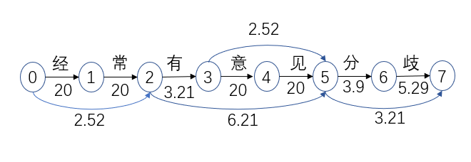

# Python 金融建模：基础与应用

MIT Licensed | Copyright © 2024-present by [Yun Liao ](mailto:james@x.cool)

## Python 提高篇（第5-8章）

第5章：算法基础介绍

第6章：算法设计思想和策略

第7章：编程中使用的高级算法

第8章：金融数据建模

---

### 第5章：算法基础

#### 5.1 算法基础概述

算法是什么？

它是一个清楚地定义的操作序列，可以表达为自然语言、流程图、伪代码或编程语言。

* 输入一些数据并产生对应输出的一种明确定义的程序。
* 它是一个步骤式（step by step）过程，定义了一系列操作来处理输入数据。

特征 算法通常具有以下特征：

* 明确性：一个算法应该是清楚地定义的和易于理解的。
* 确定性：一个算法应该对同一输入产生相同的输出
* 有效性 ：一个算法必须为任何给定的输入产生正确的输出。
* 效率 ：一个算法应该使用最小的资源（时间、空间等）来解决问题。

一些基础的算法类型：

* 排序算法：根据某些标准对数据进行排序（例如，冒泡排序、快排）。
* 搜索算法：在数据集中找到特定的数据（例如，线性搜索、二分搜索）。
* 计算算法：执行数学操作或解决问题（例如，求阶乘、生成斐波纳契数列）。
* 递归算法 ：以递归方式解决问题。
* 贪婪算法 ：在每一步选择局部最优解，希望它会导向全局最优解。

算法设计技术：

* 分治 ：将问题分解成较小的子问题，将它们递归地解决，然后组合解决方案。
* 动态规划 ：将问题分解成较小的子问题，存储子问题的解决方案，并使用备忘录以避免重复计算。
* 回溯 ：探索所有可能的解决方案，并在达到死胡同时回溯。

算法分析：

* 时间复杂度 ：衡量算法完成所需时间作为输入大小的函数。
* 空间复杂度 ：衡量算法使用的内存大小作为输入大小的函数。

#### 5.2 算法与数据结构：栈、链表、队列、图

作为计算机科学中的基本概念，数据结构在开发高效算法中扮演着至关重要的角色。

**1. 栈**

栈是一种线性数据结构，它遵循后进先出的（LIFO）原则。它允许元素从栈顶添加和删除。栈的基本操作是：

* `push()`: 将元素添加到栈顶
* `pop()`: 从栈顶删除元素
* `peek()`: 返回栈顶元素而不删除它

在 Python 中，我们可以使用列表实现一个栈：

```python
class Stack:
    def __init__(self):
        self.elements = []
    def push(self, element):
        self.elements.append(element)
    def pop(self):
        if not self.is_empty():
            return self.elements.pop()
        else:
            raise IndexError("Stack is empty")
    def peek(self):
        if not self.is_empty():
            return self.elements[-1]
        else:
            raise IndexError("Stack is empty")
    def is_empty(self):
        return len(self.elements) == 0
stack = Stack()
stack.push(1)
stack.push(2)
print(stack.peek())  # 输出：2
print(stack.pop())  # 输出：2
```

**2. 链表**

链表是一种动态数据结构，由节点组成，每个节点包含一个值和指向下一个节点的引用。链表的基本操作是：

* `insert()`: 在列表开头添加新节点
* `delete()`: 删除列表中的节点
* `traverse()`: 遍历列表中的节点

在 Python 中，我们可以使用 Node 类实现链表：

```python
class Node:
    def __init__(self, value):
        self.value = value
        self.next = None
class LinkedList:
    def __init__(self):
        self.head = None
    def insert(self, value):
        node = Node(value)
        node.next = self.head
        self.head = node
    def delete(self, value):
        current = self.head
        previous = None
        while current is not None:
            if current.value == value:
                if previous is not None:
                    previous.next = current.next
                else:
                    self.head = current.next
                break
            previous = current
            current = current.next
    def traverse(self):
        current = self.head
        while current is not None:
            print(current.value)
            current = current.next

linked_list = LinkedList()
linked_list.insert(1)
linked_list.insert(2)
linked_list.traverse()  # 输出：1 2


**3. 队列**

队列是一种线性数据结构，它遵循先进先出的（FIFO）原则。它允许元素从队列尾添加和从队列头删除。队列的基本操作是：

* `enqueue()`: 将元素添加到队列尾
* `dequeue()`: 从队列头删除元素
* `peek()`: 返回队列头元素而不删除它

在 Python 中，我们可以使用列表实现一个队列：

```python
class Queue:
    def __init__(self):
        self.elements = []
    def enqueue(self, element):
        self.elements.append(element)
    def dequeue(self):
        if not self.is_empty():
            return self.elements.pop(0)
        else:
            raise IndexError("Queue is empty")
    def peek(self):
        if not self.is_empty():
            return self.elements[0]
        else:
            raise IndexError("Queue is empty")
    def is_empty(self):
        return len(self.elements) == 0

queue = Queue()
queue.enqueue(1)
queue.enqueue(2)
print(queue.peek())  # 输出：1
print(queue.dequeue())  # 输出：1

```

**4. 图**

图是一种非线性数据结构，由节点和边组成，表示节点之间的关系。图的基本操作是：

* `add_node()`: 添加新节点到图中
* `add_edge()`: 添加边到图中
* `traverse()`: 遍历图中的节点

在 Python 中，我们可以使用字典实现一个图：

```python
class Graph:
    def __init__(self):
        self.nodes = {}
    def add_node(self, value):
        if value not in self.nodes:
            self.nodes[value] = []
    def add_edge(self, from_value, to_value):
        if from_value in self.nodes and to_value in self.nodes:
            self.nodes[from_value].append(to_value)
            self.nodes[to_value].append(from_value)
    def traverse(self):
        for node in self.nodes:
            print(node, "->", self.nodes[node])

graph = Graph()
graph.add_node(1)
graph.add_node(2)
graph.add_edge(1, 2)
graph.traverse()  # 输出：1 -> [2], 2 -> [1]
```

#### 5.3：排序算法

排序算法是计算机科学中的基本概念，它们在许多应用中扮演着关键角色。在本章节，我们将探索各种排序算法，其时间和空间复杂度，以及其使用场景。

**1. 冒泡排序（bubble sort）**

冒泡排序是一种简单的排序算法，通过不断地遍历数据并交换相邻元素来实现排序。算法继续执行直到没有更多的交换为止，这时数据已经被排序。

```python
def bubble_sort(arr):
    n = len(arr)
    for i in range(n-1):
        for j in range(0, n-i-1):
            if arr[j] > arr[j+1]:
                arr[j], arr[j+1] = arr[j+1], arr[j]
    return arr

```

**时间复杂度：** O(n^2); **空间复杂度：** O(1)

冒泡排序是一种简单易懂的算法，但其时间复杂度较高，因此通常不适用于大规模数据集。

**2. 选择排序**

选择排序是另一种简单的排序算法，它通过不断地选择未排序部分中的最小（或最大）元素，并将其移到已排序部分的开头来实现排序。

```python
def selection_sort(arr):
    n = len(arr)
    for i in range(n-1):
        min_idx = i
        for j in range(i+1, n):
            if arr[j] < arr[min_idx]:
                min_idx = j
        arr[i], arr[min_idx] = arr[min_idx], arr[i]
    return arr
```

**时间复杂度：** O(n^2); **空间复杂度：** O(1)

选择排序也是一种简单易懂的算法，但其时间复杂度较高，因此通常不适用于大规模数据集。

**3. 插入排序**

插入排序是另一种简单的排序算法，它通过不断地遍历数据并将每个元素插入到已排序部分中的正确位置来实现排序。

```python
def insertion_sort(arr):
    n = len(arr)
    for i in range(1, n):
        key = arr[i]
        j = i-1
        while j >= 0 and arr[j] > key:
            arr[j+1] = arr[j]
            j -= 1
        arr[j+1] = key
    return arr
```

**时间复杂度：** O(n^2); **空间复杂度：** O(1)

插入排序也是一种简单易懂的算法，但其时间复杂度较高，因此通常不适用于大规模数据集。

**4. 归并排序**

归并排序是一种分治算法，它通过将数据分割成小块，递归地对每个小块进行排序，然后合并已排序的小块来实现排序。

```python
def merge_sort(arr):
    if len(arr) <= 1:
        return arr
    mid = len(arr) // 2
    left = merge_sort(arr[:mid])
    right = merge_sort(arr[mid:])
    return merge(left, right)

def merge(left, right):
    result = []
    while len(left) > 0 and len(right) > 0:
        if left[0] <= right[0]:
            result.append(left.pop(0))
        else:
            result.append(right.pop(0))
    result.extend(left)
    result.extend(right)
    return result
```

**5. 快速排序（Quick Sort）**

快速排序是一种分治算法，它通过选择一个枢轴元素，对数据进行分区，并递归地对子数组进行排序。

```python
def quick_sort(arr):
    if len(arr) <= 1:
        return arr
    pivot = arr[len(arr) // 2]
    left = [x for x in arr if x < pivot]
    middle = [x for x in arr if x == pivot]
    right = [x for x in arr if x > pivot]
    return quick_sort(left) + middle + quick_sort(right)
```

Time Complexity: O(n log n) on average, O(n^2) in worst case
Space Complexity: O(log n)

快速排序是一种高效的算法，适用于大规模数据集。但是，它的最坏情况时间复杂度较高，因此需要合理选择枢轴元素以避免这种情况。

**6. 堆排序**

堆排序是一种基于比较的排序算法，它使用 堆 数据结构来实现排序。

```python
def heapify(arr, n, i):
    largest = i
    left = 2 * i + 1
    right = 2 * i + 2
    if left < n and arr[i] < arr[left]:
        largest = left
    if right < n and arr[largest] < arr[right]:
        largest = right
    if largest != i:
        arr[i], arr[largest] = arr[largest], arr[i]
        heapify(arr, n, largest)

def heap_sort(arr):
    n = len(arr)
    for i in range(n // 2 - 1, -1, -1):
        heapify(arr, n, i)
    for i in range(n-1, 0, -1):
        arr[i], arr[0] = arr[0], arr[i]
        heapify(arr, i, 0)
    return arr

```

**时间复杂度：** O(n log n)
**空间复杂度：** O(1)

堆排序是一种高效的算法，适用于大规模数据集。

结论：每种排序算法都有其优缺点，选择哪种算法取决于具体问题的需求。

#### 5.4 深度优先和广度优先搜索算法

搜索算法是解决许多问题的关键一步。深度优先（Depth-First Search, DFS）和广度优先（Breadth-First Search, BFS）是两种常用的搜索算法。

##### 5.4.1 深度优先搜索

深度优先搜索是一种遍历树或图的算法，它通过递归地访问每个节点，直到达到叶节点为止。DFS 通常用于解决问题，如查找连接组件、拓扑排序等。

```python
def dfs(graph, start):
    visited = set()
    traversal_order = []

    def dfs_helper(node):
        visited.add(node)
        traversal_order.append(node)
        for neighbor in graph[node]:
            if neighbor not in visited:
                dfs_helper(neighbor)

    dfs_helper(start)
    return traversal_order

# 示例图
graph = {
    'A': ['B', 'C'],
    'B': ['A', 'D', 'E'],
    'C': ['A', 'F'],
    'D': ['B'],
    'E': ['B', 'F'],
    'F': ['C', 'E']
}

print(dfs(graph, 'A'))  # 输出：['A', 'B', 'D', 'E', 'F', 'C']

```

**时间复杂度：** O(|V| + |E|)，其中 |V| 是图的顶点数，|E| 是图的边数。

**空间复杂度：** O(|V|)，用于存储已访问的节点

##### 5.4.2 广度优先搜索

广度优先搜索是一种遍历树或图的算法，它通过层次地访问每个节点，从起始点开始，逐步扩展到邻近节点。BFS 通常用于解决问题，如查找最短路径、网络拓扑分析等。

```python
from collections import deque
def bfs(graph, start):
    visited = set()
    traversal_order = []
    queue = deque([start])

    while queue:
        node = queue.popleft()
        if node not in visited:
            visited.add(node)
            traversal_order.append(node)
            for neighbor in graph[node]:
                if neighbor not in visited:
                    queue.append(neighbor)

    return traversal_order

# 示例图
graph = {
    'A': ['B', 'C'],
    'B': ['A', 'D', 'E'],
    'C': ['A', 'F'],
    'D': ['B'],
    'E': ['B', 'F'],
    'F': ['C', 'E']
}

print(bfs(graph, 'A'))  # 输出：['A', 'B', 'C', 'D', 'E', 'F']
```

**时间复杂度：** O(|V| + |E|)，其中 |V| 是图的顶点数，|E| 是图的边数。

**空间复杂度：** O(|V|)，用于存储已访问的节点和队列中的节点。

结论：深度优先搜索和广度优先搜索是两种常用的搜索算法，每种算法都有其优缺点，选择哪种算法取决于具体问题的需求。

#### 5.5 贪心算法（Greedy Algorithm）

贪心算法是一种简单而且有效的优化算法，它通过在每个步骤中选择当前看起来最好的选项来尝试找到问题的近似解。

贪心算法的详细方法：

1. **初始化** : 初始化解决方案和当前状态。
2. **选择** : 在当前状态下，选择看起来最好的选项，这个选项通常是局部最优的。
3. **更新** : 更新解决方案和当前状态，以反映新的选择。
4. **重复** : 重复步骤 2 和 3，直到达到终止条件。

贪心算法的实例：

**1. Coin Changing Problem**

问题：给定一个 amount 和一组 coins（硬币），找到最少数量的硬币来兑换该金额。

贪心算法解决方案：

1. 初始化：amount = 12，coins = [1, 5, 10]，solution = []。
2. 选择：选择当前看起来最好的选项，即最大的硬币小于或等于 amount（在这个例子中是 10）。
3. 更新：将选择的硬币添加到解决方案中，并减少 amount 的值。
4. 重复：重复步骤 2 和 3，直到 amount = 0。

Python 代码：

```python
def coin_changing(amount, coins):
    solution = []
    while amount > 0:
        max_coin = max([coin for coin in coins if coin <= amount])
        solution.append(max_coin)
        amount -= max_coin
    return solution

print(coin_changing(12, [1, 5, 10]))  # 输出：[10, 1, 1]

```

**2. Knapsack Problem**

问题：给定一个背包的容量和一组物品，每个物品有其价值和重量，找到在背包中装载的物品，使得总价值最大。

贪心算法解决方案：

1. 初始化：capacity = 10，items = [(2, 3), (3, 4), (5, 8)]，item的前一个值是容积后一个值为其价值，solution = []。
2. 选择：选择当前看起来最好的选项，即价值最高的物品，但不能超过背包的容量。
3. 更新：将选择的物品添加到解决方案中，并减少背包的容量。
4. 重复：重复步骤 2 和 3，直到背包的容量为 0。

Python 代码：

```python
def knapsack(capacity, items):
    solution = []
    while capacity > 0:
        max_item = max(items, key=lambda x: x[1] / x[0])
        if max_item[0] <= capacity:
            solution.append(max_item)
            capacity -= max_item[0]
        else:
            break
    return solution

print(knapsack(10, [(2, 3), (3, 4), (5, 8)]))  # 输出：[(5, 8), (3, 4)]
```

贪心算法不保证找到最优解，需要根据问题的性质和约束条件选择适合的贪心策略。

#### 5.6 递归算法

递归算法是一种解决复杂问题的方法，它通过将问题分解成小的子问题，直到找到最基本的解决方案为止。然后，从最基本的解决方案开始，逐步组合结果，直到得到原来的问题的解决方案。

递归算法的用法：

1. **定义递归函数** ：定义一个函数，它描述 $x(n+1)=f(x(n))$ 的函数关系。
2. **基线条件** ：定义一个基线条件，以确定何时停止递归调用，例如 $x(0)=0;x(1)=1$。
3. **递归调用** ：在函数中，调用自身以解决子问题。
4. **结果组合** ：从最基本的解决方案开始，逐步组合结果，直到得到原来的问题的解决方案。

递归算法的实例：

**1. 阶乘**
问题：计算一个数字的阶乘（例如 5! = 5 × 4 × 3 × 2 × 1）。
递归算法解决方案：

```python
def factorial(n):
    if n == 0 or n == 1:  # 基线条件
        return 1
    else:
        return n * factorial(n - 1)  # 递归调用
print(factorial(5))  # 输出：120

```

**2.斐波拉契数搜索**

问题：在一个排序数组中，找到一个目标值（例如，在 [1, 2, 3, 4, 5] 中找到 3）。
递归算法解决方案：

```python
def binary_search(arr, target):
    if len(arr) == 0:  # 基线条件
        return -1
    mid = len(arr) // 2
    if arr[mid] == target:
        return mid
    elif arr[mid] < target:
        return binary_search(arr[mid + 1:], target)  # 递归调用
    else:
        return binary_search(arr[:mid], target)  # 递归调用
arr = [1, 2, 3, 4, 5]
print(binary_search(arr, 3))  # 输出：2
```

**3. Tower of Hanoi**

问题：移动汉诺塔中的所有圆盘，从 A 柱到 C 柱。

递归算法解决方案：

```python
def hanoi(n, from_rod, to_rod, aux_rod):
    if n == 1:
        print(f"Move disk 1 from rod {from_rod} to rod {to_rod}")
        return
    hanoi(n - 1, from_rod, aux_rod, to_rod)
    print(f"Move disk {n} from rod {from_rod} to rod {to_rod}")
    hanoi(n - 1, aux_rod, to_rod, from_rod)
# 测试代码
n = 3
hanoi(n, 'A', 'C', 'B')

```

4. **Sodoku数独生成问题**

问题：生成一个符合 Sodoku 规则的数独。

递归算法解决方案：

```python
def solve_sudoku(board):
    def is_valid(board, row, col, num):
        for i in range(9):
            if board[row][i] == num or board[i][col] == num:
                return False
        start_row = row - row % 3
        start_col = col - col % 3
        for i in range(3):
            for j in range(3):
                if board[start_row + i][start_col + j] == num:
                    return False
        return True

    def place_numbers(board, row, col):
        if row == 9:
            return True
        if col == 9:
            return place_numbers(board, row + 1, 0)
        if board[row][col] != 0:
            return place_numbers(board, row, col + 1)
        for num in range(1, 10):
            if is_valid(board, row, col, num):
                board[row][col] = num
                if place_numbers(board, row, col + 1):
                    return True
                board[row][col] = 0
        return False

    place_numbers(board, 0, 0)
    return board

# 测试代码
board = [
    [5, 3, 0, 0, 7, 0, 0, 0, 0],
    [6, 0, 0, 1, 9, 5, 0, 0, 0],
    [0, 9, 8, 0, 0, 0, 0, 6, 0],
    [8, 0, 0, 0, 6, 0, 0, 0, 3],
    [4, 0, 0, 8, 0, 3, 0, 0, 1],
    [7, 0, 0, 0, 2, 0, 0, 0, 6],
    [0, 6, 0, 0, 0, 0, 2, 8, 0],
    [0, 0, 0, 4, 1, 9, 0, 0, 5],
    [0, 0, 0, 0, 8, 0, 0, 7, 9]
]
solved_board = solve_sudoku(board)
for row in solved_board:
    print(row)

```

总结：递归算法是一种强大的解决复杂问题的方法，但它也存在一些缺陷，例如栈溢出风险和效率问题，因此需要合理地选择递归算法。

### 第6章：算法设计思想和策略

在第五章我们简要介绍了一些基础的算法，使用一些初级的算法我们可以解决大部分简单的问题，然而当我们需要进一步提高速度或解决一些复杂问题的时候，需要使用一些思想方法和策略：

1. **分而治之**

将复杂的问题拆解成小的子问题，递归地解决每个子问题，直到找到原始问题的解决方案，示例：归并排序、快速排序、二进制搜索

2. **动态规划**

将复杂的问题拆解成小的子问题，将每个子问题的解决方案存储在表格或数组中，使用存储的解决方案来解决较大的子问题，示例：最长公共子序列

3. **贪婪算法**

在每步骤中作出局部最优选择，希望这些局部选择将导致全球最优的解决方案，示例：赫夫曼编码、活动选择问题

4. **回溯**

递归地探索所有可能的解决方案，当到达死胡同时，回溯并尝试另一个路径，示例：N皇后问题、数独

5. **记忆化**

将昂贵函数调用的结果存储在缓存中，当相同的输入再次出现时，返回缓存的结果，而不是重新计算它，示例：斐波纳契数列、最长公共子序列

6. **递归 vs 迭代（recursion and iteration)**

递归可以更容易实现和理解，但可能导致堆栈溢出，迭代可以更加高效，避免堆栈溢出，但可能难以实现和理解，需要根据问题和约束选择方法

7. **空间时间折衷（tradeoff）**

算法通常可以优化为空间复杂度或时间复杂度， 根据问题的约束，作出空间和时间之间的折衷，示例：使用哈希表 vs 使用二进制搜索树

8. **近似算法**

对于 NP-hard 问题，可能无法在多项式时间内找到精确的解决方案，使用近似算法来找到近似的解决方案，示例：旅行商问题、背包问题

#### 6.1 分治算法

分治算法是一种基于多支递归的设计范式。它由三步组成：

1. **划分** : 将问题划分成更小、更易于管理的子问题。
2. **征服** : 递归地解决每个子问题，直到找到原始问题的解决方案。
3. **合并** : 将子问题的解决方案合并以获得最终解决方案。

**实例 1：归并排序**

* 划分： 将数组划分成两个半部分。
* 征服： 递归地对每个半部分进行排序。
* 合并： 将两个已排序的半部分合并成一个单一的已排序数组。

```python
def merge_sort(arr):
    if len(arr) <= 1:
        return arr
    mid = len(arr) // 2
    left = merge_sort(arr[:mid])
    right = merge_sort(arr[mid:])
    return merge(left, right)

def merge(left, right):
    result = []
    while len(left) > 0 and len(right) > 0:
        if left[0] <= right[0]:
            result.append(left.pop(0))
        else:
            result.append(right.pop(0))
    result.extend(left)
    result.extend(right)
    return result

```

**实例 2：二分查找**

* 划分： 将搜索空间划分成两个半部分。
* 征服： 递归地在一个半部分中搜索目标元素。
* 合并： 如果找到目标元素，则返回其索引，否则返回-1

```
def binary_search(arr, target):
    low = 0
    high = len(arr) - 1
    while low <= high:
        mid = (low + high) // 2
        if arr[mid] == target:
            return mid
        elif arr[mid] < target:
            low = mid + 1
        else:
            high = mid - 1
    return -1

```

**实例 3：快速幂运算**

快速幂运算是一种高效计算指数幂的方法，它使用分治策略来降低时间复杂度。

**算法描述**

输入：基数 `a` 和指数 `n`

输出：`a` 的 `n` 次幂值，即 `a^n`

**步骤**

* **划分** ：将指数 `n` 划分成两个半部分，分别为 `n/2` 和 `n-n/2`。
* **征服** ：递归地计算每个半部分的基数的幂值，即 `a^(n/2)` 和 `a^(n-n/2)`。
* **合并** ：将两个递归调用的结果相乘，得到最终结果 `a^n`。

```python
def fast_power(a, n):
    if n == 0:
        return 1
    elif n % 2 == 0:
        half_pow = fast_power(a, n // 2)
        return half_pow * half_pow
    else:
        half_pow = fast_power(a, n // 2)
        return a * half_pow * half_pow
```

**时间复杂度**

快速幂运算的时间复杂度为 O(log n)，远远低于朴素幂运算的时间复杂度 O(n)。

**优点**

快速幂运算具有以下优点：

* 高效：快速幂运算的时间复杂度远远低于朴素幂运算。
* 适用性强：快速幂运算可以应用于各种指数幂计算场景。

**缺点**

快速幂运算也存在一些缺点：

* 递迭调用次数多：快速幂运算需要递归地调用自身，可能会导致栈溢出错误。
* 计算结果精度问题：快速幂运算的计算结果可能会出现精度问题(当n比较大)。

#### 6.2 动态规划算法

动态规划是一种**算法范式**，它通过将复杂问题分解成较小的子问题，每个子问题只解决一次，并**存储子问题的解决方案**，以避免冗余计算。

**关键特征：**

1. **划分** : 将问题分解成较小的子问题。
2. **重叠子问题** : 子问题可能会有重叠。
3. **备忘录** : 存储子问题的解决方案，以避免冗余计算。

**实例 1：最长公共子序列（LCS）**

* 问题：给定两个序列 `X` 和 `Y`，找到它们的最长公共子序列。
* 动态规划解决方案：
  * 创建一个二维数组 `dp` 来存储子问题的解决方案。
  * 初始化 `dp[i][j] = 0` 对于所有 `i` 和 `j`。
  * 对于每个 `i` 从 1 到 `m` (序列 `X` 的长度) 和每个 `j` 从 1 到 `n` (序列 `Y` 的长度)：
    - 如果 `X[i-1] == Y[j-1]`，则 `dp[i][j] = dp[i-1][j-1] + 1`。
    - 否则，`dp[i][j] = max(dp[i-1][j], dp[i][j-1])`。
  * 返回最长公共子序列 `dp[m][n]` 。

```python
def lcs(X, Y):
    m, n = len(X), len(Y)
    dp = [[0] * (n + 1) for _ in range(m + 1)]
    for i in range(1, m + 1):
        for j in range(1, n + 1):
            if X[i-1] == Y[j-1]:
                dp[i][j] = dp[i-1][j-1] + 1
            else:
                dp[i][j] = max(dp[i-1][j], dp[i][j-1])
    return dp[m][n]
```

**实例 2：背包问题**

* 问题：给定一组物品，每个物品都有一个权重和价值，确定要包括在一个限定的背包中的物品，以最大化总价值。
* 动态规划解决方案：
  * 创建一个二维数组 `dp` 来存储子问题的解决方案。
  * 初始化 `dp[i][j] = 0` 对于所有 `i` 和 `j`。
  * 对于每个 `i` 从 1 到 `n` (物品数量) 和每个 `j` 从 1 到 `W` (背包容量)：
    - 如果物品 `i` 的权重小于或等于 `j`，则 `dp[i][j] = max(dp[i-1][j], dp[i-1][j-weight[i]] + value[i])`。
    - 否则，`dp[i][j] = dp[i-1][j]`。
  * 返回最大总价值 `dp[n][W]` 。

```python
def knapsack(items, W):
    n = len(items)
    dp = [[0] * (W + 1) for _ in range(n + 1)]
    for i in range(1, n + 1):
        for j in range(1, W + 1):
            if items[i-1][0] <= j:
                dp[i][j] = max(dp[i-1][j], dp[i-1][j-items[i-1][0]] + items[i-1][1])
            else:
                dp[i][j] = dp[i-1][j]
    return dp[n][W]

```

#### 6.3 双指针算法

双指针算法是一种常用的算法技巧，它用于解决数组或链表中的问题。该算法通常使用两个指针，一个指向数组或链表的起始位置，另一个指向结束位置。通过移动这两个指针，可以在O(n)时间复杂度内解决许多问题。

**关键特征：**

1. **双指针** : 使用两个指针来遍历数组或链表。
2. **相对移动** : 两个指针可以以不同的速度移动，以适应不同的问题。

**实例 1：两数之和等于目标值**

* 问题：给定一个有序数组和一个目标值，找到两个元素之和等于目标值的元素。
* 双指针解决方案：
  * 初始化两个指针，`left` 指向数组的起始位置，`right` 指向数组的结束位置。
  * 遍历数组直到 `left` 和 `right` 相遇。
  * 在每次遍历中，检查 `nums[left] + nums[right]` 是否等于目标值。
  * 如果等于，则返回这两个元素。
  * 如果小于目标值，移动 `left` 指针以增加和。
  * 如果大于目标值，移动 `right` 指针以减少和。

```python
def two_sum(nums, target):
    left, right = 0, len(nums) - 1
    while left < right:
        if nums[left] + nums[right] == target:
            return [left, right]
        elif nums[left] + nums[right] < target:
            left += 1
        else:
            right -= 1
    return []

```

**实例 2：反转链表**

* 问题：给定一个链表，反转该链表。
* 双指针解决方案：
  * 初始化两个指针，`prev` 和 `curr`，都指向链表的头节点。
  * 遍历链表直到 `curr` 指针为空。
  * 在每次遍历中，将 `curr` 节点的下一个节点暂存起来，然后将 `curr` 节点的下一个节点设为 `prev` 节点。
  * 移动 `prev` 和 `curr` 指针。
  * 返回反转后的链表。

```
class ListNode:
    def __init__(self, x):
        self.val = x
        self.next = None

def reverse_list(head):
    prev, curr = None, head
    while curr:
        next_node = curr.next
        curr.next = prev
        prev = curr
        curr = next_node
    return prev
```

**实例 3：合并两个有序数组**

* 问题：给定两个有序数组，合并它们以得到一个新的有序数组。
* 双指针解决方案：
  * 初始化三个指针，`i` 和 `j` 指向两个数组的起始位置，`k` 指向结果数组的起始位置。
  * 遍历两个数组直到 `i` 或 `j` 指针到达结尾。
  * 在每次遍历中，比较 `nums1[i]` 和 `nums2[j]`，将较小的元素添加到结果数组中。
  * 移动相应的指针。

```python
def merge_arrays(nums1, nums2):
    i, j  = 0, 0
    result = []
    while i < len(nums1) and j < len(nums2):
        if nums1[i] <= nums2[j]:
            result.append(nums1[i])
            i += 1
        else:
            result.append(nums2[j])
            j += 1
    result.extend(nums1[i:])
    result.extend(nums2[j:])
    return result

```

这些实例演示了双指针算法在解决数组和链表问题中的力量，可以通过相对移动两个指针来遍历数据结构，并解决许多复杂的问题。

#### 6.4 回溯算法

回溯算法是一种常用的算法技巧，用于解决复杂的问题。该算法通过递归函数调用自身，以探索所有可能的解空间，并在找到可行解时返回结果。

**关键特征：**

1. **递归函数** : 使用递归函数调用自身，以探索所有可能的解空间。
2. **回溯点** : 在探索过程中，保存当前状态，以便在需要时回到之前的状态。

**实例 1：子集生成**

* 问题：给定一个集合，生成所有可能的子集。

```python
def generate_subsets(nums):
    def backtrack(start, path):
        result.append(path[:])
        for i in range(start, len(nums)):
            path.append(nums[i])
            backtrack(i + 1, path)
            path.pop()

    result = []
    backtrack(0, [])
    return result
```

**实例 2：排列生成**

* 问题：给定一个集合，生成所有可能的排列。

```python
ef generate_permutations(nums):
    def backtrack(start, path):
        if len(path) == len(nums):
            result.append(path[:])
            return
        for i in range(len(nums)):
            if nums[i] not in path:
                path.append(nums[i])
                backtrack(i + 1, path)
                path.pop()

    result = []
    backtrack(0, [])
    return result

```

**实例3：算24**

* 问题： 给定4个数字通过加减乘除计算24

```python
rom itertools import permutations
 
a = int(input("请输入第1个数字:"))
b = int(input("请输入第2个数字:"))
c = int(input("请输入第3个数字:"))
d = int(input("请输入第4个数字:"))
my_list = [a, b, c, d]
# 对4个整数随机排列的列表
result = [c for c in permutations(my_list, 4)] 
symbols = ["+", "-", "*", "/"] 
list2 = []  # 算出24的排列组合的列表
flag = False
 
for one, two, three, four in result:
    for s1 in symbols:
        for s2 in symbols:
            for s3 in symbols:
                if s1 + s2 + s3 == "+++" or s1 + s2 + s3 == "***":
                    express = ["{0}{1}{2}{3}{4}{5}{6}".format(one, s1, two, s2, three, s3, four)]  # 全加或者乘时，括号已经没有意义。
                else:
                    express = ["(({0}{1}{2}){3}{4}){5}{6}".format(one, s1, two, s2, three, s3, four),
                               "({0}{1}{2}){3}({4}{5}{6})".format(one, s1, two, s2, three, s3, four),
                               "(({0}{1}({2}{3}{4})){5}{6})".format(one, s1, two, s2, three, s3, four),
                               "{0}{1}(({2}{3}{4}){5}{6})".format(one, s1, two, s2, three, s3, four),
                               "{0}{1}({2}{3}({4}{5}{6}))".format(one, s1, two, s2, three, s3, four)]
 
                for e in express:
                    try:
                        if round(eval(e), 6) == 24:
                            list2.append(e)
                            flag = True
                    except ZeroDivisionError:
                        pass
 
list3 = set(list2)  # 去除重复项
 
for c in list3:
    print("YES：", c)
 
if not flag:
    print("NO！")

```

#### 6.5 旅行商问题

**旅行商问题（Traveling Salesman Problem, TSP）**

**问题描述：**
给定一组城市和它们之间的距离，求出一种Hamiltonian回路，即从起始城市出发、访问每个城市恰好一次，然后返回起始城市的最短路径。

**问题特点：**

1. **NP 难题** : TSP 是一个 NP 难题，无法在多项式时间内找到精确解。
2. **组合优化** : TSP 需要在指数级别的搜索空间中找到最佳解决方案。

**算法解决方法：**

1. Brute Force Algorithm

* 对于小规模问题，可以使用暴力破解算法，检查所有可能的路径组合。

```python
def brute_force_tsp(cities, distances):
    def is_valid_path(path):
        return len(set(path)) == len(cities)

    def calculate_distance(path):
        distance = 0
        for i in range(len(path) - 1):
            distance += distances[path[i]][path[i + 1]]
        distance += distances[path[-1]][path[0]]
        return distance

    min_distance = float('inf')
    best_path = None
    for path in itertools.permutations(cities):
        if is_valid_path(path):
            distance = calculate_distance(path)
            if distance < min_distance:
                min_distance = distance
                best_path = path
    return best_path, min_distance
```

2. Nearest Neighbor Algorithm

* 对于中等规模问题，可以使用最近邻算法，选择当前城市的最近邻居作为下一个访问城市。

```python
def nearest_neighbor_tsp(cities, distances):
    current_city = cities[0]
    path = [current_city]
    unvisited_cities = set(cities[1:])

    while unvisited_cities:
        next_city = min(unvisited_cities, key=lambda x: distances[current_city][x])
        path.append(next_city)
        unvisited_cities.remove(next_city)
        current_city = next_city

    distance = 0
    for i in range(len(path) - 1):
        distance += distances[path[i]][path[i + 1]]
    distance += distances[path[-1]][path[0]]

    return path, distance
```

### 第7章：金融建模中的高级算法

#### 7.1 Dijkstra 算法

最短路径是图论中常见问题。最短路径是指在一个图中找到两个节点之间的最短路径。最短路径算法常见的有 floyd算法（弗洛伊德算法）和 dijkstra算法（迪杰斯特拉）。本文只介绍dijkstra算法。最短路径运用非常广泛，比如在导航系统中，确定两个地点间哪条路线最短；在网络路由中，路由器需要找到最短路径来转发数据包. 这个算法由荷兰杰出计算机科学家、软件工程师 **艾兹赫尔·戴克斯特拉 (Edsger W. Dijkstra)（** 1930年5月11日~2002年8月6日）发明。他是计算机先驱之一，与 **高德纳（Donald Ervin Knuth）** 并称为我们这个时代最伟大的计算机科学家。

加权图是指每条边都带有权重的图。每个边的权重可以表示两个顶点之间的距离、成本或任何其他可以量化的指标。实际上，边的权重可以为负数，但是本章只介绍最短路径中的dijkstra算法且这种算法的前提条件就是权重不能为负数，所以不将负数的权重拓展到本文。下面的加权图中，每一个红色的数字都代表着那条边的权重。

Dijkstra 算法的基本思路

首先将起始节点的距离标记为0，其他节点的距离因为还不确定所以先需要标记为无穷大。然后，在图中找到距离起始节点最近的节点，更新其相邻节点的距离，距离为从起始节点到该节点的距离加上该节点到相邻节点的距离。不断循环此过程，直到所有节点都被访问过。这就是Dijkstra 算法的基本思路

```python
import sys
def dijkstra(graph, start_node):
    unvisited_nodes = {node: sys.maxsize for node in graph}  # 初始化所有节点距离为无穷大
    unvisited_nodes[start_node] = 0  # 起始节点距离为0
    shortest_paths = {start_node: (0, [])}  # 起始节点的路径和距离
    while unvisited_nodes:
        current_node = min(unvisited_nodes, key=unvisited_nodes.get)  # 找到未访问节点中距离最小的节点
        current_distance = unvisited_nodes[current_node]
        for neighbor, distance in graph[current_node].items():
            if neighbor not in unvisited_nodes: continue  # 已访问过的节点跳过
            new_distance = current_distance + distance
            if new_distance < unvisited_nodes[neighbor]:  # 如果找到更短路径，更新
                unvisited_nodes[neighbor] = new_distance
                shortest_paths[neighbor] = (new_distance, shortest_paths[current_node][1] + [current_node])  # 更新路径和距离
        unvisited_nodes.pop(current_node)  # 当前节点已访问过，从未访问节点中删除
   return shortest_paths  # 返回最短路径和距离
 
# 测试Dijkstra算法
if __name__ == "__main__":
    graph = {
        'A': {'B': 2, 'C': 9},
        'B': {'A': 2, 'D': 4, 'E': 8},
        'C': {'A': 9, 'E': 10, 'F': 3},
        'D': {'B': 4, 'E': 1, 'G': 5},
        'E': {'B': 8, 'C': 10, 'D': 1, 'F': 11, 'G': 6, 'H': 12},
        'F': {'C': 3, 'E': 11, 'H': 17},
        'G': {'D': 5, 'E': 6},
        'H': {'E': 12, 'F': 17},
    }
    start_node = 'D'
    shortest_paths = dijkstra(graph, start_node)
    print(shortest_paths)
```

#### 7.2 Viterbi 算法

维特比算法是一种用于 Hidden Markov Model (HMM) 的解码算法，用于查找给定观测值的情况下最可能的状态序列。该算法由 Andrew Viterbi 于1967年提出。

隐藏马尔科夫模型（HMM）是一种统计模型，用于描述假设为马尔科夫过程的系统，但其状态不可观测。在 HMM 中，系统可以处于多个状态中，并根据某些概率从一个状态转移到另一个状态。

**HMM 的组成部分**

1. **状态** : 系统可以处于的一组状态 Q = {q1, q2, …, qN}。
2. **观测值** : 由系统发射的一组观测值 O = {o1, o2, …, oT}。
3. **转移概率** : 矩阵 A = {aij}，其中 aij 是从状态 qi 转移到状态 qj 的概率。
4. **发射概率** : 矩阵 B = {bjk}，其中 bjk 是在状态 qj 下观测到 ok 的概率。
5. **初始状态分布** : 向量 π = {πi}，其中 πi 是从状态 qi 开始的概率。

**算法步骤**

1. **初始化** ：对每个状态 qi 计算初始概率 δ1(i) = P(o1, qt=i) 和 ψ1(i) = argmax{P(o1, qt=i)}
2. **递推** ：对于每个时间步骤 t 从 2 到 T

* 计算每个状态 qi 在时间步骤 t 的概率 δt(i) = max{P(ot, qt=i)} × ψt-1(j)
* 计算每个状态 qi 在时间步骤 t 的前一个状态 ψt(i) = argmax{P(ot, qt=i)} × ψt-1(j)

3. **回溯** ：从最后一个时间步骤 T 开始，递推计算最可能的状态序列 qt

```python
import numpy as np
def viterbi(obs, states, start_prob, trans_prob, emit_prob):
    """
    维特比算法

    Parameters:
        obs (list): 观测值序列
        states (list): 状态列表
        start_prob (dict): 初始状态概率
        trans_prob (dict): 转移概率
        emit_prob (dict): 发射概率

    Returns:
        state_seq (list): 最可能的状态序列
    """
    n_states = len(states)
    n_obs = len(obs)

    # 初始化
    delta = np.zeros((n_states, n_obs))
    psi = np.zeros((n_states, n_obs))

    for i in range(n_states):
        delta[i, 0] = start_prob[states[i]] * emit_prob[states[i]][obs[0]]
        psi[i, 0] = states[i]

    # 递推
    for t in range(1, n_obs):
        for j in range(n_states):
            max_prob = 0
            max_state = None
            for i in range(n_states):
                prob = delta[i, t-1] * trans_prob[states[i]][states[j]] * emit_prob[states[j]][obs[t]]
                if prob > max_prob:
                    max_prob = prob
                    max_state = states[i]
            delta[j, t] = max_prob
            psi[j, t] = max_state

    # 回溯
    state_seq = []
    max_prob = 0
    max_state = None
    for i in range(n_states):
        if delta[i, -1] > max_prob:
            max_prob = delta[i, -1]
            max_state = states[i]
    state_seq.append(max_state)
    for t in range(n_obs-2, -1, -1):
        state_seq.insert(0, psi[state_seq[0], t])

    return state_seq

# 示例数据
obs = ['o1', 'o2', 'o3', 'o4', 'o5']
states = ['s1', 's2', 's3']
start_prob = {'s1': 0.4, 's2': 0.3, 's3': 0.3}
trans_prob = {
    's1': {'s1': 0.7, 's2': 0.3, 's3': 0.0},
    's2': {'s1': 0.4, 's2': 0.6, 's3': 0.0},
    's3': {'s1': 0.0, 's2': 0.5, 's3': 0.5}
}
emit_prob = {
    's1': {'o1': 0.5, 'o2': 0.3, 'o3': 0.2},
    's2': {'o1': 0.4, 'o2': 0.6, 'o3': 0.0},
    's3': {'o1': 0.2, 'o2': 0.4, 'o3': 0.4}
}

state_seq = viterbi(obs, states, start_prob, trans_prob, emit_prob)
print(state_seq)  # Output: ['s1', 's2', 's2', 's3', 's3']

```

维特比算法是安德鲁.维特比(Andrew Viterbi)于1967年为解决通信领域中的解码问题而提出的，它同样广泛用于解决自然语言处理中的解码问题，隐马尔可夫模型的解码是其中典型的代表。无论是通信中的解码问题还是自然语言处理中的解码问题，本质上都是要在一个篱笆网络中寻找得到一条最优路径。所谓篱笆网络，指的是单向无环图，呈层级连接，各层节点数可以不同。如图是一个篱笆网络，连线上的数字是节点间概念上的距离（如间距、代价、概率等），现要找到一条从起始点到终点的最优路径。该问题具有这样一个特性，对于最优（如最短距离）的路径，任意一段子路径一定是该段两端点间所有可达路径中最优的，如若不然，将该段中更优的子路径接到两端点便构成了另一个整体最优路径，这是矛盾的。或者说，最优路径中，从起始点到由近及远的任一点的子路径，一定是该段所有可达路径中最优的。也即，**整体最优，局部一定最优**。

##### 维特比算法在自然语言分词中的应用实例

目的：将句子“经常有意见分歧”进行分词

我们有以下数据：

```python
词典 = ["经常","有","意见","意","见","有意见","分歧","分","歧"]
概率P(x)= {"经常":0.08,"有":0.04,"意见":0.08,"意":0.01,"见":0.005,"有意见":0.002,"分歧":0.04,"分":0.02, "歧":0.005}
-ln(P(x)) = {"经常":2.52,"有":3.21,"意见":2.52,"意":4.6,"见":5.29,"有意见":6.21,"分歧":3.21,"分":3.9, "歧":5.29}
```

如果某个词不在字典中，我们将认为其 − l n [ P ( x ) ]值为20。我们构建以下的DAG(有向图），每一个边代表一个词，我们将 − l n [ P ( x ) ]  值标在边上，分词认为转化为求最短路径（即最大概率）的问题。由图可以看出，路径 0—>②—>③—>⑤—>⑦ 所求的值最小，所以其就是最优结果：经常 / 有 / 意见 / 分歧



那么我们应该怎样快速计算出来这个结果呢？

我们设 f ( n ) 代表从起点 0到结点 n 的最短路径的值，所以我们想求的就是 f ( 7 )，从DAG图中可以看到，到结点⑦有2条路径：

从结点⑤—>结点⑦：f ( 7 ) = f ( 5 ) + 3.21
从结点⑥—>结点⑦：f ( 7 ) = f ( 6 ) + 5.29

我们应该从2条路径中选择路径短的。

在上面的第1条路径中，f ( 5 ) 还是未知的，同理我们发现到结点⑤的路径有3条路径：

从结点②—>结点⑤：f ( 5 ) = f ( 2 ) + 6.21
从结点③—>结点⑤：f ( 5 ) = f ( 3 ) + 2.52
从结点④—>结点⑤：f ( 5 ) = f ( 4 ) + 20

我们同样从3条路径中选择路径短的。以此类推，直到结点0，所有的路径值都可以算出来。我们维护一个列表来表示 f ( n )的各值列表

根据**整体最优，局部一定最优的原则，有以下代码：**

```python
import math
import collections
# 维特比算法(viterbi)
def word_segmentation(text):
    ####################################################################################################################################################################
    word_dictionaries = ["经常", "有", "意见", "意", "见", "有意见", "分歧", "分", "歧"]
    probability = {"经常": 0.08, "有": 0.04, "意见": 0.08, "意": 0.01, "见": 0.005, "有意见": 0.002, "分歧": 0.04, "分": 0.02, "歧": 0.005}
    probability_ln = {key: -math.log(probability[key]) for key in probability}
    # probability_ln = {'经常': 2.5257286443082556, '有': 3.2188758248682006, '意见': 2.5257286443082556, '意': 4.605170185988091, '见': 5.298317366548036, '有意见': 6.214608098422191, '分歧': 3.2188758248682006, '分': 3.912023005428146, '歧': 5.298317366548036}
    print("probability_ln = {0}".format(probability_ln))
    # 构造图的代码并没有实现，以下只是手工建立的图【如果某个词不在字典中，我们将认为其 −ln[P(x)] 值为20。】，为了说明 维特比算法
    ####################################################################################################################################################################
    # 有向五环图，存储的格式：key是结点名，value是一个结点的所有上一个结点（以及边上的权重）
    graph = {
        0: {0: (0, "")},
        1: {0: (20, "经")},
        2: {0: (2.52, "经常"), 1: (20, "常")},
        3: {2: (3.21, "有")},
        4: {3: (20, "意")},
        5: {2: (6.21, "有意见"), 3: (2.52, "意见"), 4: (5.30, "见")},
        6: {5: (3.9, "分")},
        7: {5: (3.21, "分歧"), 6: (5.29, "歧")}
    }
    # =====================================================================利用“维特比算法”构建各个节点的最优路径：开始=====================================================================
    print("#"*50, "利用“维特比算法”构建各个节点的最优路径：开始", "#"*50)
    f = collections.OrderedDict()  # 保存结点n的f(n)以及实现f(n)的上一个结点【f(n)：代表从起点 0 到结点 n 的最短路径的值】
    for key, value in graph.items():  # 遍历有向图graph中的所有节点
        print("\nkey = {0}----value = {1}".format(key, value))
        tuple_temp_list = []
        for pre_node_key, pre_node_value in value.items():  # 遍历当前节点的所有上一个节点【pre_node_key：上一个节点的节点号，pre_node_value：本节点距离上一个节点的距离】
            # print("本节点的节点号：key = {0}----上一个节点的节点号：pre_node_key = {1}----本节点距离上一个节点的距离：pre_node_value = {2}".format(key, pre_node_key, pre_node_value))
            distance_from_0 = 0
            if pre_node_key not in f:  # 当遍历到0节点时，该节点的上一个结点还没有计算f(n)；
                distance_from_0 = pre_node_value[0]  # 0节点的上一节点（依旧时0节点）的距离
            else:  # 当遍历到0节点之后的节点
                distance_from_0 = pre_node_value[0] + f[pre_node_key][0]  # pre_node_value[0]：当前节点距离上一节点的距离；f[pre_node_key][0]：当前节点的上一节点“pre_node_key”距离0节点的最短距离
                print("本节点的节点号：key = {0}----本节点可触及的上一节点号：pre_node_key = {1}----本节点距离上一个节点“节点{1}”的距离：pre_node_value = {2}----上一节点“节点{1}”距离0节点的最短距离：f[pre_node_key][0] = {3}----本节点路径上一节点“节点{1}”距离0节点的距离：distance_from_0 = {4}".format(key, pre_node_key, pre_node_value, f[pre_node_key][0], distance_from_0))
            tuple_temp = (distance_from_0, pre_node_key)  # 【pre_node_value[0]：本节点距离0节点的最短距离；pre_node_key：本节点实现距离0节点距离最短时的上一个节点的节点号】
            tuple_temp_list.append(tuple_temp)
        min_temp = min(tuple_temp_list)  # 比较比较当前节点路径所触及的所有上一节点到达0节点的距离，得出当前节点 key 距离0节点的最短距离
        # min_temp = min((pre_node_value[0], pre_node_key) if pre_node_key not in f else (pre_node_value[0] + f[pre_node_key][0], pre_node_key) for pre_node_key, pre_node_value in value.items())  # 高阶写法
        print("本节点的节点号：key = {0}----当前节点路径所触及的所有上一节点到达0节点的距离：tuple_temp_list = {1}----当前节点 key 距离0节点的最短距离：min_temp = {2}".format(key, tuple_temp_list, min_temp))
        f[key] = min_temp
        print("将当前节点{0}距离0节点的（最短距离,路径的节点号）= ({0},{1}) 加入f---->f = {2}".format(key, min_temp, f))  # f = OrderedDict([(0, (0, 0)), (1, (20, 0)), (2, (2.52, 0)), (3, (5.73, 2)), (4, (25.73, 3)), (5, (8.25, 3)), (6, (12.15, 5)), (7, (11.46, 5))])
    print("#" * 50, "利用“维特比算法”构建各个节点的最优路径：结束", "#" * 50)
    # =====================================================================利用“维特比算法”构建各个节点的最优路径：结束=====================================================================

    # =====================================================================提取最优最优路径：开始=====================================================================
    print("\n", "#" * 50, "提取最优路径：开始", "#" * 50)
    last = next(reversed(f))  # 最后一个结点7
    first = next(iter(f))  # 第一个结点0
    path_result = [last, ]  # 保存路径，最后一个结点先添入
    pre_last = f[last]  # 最后一个结点的所有前一个结点
    print("最后一个结点7：last = {0}----第一个结点0：first = {1}----初始化最优路径：path_result = {2}----最后一个结点的所有前一个结点：pre_last = {3}".format(last, first, path_result, pre_last))

    while pre_last[1] is not first:  # 没到达第一个结点就一直循环，查找上一个节点的上一个节点号
        path_result.append(pre_last[1])  # 加入一个路径结点X
        pre_last = f[pre_last[1]]  # 定位到路径结点X的上一个结点
    path_result.append(first)  # 第一个结点添入
    print("最优路径：path_result = {0}".format(path_result))  # 结果：[7, 5, 3, 2, 0]
    print("#" * 50, "提取最优路径：结束", "#" * 50)
    # =====================================================================提取最优最优路径：结束=====================================================================

    # =====================================================================通过最优路径得到分词结果：开始=====================================================================
    print("\n", "#" * 50, "通过最优路径得到分词结果：开始", "#" * 50)
    text_result = []
    for index, num in enumerate(path_result):  # 找到路径上边的词
        if index + 1 == len(path_result):
            break
        word = graph[num][path_result[index + 1]][1]
        print("最优路径：path_result = {0}----index = {1}----当前节点号：num = {2}----在最优路径里，当前节点号的上一个节点号：path_result[index + 1] = {3}----当前节点号{2}与上一节点号{3}之间的词汇：{4}".format(path_result, index, num, path_result[index + 1], word))
        text_result.append(word)
    print("text_result = {0}".format(text_result))
    text_result.reverse()  # 翻转一下
    print("翻转后：text_result = {0}".format(text_result))
    print("#" * 50, "通过最优路径得到分词结果：结束", "#" * 50)
    return "".join(word + "/" for word in text_result)
    # =====================================================================通过最优路径得到分词结果：结束=====================================================================

if __name__ == '__main__':
    content = "经常有意见分歧"
    word_segmentation_result = word_segmentation(content)
    print("word_segmentation_result:", word_segmentation_result)
```

#### 7.3 EM算法

EM (Expectation-Maximization) 算法是一种广泛使用的unsupervised learning 算法，用于估计参数最大似然估计（MLE）问题中难以解决的问题。它通过交替执行两个步骤来找到局部最优解：E 步（ Expectation）和 M 步（Maximization）。

**算法步骤**

1. **初始化** ：随机初始化模型参数 θ
2. **E 步** ：

* 对每个观测值计算反馈，表示该观测值是由哪个隐含变量生成的概率
* 计算当前模型参数下的期望值

  3 .**M 步** ：更新模型参数，以最大化 likelihood 函数

4. **重复** ：直到收敛或达到停止条件

**Python 实例**

我们将使用 EM 算法来估计高斯混合模型（Gaussian Mixture Model，GMM）的参数。

```python
import numpy as np
from scipy.stats import multivariate_normal
def em_gmm(data, k, max_iter=100):
    """
    EM 算法用于高斯混合模型参数估计
    Parameters:
        data (numpy array): 观测值矩阵（n x d），其中 n 是样本数，d 是维度
        k (int): 高斯混合模型中隐含变量的数量
        max_iter (int): 最大迭代次数
    Returns:
        pi (numpy array): 混合权重向量（k x 1）
        mu (numpy array): 均值矩阵（k x d）
        sigma (numpy array): 协方差矩阵列表（k x d x d）
    """
    n, d = data.shape
    pi = np.random.rand(k)
    pi /= pi.sum()
    mu = np.random.rand(k, d)
    sigma = [np.eye(d) for _ in range(k)]

    for _ in range(max_iter):
        # E 步
        responsibility = np.zeros((n, k))
        for i in range(k):
            responsibility[:, i] = multivariate_normal.pdf(data, mu[i], sigma[i])
        responsibility /= responsibility.sum(axis=1, keepdims=True)

        # M 步
        pi = responsibility.sum(axis=0) / n
        mu = (responsibility.T @ data) / responsibility.sum(axis=0, keepdims=True)
        for i in range(k):
            diff = data - mu[i]
            sigma[i] = (responsibility[:, i, np.newaxis, np.newaxis] * (diff[:, :, np.newaxis] * diff[:, np.newaxis, :])).sum(axis=0) / responsibility[:, i].sum()

    return pi, mu, sigma
# 示例数据
data = np.loadtxt('your_data.txt')
# EM 算法参数估计
pi, mu, sigma = em_gmm(data, k=3)
print(" 混合权重向量：", pi)
print(" 均值矩阵：", mu)
print(" 协方差矩阵列表：", sigma)
```

#### 7.4 Gradient Descent（梯度下降）算法

Gradient Descent（梯度下降）是一种常用的优化算法，用于寻找函数的最小值或最大值。它通过迭代地更新参数，以达到损失函数的极小值。

**算法步骤**

1. **初始化** ：设置初始参数值和学习率（learning rate）
2. **计算梯度** ：计算损失函数对参数的梯度
3. **更新参数** ：使用梯度和学习率更新参数值
4. **重复** ：直到收敛或达到停止条件

以下是一个线性回归模型的最小化损失函数过程，其损失函数为均方差（Mean Squared Error），在每次迭代中，我们首先计算梯度，然后使用学习率和梯度更新参数值。我们重复这个过程 100 次，直到收敛或达到停止条件。最后，我们输出最终的参数值和损失函数值

```python
import numpy as np

# 定义损失函数
def loss_function(params, X, y):
    # 计算预测值
    y_pred = np.dot(X, params)
    # 计算损失
    loss = np.mean((y_pred - y) ** 2)
    return loss

# 定义梯度计算函数
def gradient_descent(params, X, y, learning_rate):
    # 计算梯度
    gradient = 2 * np.dot(X.T, (np.dot(X, params) - y))
    # 更新参数
    params -= learning_rate * gradient
    return params

# 示例数据
X = np.array([[1, 2], [3, 4], [5, 6]])
y = np.array([7, 8, 9])

# 初始化参数
params = np.array([0, 0])

# 设置学习率
learning_rate = 0.01

# 迭代地更新参数
for i in range(100):
    params = gradient_descent(params, X, y, learning_rate)
    print("Iteration {}, Loss: {}".format(i, loss_function(params, X, y)))

print("Final Parameters:", params)

```

#### 7.5 **反向传播算法（Backpropagation Algorithm）**

反向传播算法是一种常用的神经网络优化算法，用于计算损失函数对模型参数的梯度，以便进行参数更新。

**算法步骤**

1. **Forward Pass** ：从输入层开始，对每个节点计算其输出值，直到输出层。
2. **Backward Pass** ：从输出层开始，对每个节点计算其误差梯度，直到输入层。
3. **Weight Update** ：使用误差梯度更新模型参数。

**实例**

我们将使用反向传播算法来训练一个简单的神经网络，以实现二元分类任务。

```python
import numpy as np
def sigmoid(x):
    return 1 / (1 + np.exp(-x))
def sigmoid_derivative(x):
    return x * (1 - x)
class NeuralNetwork:
    def __init__(self, input_nodes, hidden_nodes, output_nodes):
        self.input_nodes = input_nodes
        self.hidden_nodes = hidden_nodes
        self.output_nodes = output_nodes
        # 初始化权重和偏置
        self.weights1 = np.random.rand(self.input_nodes, self.hidden_nodes)
        self.weights2 = np.random.rand(self.hidden_nodes, self.output_nodes)
        self.bias1 = np.zeros((self.hidden_nodes,))
        self.bias2 = np.zeros((self.output_nodes,))
    def forward_pass(self, inputs):
        #隐藏层
        hidden_layer = sigmoid(np.dot(inputs, self.weights1) + self.bias1)
        #输出层
        output_layer = sigmoid(np.dot(hidden_layer, self.weights2) + self.bias2)
        return hidden_layer, output_layer
    def backward_pass(self, inputs, targets):
        hidden_layer, output_layer = self.forward_pass(inputs)
        #计算输出层误差
        error_output = targets - output_layer
        #计算隐藏层误差
        error_hidden = error_output * sigmoid_derivative(hidden_layer)
        #更新权重和偏置
        self.weights2 += 0.1 * np.dot(hidden_layer.T, error_output)
        self.bias2 += 0.1 * error_output
        self.weights1 += 0.1 * np.dot(inputs.T, error_hidden)
        self.bias1 += 0.1 * error_hidden
    def train(self, inputs, targets):
        for _ in range(1000):  # 训练 1000 次
            self.backward_pass(inputs, targets)
# 示例数据
inputs = np.array([[0, 0], [0, 1], [1, 0], [1, 1]])
targets = np.array([[0], [1], [1], [0]])
# 创建神经网络
nn = NeuralNetwork(input_nodes=2, hidden_nodes=2, output_nodes=1)
# 训练神经网络
nn.train(inputs, targets)
# 测试神经网络
hidden_layer, output_layer = nn.forward_pass(np.array([[0, 0]]))
print("输出值：", output_layer)
```

### 第8章：金融数据建模

#### 8.1 金融数据建模导论

在金融领域中，数据建模是一个关键步骤，以便对投资组合进行评估、预测和风险管理。本节我们将讨论 Python 中的金融数据建模基本概念，包括时间序列分析、预测和风险管理。

**时间序列分析（Time Series Analysis）**

时间序列分析是指对一系列按时间顺序排列的数据进行分析，以了解其模式、趋势和季节性变化。在 Python 中，我们可以使用以下库来实现时间序列分析：

* `pandas`：提供了强大的数据处理和分析功能，包括时间序列分析。
* `statsmodels`：提供了统计模型和时间序列分析功能。

常见的时间序列分析技术包括：

* 趋势分析（Trend Analysis）：识别时间序列中的趋势变化。
* 季节性分析（Seasonal Decomposition）：分解时间序列为趋势、季节性和残差三部分。
* 自相关分析（Autocorrelation Analysis）：计算时间序列的自相关系数，以了解其自身相关性。

**预测（Forecasting）**

预测是指基于历史数据对未来的值进行预测。在 Python 中，我们可以使用以下库来实现预测：

* `statsmodels`：提供了统计模型和预测功能。
* `scikit-learn`：提供了机器学习算法和预测功能。

常见的预测技术包括：

* ARIMA 模型（AutoRegressive Integrated Moving Average）：一个流行的时间序列预测模型。
* 机器学习算法（Machine Learning Algorithms）：如决策树、随机森林、支持向量机等。
* 神经网络算法（Neural Network Algorithms）：如递归神经网络、卷积神经网络等。

**风险管理（Risk Management）**

常见的风险管理技术包括：

* 风险价值（Value at Risk, VaR）：计算投资组合的潜在风险价值。
* Expected Shortfall（ES）：计算投资组合的预期亏损值。
* Greeks 分析：计算投资组合的敏感度和希腊系数。

总之，Python 提供了强大的金融数据建模能力，涵盖时间序列分析、预测和风险管理等多个方面。通过结合这些库和技术，我们可以构建一个完整的金融数据建模系统，以支持投资决策和风险管理。

#### 8.2 使用Python 库构建时间序列模型

statsmodel 的安装使用

```
pip install statsmodels
```

以下是一个使用statsmodels进行线性回归的例子

```python
import pandas as pd
import statsmodels.api as sm
# 加载数据集
data = pd.read_csv('https://raw.githubusercontent.com/mwaskom/seaborn-data/master/tips.csv')
# 创建一个包含截距项的线性回归模型
X = data[['size', 'smoking']]
# 仅选择总账单金额大于10的行
X = X[X['total_bill'] > 10]
y = X['total_bill']
# 将独立变量添加截距项
X = sm.add_constant(X)
# 适合模型
model = sm.OLS(y, X).fit()
# 打印模型系数
print(model.params)
```

使用 Python 库（如Pandas、Statsmodels）为股票价格构建时间序列模型

```python
mport pandas as pd
import statsmodels.api as sm
from statsmodels.tsa.arima_model import ARIMA

# 从 Yahoo Finance 或 Quandl 加载股票价格数据
stock_data = pd.read_csv('AAPL.csv', index_col='Date', parse_dates=['Date'])

# 将数据转换为 Pandas Series，用于更方便的操作
series = stock_data['Close']

# 使用 Matplotlib 可视化时间序列数据
import matplotlib.pyplot as plt
plt.plot(series)
plt.title('Apple Stock Price')
plt.show()

# 对数据拟合 ARIMA 模型（例如 ARIMA(1,1,1））
model = sm.tsa.statespace.SARIMAX(endog=series, order=(1, 1, 1), seasonal_order=(0, 0, 0))

# 估计模型参数
results = model.fit()

# 打印模型性能摘要
print(results.summary())

# 使用模型预测未来的股票价格（例如，下一个 30 天）
forecast_steps = 30
forecast = results.forecast(steps=forecast_steps)

# 将原始数据和预测值绘制成图像
plt.plot(series)
plt.plot(forecast)
plt.title('Apple Stock Price Forecast')
plt.show()

```

使用 Pandas 和 Statsmodels 进行时间序列分析

在这个示例中，我们将使用 Pandas 和 Statsmodels 对时间序列数据进行分析。

数据集 数据集是著名的“航空客流量”数据集，它包含从 1949 年到 1960 年之间每月的航空客流量。这款数据集经常被用作时间序列分析和预测的示例。

```python
import pandas as pd
from statsmodels.tsa.seasonal import seasonal_decompose

# 加载数据集
data = pd.read_csv('https://raw.githubusercontent.com/mwaskom/seaborn-data/master/airline_passengers.csv', header=0)

# 设置日期列作为索引
data.index = pd.to_datetime(data.index, format='%y%m')

# 画出原始系列
import matplotlib.pyplot as plt
plt.figure(figsize=(10, 5))
plt.plot(data)
plt.title('Original Series')
plt.show()

# 将时间序列分解成趋势、季节和残差组件
decomposition = seasonal_decompose(data)

# 画出分解结果
plt.figure(figsize=(12, 6))
plt.subplot(411)
plt.plot(data, label='Original')
plt.legend(loc='best')

plt.subplot(412)
plt.plot(decomposition.trend, label='Trend')
plt.legend(loc='best')

plt.subplot(413)
plt.plot(decomposition.seasonal, label='Seasonality')
plt.legend(loc='best')

plt.subplot(414)
plt.plot(decomposition.resid, label='Residuals')
plt.legend(loc='best')

plt.tight_layout()
plt.show()

# 对数据进行 SARIMA 模型拟合
from statsmodels.tsa.statespace import SARIMAX

model = SARIMAX(data, order=(1, 1, 1), seasonal_order=(1, 1, 12))
result = model.fit()
print(result.summary())

```

这个示例展示了如何使用 Pandas 和 Statsmodels 进行时间序列分析、分解和预测，主要步骤如下。

* 使用 Pandas 加载数据集。将日期列设置为索引使用 pd.to_datetime()。
* 对原始系列进行画出。
* 将时间序列分解成趋势、季节和残差组件使用 Statsmodels 的 seasonal_decompose() 函数。
* 对分解结果进行画出使用多个子图。
* 对数据进行 SARIMA (Seasonal AutoRegressive Integrated Moving Average) 模型拟合使用 Statsmodels 的 SARIMAX 类。
* 打印模型拟合的汇总统计。

#### 8.3 使用蒙特卡罗模拟建模金融工具

**蒙特卡罗模拟（Monte Carlo Simulation）**

蒙特卡罗模拟是一种统计模拟方法，用于估算复杂系统或过程的行为和结果。该方法通过随机抽样和实验来近似解决问题，通常用于处理不确定性和随机性的问题。

**定义：**

蒙特卡罗模拟是基于以下三个基本假设：

1. **随机性** ：模型中存在随机变量或噪声。
2. **独立同分布** ：每个随机变量都是独立的，并服从某种概率分布。
3. **大数定律** ：随着模拟次数的增加，样本均值会收敛到真实期望值。

**应用：**

蒙特卡罗模拟广泛应用于各种领域，包括：

1. **金融工程** ：风险评估、投资组合优化、衍生品定价等。
2. **运筹学** ：供应链管理、生产计划、 inventory control 等。
3. **物理科学** ：粒子物理、气象学、材料科学等。
4. **生物医学** ：药物研发、疫情模拟、遗传算法等。
5. **计算机科学** ：机器学习、人工智能、数据挖掘等。

蒙特卡罗模拟的优点包括：

1. **灵活性** ：可以处理复杂的非线性问题和高维空间的问题。
2. **快速性** ：可以快速地进行大量的模拟实验，获得近似的结果。
3. **可靠性** ：可以对结果进行评估和校正，以提高结果的可靠性。

然而，蒙特卡罗模拟也存在一些缺点，例如：

1. **计算复杂度** ：需要进行大量的随机抽样和实验，可能导致计算速度慢。
2. **噪声敏感** ：结果可能受到噪声的影响，需要进行适当的噪声处理。

总之，蒙特卡罗模拟是一种强大的工具，可以帮助我们解决复杂的问题，并提供了一个可靠的方法来评估和预测不确定性的结果。

以下对于金融数据的蒙特卡罗模拟介绍：风险评估、组合优化和期权定价

##### **示例1：风险评估 - Value-at-Risk（VaR）计算**

在这个示例中，我们将使用蒙特卡罗模拟来估算投资组合的Value-at-Risk（VaR）。VaR 是衡量投资组合在特定时间范围内可能损失的价值。

```python
import numpy as np
from scipy.stats import norm

# 定义投资组合参数
stock_prices  = [100, 50]   #初始股票价格
volatilities  = [0.2, 0.3]   #年度化波动率
correlation  = 0.5   #股票之间的相关性
n_simulations  = 10000   # 模拟次数

# 定义时间范围和置信水平
time_horizon  = 1   # 年
confidence_level  = 0.95   # 损失概率

# 执行蒙特卡罗模拟
np.random.seed(0)
simulated_returns  = np.zeros((n_simulations, len(stock_prices)))
for i in range(n_simulations):
    simulated_returns[i]  = norm.rvs(loc=0, scale=volatilities, size=len(stock_prices), corrcoef=np.array([[1, correlation], [correlation, 1]]))

# 计算投资组合回报
portfolio_returns  = np.sum(simulated_returns * stock_prices, axis=1)

# 计算 VaR
VaR  = np.percentile(-portfolio_returns, (1 - confidence_level) * 100)
print(f"Value-at-Risk（VaR）：{VaR:.2f}")

```

##### **示例2：投资组合优化 - 最大回报投资组合**

在这个示例中，我们将使用蒙特卡罗模拟来优化投资组合，最大化预期回报同时满足约束条件。

```python
import numpy as np
from scipy.stats import norm

# 定义投资组合参数
stock_returns  = [0.1, 0.2]   #股票预期回报
cov_matrix  = [[0.01, 0.005], [0.005, 0.02]]   #协方差矩阵
n_simulations  = 10000   # 模拟次数

# 定义目标函数和约束条件
def objective(weights):
    portfolio_return  = np.sum(stock_returns * weights)
    portfolio_volatility  = np.sqrt(np.dot(weights.T, np.dot(cov_matrix, weights)))
    return -portfolio_return / portfolio_volatility

def constraint_weights(weights):
    return np.sum(weights) - 1

# 执行蒙特卡罗模拟
np.random.seed(0)
simulated_returns  = np.zeros((n_simulations, len(stock_returns)))
for i in range(n_simulations):
    simulated_returns[i]  = norm.rvs(loc=stock_returns, scale=np.sqrt(cov_matrix.diagonal), size=len(stock_returns))

# 计算最优投资组合权重
initial_guess  = np.array([1.0 / len(stock_returns)] * len(stock_returns))
bounds  = [(0, 1)] * len(stock_returns)
result  = minimize(objective, initial_guess, method="SLSQP", constraints={"type": "eq", "fun": constraint_weights}, bounds=bounds)
optimal_weights  = result.x
print(f"最优投资组合权重：{Optimal_Weights}")

```

##### **示例3：期权定价 - 欧式看涨期权**

在这个示例中，我们将使用蒙特卡罗模拟来定价欧式看涨期权。

```python
import numpy as np
from scipy.stats import norm

# 定义期权参数
S0  = 100.0   # 初始股票价格
K  = 105.0   # 行权价
r  = 0.05   # 无风险利率
sigma  = 0.2   # 波动率
T  = 1.0   # 到期日
n_simulations  = 10000   # 模拟次数

# 执行蒙特卡罗模拟
np.random.seed(0)
simulated_stock_prices  = np.zeros(n_simulations)
for i in range(n_simulations):
    simulated_stock_prices[i]  = S0 * np.exp((r - 0.5 * sigma**2) * T + sigma * np.sqrt(T) * norm.rvs())

# 计算期权价格
option_price  = np.mean(np.maximum(simulated_stock_prices - K, 0)) * np.exp(-r * T)
Print(f"欧式看涨期权价格：{option_price:.2f}")

```

#### 8.4 金融数据降维技术和应用

##### 8.4.1 **主成分分析（Principal Component Analysis, PCA）**

**概念：**
主成分分析是一种统计方法，旨在将高维数据降维到低维空间，使得数据更易于理解和分析。PCA 通过对数据进行正交变换，将原始数据投影到一个新的坐标系中，以便提取主要的特征信息。

**算法：**

1. **标准化** ：对原始数据进行标准化，使得每个特征维度具有零均值和单位方差。
2. **协方差矩阵** ：计算标准化后的数据的协方差矩阵，以了解数据之间的相关性。
3. **特征分解** ：对协方差矩阵进行特征分解，获取其 eigenvalues 和 eigenvectors。
4. **主成分选择** ：根据 eigenvalues 的大小，选择最重要的 k 个主成分（ principal Components），以便保留主要的特征信息。
5. **投影** ：将原始数据投影到选定的 k 个主成分上，以获取降维后的数据。

**应用：**

1. **数据可视化** ：PCA 可以帮助将高维数据降维到低维空间，使得数据更易于可视化和理解。
2. **特征提取** ：PCA 可以用于提取主要的特征信息，以便提高模型的性能和泛化能力。
3. **降维** ：PCA 可以用于将高维数据降维到低维空间，以减少计算复杂度和提高算法效率。
4. **异常检测** ：PCA 可以用于检测数据中的异常值和 outliers。
5. **图像处理** ：PCA 可以用于图像压缩、去噪声和特征提取。

**优点：**

1. **维度减少** ：PCA 可以将高维数据降维到低维空间，使得数据更易于理解和分析。
2. **特征保留** ：PCA 可以保留主要的特征信息，以便提高模型的性能和泛化能力。
3. **计算效率** ：PCA 可以减少计算复杂度和提高算法效率。

**缺点：**

1. **信息损失** ：PCA 可能导致一些重要的特征信息被丢失。
2. **选择主成分** ：需要根据 eigenvalues 的大小，选择合适的 k 个主成分，以便保留主要的特征信息。

###### 使用 Python 库（如scikit-learn、pandas）将 PCA 应用于金融数据

在这个示例中，我们将使用 Python 的 scikit-learn 库和 pandas 库来对股票市场的日收益率数据进行主成分分析（PCA）。

```python
import pandas as pd
from sklearn.decomposition import PCA
from sklearn.preprocessing import StandardScaler

# 加载股票市场的日收益率数据
data = pd.read_csv('stock_data.csv', index_col='Date', parse_dates=['Date'])
# 标准化数据
scaler = StandardScaler()
data_scaled = scaler.fit_transform(data)
```

我们使用 `StandardScaler` 来对数据进行标准化，使得每个特征维度具有零均值和单位方差。

```python
# 创建 PCA 模型
pca_model = PCA(n_components=0.95)  # 保留 95% 的 variance
# 拟合数据
data_pca = pca_model.fit_transform(data_scaled)
###我们使用 fit_transform 方法来拟合标准化后的数据，并获取降维后的结果。
# 选择主成分
components = pca_model.components_
variance_ratio = pca_model.explained_variance_ratio_
print('Variance ratio:', variance_ratio)

# 结果可视化
import matplotlib.pyplot as plt

plt.figure(figsize=(10, 6))
plt.plot(variance_ratio, 'o-')
plt.xlabel('Principal Component')
plt.ylabel('Variance Ratio')
plt.title('PCA Variance Ratio')
plt.show()

# 降维后的数据
data_pca_df = pd.DataFrame(data_pca, columns=['PC1', 'PC2', 'PC3'])
print(data_pca_df.head())
```

我们可以将降维后的结果转换为一个 pandas 数据框，以便进行进一步的分析和处理。这个示例展示了如何使用 Python 库来对股票市场的日收益率数据进行主成分分析（PCA），以便提取主要的特征信息并减少计算复杂度。

##### **8.4.2 独立成分分析（ICA）**

**独立成分分析（Independent Component Analysis, ICA）**

**概念：**
独立成分分析是一种统计方法，旨在将多变量的观测数据分解为独立的潜在成分。ICA 的主要假设是，这些潜在成分之间是统计独立的，也就是说它们之间没有相关性。与PCA正好相反，ICA是将信号分离成多个成分。

**定义：**
ICA 是一种blind source separation技术，用于分离混合信号中的独立成分。它的数学模型可以表示为：

x = As

其中，x 是观测数据的向量，A 是混合矩阵，s 是独立成分的向量。

**目标：**
ICA 的目标是寻找一个反混杂矩阵 W，使得：

s = Wx

这样，s 就是独立成分的估计值。

**应用：**
ICA 有许多实际应用，包括：

1. **信号处理** : ICA 可以用于信号去噪声、滤波和压缩。
2. **图像处理** : ICA 可以用于图像去噪声、分离图像中的独立成分。
3. **生物医学信号处理** : ICA 可以用于分析 Electroencephalography (EEG)、Magnetoencephalography (MEG) 和 Functional Magnetic Resonance Imaging (fMRI) 等信号。
4. **金融数据分析** : ICA 可以用于分析股票市场和经济指标的独立成分。

**优点：**

1. **独立性假设** : ICA 假设潜在成分之间是统计独立的，这使得模型更加 robust。
2. **不需要 prior 信息** : ICA 不需要关于数据分布或参数的 prior 信息。
3. **适应性强** : ICA 可以用于分析非高斯和非线性的数据。

**缺点：**

1. **计算复杂度高** : ICA 的计算复杂度较高，特别是在高维数据的情况下。
2. **不稳定性** : ICA 的结果可能不稳定，特别是在数据量小或噪声大的情况下。

总之，ICA 是一种强大且有用的blind source separation技术，广泛应用于信号处理、图像处理、生物医学信号处理和金融数据分析等领域。

###### 使用 Python 库（如scikit-learn、pandas）将 ICA 应用于金融数据

在这个示例中，我们将使用 scikit-learn 库来实现独立成分分析（ICA），并将其应用于道琼斯工业指数。

```python
import pandas as pd
from sklearn.decomposition import FastICA
import matplotlib.pyplot as plt
# 加载道琼斯工业平均指数（DJI）历史数据
djia = pd.read_csv(' djia.csv', index_col='Date', parse_dates=['Date'])
# 将数据转换为矩阵形式
X = djia.values
# 归一化数据
from sklearn.preprocessing import StandardScaler
scaler = StandardScaler()
X_scaled = scaler.fit_transform(X)
# 应用 FastICA 算法
ica = FastICA(n_components=5, max_iter=1000)
S_ica = ica.fit_transform(X_scaled)
# 获取独立成分
A_ica = ica.components_
# 可视化独立成分
plt.figure(figsize=(10, 6))
for i in range(5):
    plt.subplot(5, 1, i+1)
    plt.plot(S_ica[:, i])
    plt.title(f'Independent Component {i+1}')
plt.tight_layout()
plt.show()
```

在这个示例中，我们应用了 FastICA 算法来分离道琼斯工业平均指数（DJI）历史数据中的独立成分。我们选择了 5 个独立成分，并将其可视化为时间序列。每个独立成分都代表了市场中的一个潜在 因子，这些因子 之间是统计独立的。在这个示例中，我们可以看到，每个独立成分都有其自己的模式和特征，例如一些独立成分呈现周期性，而另一些则呈现趋势性。这些独立成分可以被用来进行进一步的分析和建模，例如预测市场趋势、识别风险因素等。

##### 8.4.3 t-分布随机邻近嵌入（t-SNE）用于金融数据降维

t-SNE 是一种非线性降维算法，用于将高维数据嵌入到低维空间中。它是基于概率模型的随机邻近嵌入算法。t-SNE 算法的关键步骤是使用 t-分布来模型化高维空间中的相似度矩阵。这使得算法能够捕捉到高维空间中的非线性结构，并生成更加准确的低维嵌入结果。

以下示例为使用 t-SNE 将道琼斯工业平均指数（DJI）历史数据的高维度特征矩阵降维到 2D 空间中。然后，我们使用 scatter plot 可视化降维结果，颜色表示每日的回报率。

```import
import pandas as pd
import numpy as np
from sklearn.manifold import TSNE
import matplotlib.pyplot as plt
# 加载道琼斯工业平均指数（DJI）历史数据
df = pd.read_csv('djia.csv', index_col='Date', parse_dates=['Date'])

# 计算每日的回报率
df['Return'] = df['Close'].pct_change()

# 选择特征
features = ['Open', 'High', 'Low', 'Close', 'Volume']

# 创建特征矩阵
X = df[features].values

# 标准化特征矩阵
from sklearn.preprocessing import StandardScaler
scaler = StandardScaler()
X_scaled = scaler.fit_transform(X)

# 使用 t-SNE 降低维度到 2D
tsne = TSNE(n_components=2, random_state=42)
X_2d = tsne.fit_transform(X_scaled)

# 可视化降维结果
plt.scatter(X_2d[:, 0], X_2d[:, 1], c=df['Return'])
plt.xlabel('Feature 1')
plt.ylabel('Feature 2')
plt.title('t-SNE Visualization of DJIA Returns')
plt.colorbar(label='Returns')
plt.show()

```

通过这个可视化结果，我们可以观察到以下几点：

* 高回报率的天数倾向于聚集在一起，表明着这些天数之间存在相似性。
* 低回报率的天数倾向于分布在图形的边缘，表明着这些天数之间不存在强烈的相似性。
* 图形中存在一些明显的簇（ cluster），表明着 DJIA 的 回报 在某些时期存在着集中的趋势。

这个示例演示了 t-SNE 在可视化高维度金融数据中的作用，可以帮助我们发现隐藏在数据中的结构和模式。

##### 8.4.4 自编码器用于金融数据降维

**自编码器（Autoencoder）**

**概念：**
自编码器是一种类型的神经网络，它们的目标是学习将输入数据重新构建回原始形式。自编码器通常由两部分组成：编码器（Encoder）和解码器（Decoder）。编码器将输入数据压缩到更低维度的表示中，而解码器则尝试从该表示中重建原始数据。

**算法：**
自编码器的算法可以分为以下步骤：

1. **初始化权重** ：随机初始化自编码器的权重矩阵。
2. **前向传播** ：将输入数据通过编码器和解码器进行前向传播，计算重建后的数据。
3. **计算损失函数** ：计算原始数据与重建数据之间的差异，通常使用均方误差或交叉熵作为损失函数。
4. **反向传播** ：使用反向传播算法来更新自编码器的权重矩阵，以减少损失函数。

**应用：**
自编码器广泛应用于以下领域：

1. **无监督学习** ：自编码器可以用于学习数据的内部表示，捕捉到数据中的模式和结构。
2. **降维** ：自编码器可以用于降维高维度数据，将其压缩到更低维度的表示中。
3. **生成模型** ：自编码器可以用于生成新的数据样本，例如图像或文本。
4. **异常检测** ：自编码器可以用于检测输入数据中的异常值，因为自编码器无法很好地重建这些数据。

**优点：**

1. **无需监督信息** ：自编码器不需要标注的数据，可以直接学习从未标注的数据中。
2. **泛化能力强** ：自编码器可以泛化到新鲜数据上，捕捉到数据中的模式和结构。
3. **可用于多种任务** ：自编码器可以用于多种机器学习任务，例如降维、生成模型、异常检测等。

**缺点：**

1. **计算复杂度高** ：自编码器的计算复杂度较高，特别是在大规模数据集的情况下。
2. **需要大量数据** ：自编码器需要大量的训练数据来学习有用的表示。
3. **可能存在过拟合** ：自编码器可能会过拟合到训练数据上，无法泛化到新鲜数据上。

###### 使用 Python 库构建自编码器用于金融数据降维的简单实例

**问题描述：**

假设我们有一个高维度的金融数据集，包含了股票价格、交易量、经济指标等多种特征。我们的目标是使用自编码器将这些数据降维到更低维度的表示中，以便于后续的分析和建模。

**示例代码：**

```python
import pandas as pd
import numpy as np
from tensorflow.keras.models import Model
from tensorflow.keras.layers import Input, Dense

# 加载金融数据集
df = pd.read_csv('financial_data.csv')

# 选择特征
features = ['stock_price', 'trading_volume', 'economic_indicator1', ...]

# 创建自编码器模型
input_dim = len(features)
encoding_dim = 2

input_layer = Input(shape=(input_dim,))
encoded_layer = Dense(encoding_dim, activation='relu')(input_layer)
decoded_layer = Dense(input_dim, activation='sigmoid')(encoded_layer)

autoencoder = Model(inputs=input_layer, outputs=decoded_layer)

# 编译自编码器模型
autoencoder.compile(optimizer='adam', loss='mean_squared_error')

# 训练自编码器模型
autoencoder.fit(df[features], epochs=100, batch_size=256, validation_split=0.2)

# 获取降维后的数据
encoded_data = autoencoder.predict(df[features])

```

**结果分析：**
在上面的示例中，我们使用了一个自编码器模型将高维度的金融数据集降维到 2 维度的表示中。我们可以使用降维后的数据来进行后续的分析和建模，例如：

* 使用降维后的数据进行聚类分析，以发现股票价格、交易量、经济指标等特征之间的关系。
* 使用降维后的数据进行预测模型的训练，以预测股票价格、交易量等的未来走势。

**优点：**

* 自编码器可以自动地学习到金融数据集中的模式和结构，无需手动选择特征或设定超参数。
* 降维后的数据可以更容易地用于后续的分析和建模，例如聚类分析、预测模型等。

**缺点：**

* 自编码器可能会存在过拟合的问题，需要调整模型的架构和超参数来避免这种情况。
* 降维后的数据可能会丢失一些重要的信息，需要选择合适的降维方法和参数。

#### 8.5 **灰度预测（Grey Prediction）**

**概念定义：**

灰度预测是一种基于时间序列分析的预测方法，旨在预测未来某一段时间内的不确定值或趋势。这种方法考虑了历史数据的模式和规律，并使用这些信息来预测未来的可能性结果。

**模型：**
灰度预测模型通常可以分为以下几个步骤：

1. **数据收集** : 收集相关的历史数据，例如股票价格、气温记录、销售数据等。
2. **数据预处理** : 对收集到的数据进行预处理，例如去除缺失值、平滑噪声等。
3. **模式识别** : 使用时间序列分析技术，例如傅氏分析（Spectral Analysis）、自回归移动平均模型（ARIMA）等，来识别历史数据中的模式和规律。
4. **预测模型建立** : 根据识别出的模式和规律，建立一个灰度预测模型，该模型可以预测未来某一段时间内的可能性结果。
5. **模型优化** : 使用一些优化算法，例如遗传算法（Genetic Algorithm）、粒子群优化算法（Particle Swarm Optimization）等，来优化模型的参数和性能。

**常见的灰度预测模型：**

1. **Grey Model (GM)** : 一种基于差分方程的灰度预测模型，使用历史数据中的模式和规律来预测未来某一段时间内的可能性结果。
2. **Autoregressive Integrated Moving Average (ARIMA) Model** : 一种结合自回归（Autoregression）、移动平均（Moving Average）和差分方程（Integration）的灰度预测模型，能够捕捉到历史数据中的短期和长期模式。
3. **Exponential Smoothing (ES)** : 一种基于指数平滑的灰度预测模型，使用历史数据中的近期趋势来预测未来某一段时间内的可能性结果。

**优点：**

* 灰度预测可以处理不确定的数据，例如股票价格、气温记录等。
* 灰度预测可以捕捉到历史数据中的模式和规律，从而提高预测的准确性。
* 灰度预测可以用于各种领域，例如金融、气候预报、销售预测等。

**缺点：**

* 灰度预测需要大量的历史数据，以便于建立一个可靠的预测模型。
* 灰度预测可能会受到噪声和异常值的影响，从而降低预测的准确性。
* 灰度预测需要选择合适的模型和参数，以避免过拟合或欠拟合的情况。

##### **Python 灰度预测示例：股票价格预测**

在这个示例中，我们将使用 Python 中的 `grey` 库和 `pandas` 库来实现一个灰度预测模型，用于预测股票价格。

```python
import pandas as pd
from grey import GreyModel
# 加载股票价格数据
stock_data = pd.read_csv('stock_prices.csv', index_col='Date', parse_dates=['Date'])
# 将日期设置为索引
stock_data.index = pd.to_datetime(stock_data.index)
# 填充缺失值
stock_data.fillna(method='ffill', inplace=True)
# 转换到日回报率
stock_data['Return'] = stock_data['Close'].pct_change()
# 创建一个 GreyModel 对象
gm = GreyModel(stock_data['Return'], 1, 1)

# 进行模型拟合
gm.fit()

# 获取模型参数
params = gm.get_params()

print('Model Parameters:')
print('alpha:', params[0])
print('beta:', params[1])
# 预测未来 30 天的股票价格
forecast = gm.forecast(steps=30)

print('Forecasted Stock Prices:')
print(forecast)

#可视化
import matplotlib.pyplot as plt

# 绘制原始数据和预测结果
plt.plot(stock_data.index, stock_data['Close'], label='Original Data')
plt.plot(forecast.index, forecast, label='Forecasted Data')
plt.legend()
plt.show()

```

这个示例中，我们首先加载了股票价格数据，然后对其进行预处理，包括填充缺失值和转换到日回报率。接下来，我们创建了一个灰度预测模型，并使用历史数据拟合该模型。最后，我们使用该模型预测未来 30 天的股票价格，并将结果与原始数据进行比较。

#### 8.6 练习

##### 练习1. 综合练习

1. 导入近3年的沪深300指数数据，计算日收益率，并进行可视化。
2. 建立简单移动平均交叉策略（**Moving Average Crossover Strategy**），使用 `pandas` 库建立简单移动平均交叉策略。
3. 计算该策略可获的最大收益

##### 练习2.学习并使用scikit-learn 库中的Kmeans方法对3年内的中国宏观经济变量时间序列进行降维处理

###### 简单移动平均交叉策略

根据移动平均价格设置买点和卖点，买点在短线平均值大于长线平均值，卖点在短线平均值小于长线平均值

短线可设置为5天-20天，长线可设置为20天-60天，以上即为练习1的给定条件。

:::

MIT Licensed | Copyright © 2024-present by [Yun Liao ](mailto:james@x.cool)
:::
