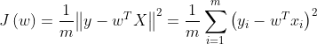
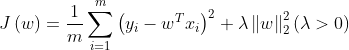
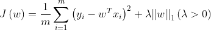
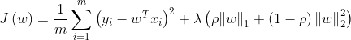

# Python 金融建模：基础与应用

MIT Licensed | Copyright © 2024-present by [Yun Liao ](mailto:james@x.cool)

## Python 进阶篇（第9-12章）

第9章：统计学习基础

第10章：统计学习中的集成算法

第11章：深度学习基础

第12章：大型语言预训练模型（LLMs）和金融知识库

---

### 第9章：统计学习

#### 9.1 统计学习导论

##### 9.1.1 什么是统计学习？

统计学习是一种机器学习的子领域，它涉及开发算法来分析和预测大数据。它涉及使用统计技术来识别大数据中的模式、关系和趋势 。事实上，统计学习就是使用数据，依赖一系列工具来做出决定或预测。在使用统计学习技术，可以：识别数据集中隐藏的模式和关系、做出准确的预测关于未来的结果，从而来优化决策过程。

在使用统计学习任务中最突出的两项就是分类与回归，以下是它们的定义：

分类

分类是机器学习中的基本问题，目标是预测对象所属的类别。它涉及在标记过的数据上训练模型，每个示例都与特定的类别标签相关。然后，可以使用训练好的模型对新的、未见过的示例进行分类。根据分类类型的数量来区分，可分为二元分类和多元分类，二元分类的目标是将实例分配到两个类别中（例如，垃圾邮件vs非垃圾邮件）。多元分类的目标是将实例分配到三个或更多类别中（例如，图像分类、识别）.

回归

统计学习回归任务涉及根据输入特征预测连续或数值结果，如评分或价格。它涉及在标记过的数据上训练模型，每个示例都与特定的目标值相关。回归类型可分为线性回归和非线性回归，目标是预测输入特征和目标变量之间的线性关系（例如，多项式回归）或非线性关系。围绕完成分类和回归任务，有以下几个相关概念：数据预处理（data preprocessing)、数据降维（dimensionality reduction）、聚类分析（clustering）、模型评估和选择（model evaluation and selection)。

1. **监督学习** ：统计学习回归和分类都属于监督学习，回归任务模型根据标记数据训练以预测连续结果, 分类任务模型通过训练有标签数据来学习输入特征和输出标签之间的关系。
2. **特征工程（feature engineering）** ：特征工程涉及选择和转换原始数据为可以被机器学习算法使用的特征。
3. **模型评估** ：回归任务模型评估涉及使用指标例如均方根误差（MSE）、均绝对误差（MAE）和R平方来衡量回归模型的性能。分类任务模型评估指标，使用准确率、精度、召回率、F1 分数和 ROC-AUC，用于评估分类模型的性能。

#### 9.2 统计学习之回归任务

##### 基本线性回归的代价函数一览

* 线性回归——最小二乘法求解回归系数

cost function:       

* L2范数正则化（Ridge Regression，岭回归 ）

cost function:       

* L1范数正则化（LASSO，Least Absoulute Shrinkage and Selection Operator，最小绝对收缩选择算子）

cost function:       

* L1正则项和L2正则项结合（elastic net）

cost function:      

##### 正则化

**什么是正则化？**

正则化是一种机器学习技术，用于防止过拟合。过拟合发生在模型太复杂，但是在新、未见的数据上表现不佳的情况下。

正则化添加一个惩罚项到损失函数中，降低过拟合。

**正则化类型**
有几种类型的正则化：

1. **L1 正则化（Lasso）** ：添加一个项到损失函数中，该项与模型权重的绝对值成比例。
2. **L2 正则化（Ridge）** ：添加一个项到损失函数中，该项与模型权重的平方成比例。
3. **Dropout** ：在神经网络模型训练期间随机地删除神经元，这具有正则化的效果。

**为什么使用正则化？**
正则化有助于：

1. 减少过拟合
2. 提高模型可解释性
3. 增加模型强壮性

以下是使用正则化的一些例子

```python
import numpy as np
import pandas as pd
from sklearn import datasets
from sklearn.linear_model import Ridge, Lasso, ElasticNet
from sklearn.metrics import mean_squared_error, r2_score
X, y = datasets.load_diabetes(return_X_y=True)
X_train, X_test, y_train, y_test = train_test_split(X, y, test_size=0.3, random_state=42)
# 创建一个 Lasso 回归对象，alpha=0.1，L1 正则化（Lasso）
lasso = Lasso(alpha=0.1)
# 将模型拟合到数据
lasso.fit(X_train, y_train)
from sklearn.linear_model import Ridge，L2 正则化（Ridge）
# 创建一个 Ridge 回归对象，alpha=0.1
ridge = Ridge(alpha=0.1)
# 将模型拟合到数据
ridge.fit(X_train, y_train)
```

##### 示例1：一个完整的使用L1和L2正则化的例子

```python
import numpy as np
import pandas as pd
from sklearn import datasets
from sklearn.model_selection import train_test_split, GridSearchCV
from sklearn.linear_model import Ridge, Lasso, ElasticNet
from sklearn.metrics import mean_squared_error, r2_score
X, y = datasets.load_diabetes(return_X_y=True)
X_train, X_test, y_train, y_test = train_test_split(X, y, test_size=0.3, random_state=42)

# 定义岭回归模型
ridge = Ridge()

# 定义LASSO回归模型
lasso = Lasso()

# 定义弹性网络模型
elastic_net = ElasticNet()

# 设置参数网格
param_grid_ridge = {'alpha': np.logspace(-4, 4, 50)}
param_grid_lasso = {'alpha': np.logspace(-4, 4, 50)}
param_grid_elastic_net = {'alpha': np.logspace(-4, 4, 50), 'l1_ratio': np.linspace(0, 1, 10)}

# 创建GridSearchCV对象
grid_ridge = GridSearchCV(ridge, param_grid_ridge, cv=5, scoring='neg_mean_squared_error')
grid_lasso = GridSearchCV(lasso, param_grid_lasso, cv=5, scoring='neg_mean_squared_error')
grid_elastic_net = GridSearchCV(elastic_net, param_grid_elastic_net, cv=5, scoring='neg_mean_squared_error')

# 训练模型
grid_ridge.fit(X_train, y_train)
grid_lasso.fit(X_train, y_train)
grid_elastic_net.fit(X_train, y_train)

# 获取最优参数
best_params_ridge = grid_ridge.best_params_
best_params_lasso = grid_lasso.best_params_
best_params_elastic_net = grid_elastic_net.best_params_

# 输出最优参数
print("Best parameters for Ridge:", best_params_ridge)
print("Best parameters for LASSO:", best_params_lasso)
print("Best parameters for Elastic Net:", best_params_elastic_net)

# 使用最佳模型进行预测
best_model_ridge = grid_ridge.best_estimator_
best_model_lasso = grid_lasso.best_estimator_
best_model_elastic_net = grid_elastic_net.best_estimator_

y_pred_ridge = best_model_ridge.predict(X_test)
y_pred_lasso = best_model_lasso.predict(X_test)
y_pred_elastic_net = best_model_elastic_net.predict(X_test)


# 评估模型
mse_ridge = mean_squared_error(y_test, y_pred_ridge)
r2_ridge = r2_score(y_test, y_pred_ridge)

mse_lasso = mean_squared_error(y_test, y_pred_lasso)
r2_lasso = r2_score(y_test, y_pred_lasso)

mse_elastic_net = mean_squared_error(y_test, y_pred_elastic_net)
r2_elastic_net = r2_score(y_test, y_pred_elastic_net)

# 输出结果
print("Ridge Regression:")
print(f"Mean Squared Error: {mse_ridge:.2f}")
print(f"R^2 Score: {r2_ridge:.2f}")

print("\nLASSO Regression:")
print(f"Mean Squared Error: {mse_lasso:.2f}")
print(f"R^2 Score: {r2_lasso:.2f}")

print("\nElastic Net Regression:")
print(f"Mean Squared Error: {mse_elastic_net:.2f}")
print(f"R^2 Score: {r2_elastic_net:.2f}")
```

pytorch库使用dropout的例子

```python
import torch
import torch.nn as nn

class Net(nn.Module):
    def __init__(self):
        super(Net, self).__init__()
        self.fc1 = nn.Linear(784, 128)
        self.dropout = nn.Dropout(p=0.2)
        self.fc2 = nn.Linear(128, 10)

    def forward(self, x):
        x = torch.relu(self.fc1(x))
        x = self.dropout(x)
        x = self.fc2(x)
        return x

model = Net()

# 定义损失函数
def loss_fn(model, inputs, targets):
    outputs = model(inputs)
    loss = nn.CrossEntropyLoss()(outputs, targets)
    return loss

# 训练模型
optimizer = torch.optim.SGD(model.parameters(), lr=0.01)
for epoch in range(10):
    optimizer.zero_grad()
    inputs, targets = ...
    loss = loss_fn(model, inputs, targets)
    loss.backward()
    optimizer.step()

```

**正则化惩罚项和权重系数的关系：**

一般来说正则化力度alpha越大，权重系数越小；正则化力度alpha越大，权重系数越小。

##### 其他回归算法

逻辑回归(Logistic Regression)

Logistic Regression 是一种用于预测分类独立变量结果的回归分析方法，基于一个或多个预测变量。它根据一组输入变量来估计事件发生的概率（例如 1/0、是/否）。 Logistic Regression 模型可以学习从输入特征到输出类别之间的关系，并生成概率预测。

Logistic Regression 模型可以用以下数学表达式表示：

$p(y=1|x) = \frac{1}{1 + e^{-(w^Tx + b)}}$

其中：

* p(y=1|x) 是事件发生的概率（例如 1/0、是/否）
* x 是输入特征向量
* w是权重向量
* b是偏置项
* e 是自然数

**Cost Function：**

Logistic Regression 模型的成本函数通常是交叉熵损失函数：

$L(w, b) = -\sum_{i=1}^{n} [y_i \log(p(y_i=1|x_i)) + (1-y_i)\log(1-p(y_i=1|x_i))]$

* **L**(**w**,**b**) 是成本函数
* w 和 b 是模型参数
* xi和 yi 是第 **i** 个样本的输入特征和输出类别
* n 是样本数量

```python
from sklearn.linear_model import LogisticRegression
import numpy as np

# 生成一些样本数据
X = np.random.rand(100, 10)
y = np.random.randint(0, 2, 100)

# 创建和训练逻辑回归模型
log_reg = LogisticRegression()
log_reg.fit(X, y)

# 对新数据进行预测
new_X = np.random.rand(10, 10)
predictions = log_reg.predict(new_X)

```

神经网络回归

神经网络回归是一种使用人工神经网络来预测连续结果的回归分析方法。它可以学习输入和输出之间的复杂关系。

* 神经网络是一个正向求解的过程，通过不断反向迭代来接近理想解的过程。
* 基本要素：输入层；隐含层；输出层；激活函数；损失函数；梯度下降算法；反向传播

##### 示例2：神经网络回归

```python
from sklearn.neural_network import MLPRegressor
import numpy as np

# 生成一些样本数据
X = np.random.rand(100, 10)
y = np.random.rand(100)

# 创建和训练神经网络回归模型
nn_reg = MLPRegressor(hidden_layer_sizes=(50,))
nn_reg.fit(X, y)

# 对新数据进行预测
new_X = np.random.rand(10, 10)
predictions = nn_reg.predict(new_X)

```

示例：神经网络回归pytorch版本

```python
import torch
import torch.nn as nn
class NeuralNetwork(nn.Module):
    def __init__(self, input_dim, hidden_dim, output_dim):
        super(NeuralNetwork, self).__init__()
        self.fc1 = nn.Linear(input_dim, hidden_dim)
        self.fc2 = nn.Linear(hidden_dim, output_dim)

    def forward(self, x):
        x = torch.relu(self.fc1(x))
        x = self.fc2(x)
        return x

model = NeuralNetwork(784, 128, 10)
criterion = nn.MSELoss()
optimizer = torch.optim.SGD(model.parameters(), lr=0.01)

for epoch in range(10):
    optimizer.zero_grad()
    inputs, targets = ...
    outputs = model(inputs)
    loss = criterion(outputs, targets)
    loss.backward()
    optimizer.step()

```

决策树回归（CART:Classification And Regression Tree)：决策树回归是一种使用决策树来预测连续结果的回归分析方法。它将输入空间划分为区域，并根据区域来预测输出。

将整个输入空间划分为多个子区域：

* 回归树采用的是自顶向下的贪婪式递归方案，即每一次的划分，只考虑当前最优，而不回头考虑之前的划分。
* 连续值切分原则——按照最小均方差切分，保证叶子节点均方差和RSS最小；
* 每个子区域输出的为该区域内所有训练样本的平均值；

**数学表达式：**
决策树回归模型可以用以下数学表达式表示：

$f(x) = \sum_{i=1}^{M} c_i \mathbb{I}(x \in R_i)$

其中：

* **f**(**x**) 是预测的连续结果
* **c**i 是第 **i** 个区域的常数值
* **R**i 是第 **i** 个区域
* $ \mathbb{I}(x \in R_i)$  是指示函数，如果 **x** 属于 **R**i 则返回 1，否则返回 0
* M 是决策树的叶节点数量

可以看出，决策树回归的精度和深度（depth)相关，然而深度越大，越容易产生过拟合。

以下是一个决策树回归（不同深度）的示例

```python
# Import the necessary modules and libraries
import numpy as np
from sklearn.tree import DecisionTreeRegressor
import matplotlib.pyplot as plt
 
# Create a random dataset
rng = np.random.RandomState(1)
X = np.sort(5 * rng.rand(80, 1), axis=0)
y = np.sin(X).ravel()
y[::5] += 3 * (0.5 - rng.rand(16))
 
# Fit regression model
regr_1 = DecisionTreeRegressor(max_depth=5)
regr_2 = DecisionTreeRegressor(max_depth=50)
regr_1.fit(X, y)
regr_2.fit(X, y)
 
# Predict
X_test = np.arange(0.0, 5.0, 0.01)[:, np.newaxis]
y_1 = regr_1.predict(X_test)
y_2 = regr_2.predict(X_test)
 
# Plot the results
plt.figure()
plt.scatter(X, y, s=20, edgecolor="black", c="darkorange", label="data")
plt.plot(X_test, y_1, color="cornflowerblue", label="max_depth=5", linewidth=2)
plt.plot(X_test, y_2, color="yellowgreen", label="max_depth=50", linewidth=2)
plt.xlabel("data")
plt.ylabel("target")
plt.title("Decision Tree Regression")
plt.legend()
plt.show()
```

##### 回归任务评价标准

以下是四种常见的损失函数的数学表达式：

1. 均方误差（Mean Square Error）
   $ MSE=\frac{1}{n}\sum_{i=1}^{n}(\widehat{y_{i}}-y_{i})^{2} $
2. 均方根误差（Root Mean Square Error）
   $RMSE=\sqrt{\frac{1}{n}\sum_{i=1}^{n}(\widehat{y_{i}}-y_{i})^{2}}$
3. 平均绝对误差（Mean Absolute Error）
   $MAE={\frac{1}{n}\sum_{i=1}^{n}\left| \widehat{y_{i}}-y_{i}\right |}$
4. 平均绝对百分比误差（Mean Absolute Percentage Error）
   $MAPE={\frac{100}{n}\sum_{i=1}^{n}\left|\frac{\widehat{y_{i}}-y_{i}}{y_{i}}\right |}$

使用scikit-learn库函数计算四个指标

```python
#回归评价指标
from sklearn import metrics
MSE = metrics.mean_squared_error(y_test, y_pred)
RMSE = metrics.mean_squared_error(y_test, y_pred) ** 0.5
MAE = metrics.mean_absolute_error(y_test, y_pred)
MAPE = metrics.mean_absolute_percentage_error(y_test, y_pred)
```

#### 9.3 统计学习之分类任务

分类是一种基本的机器学习任务，我们训练一个模型，以预测输入特征的一组标签或类别，可应用于很多领域中，如图像识别、自然语言处理和推荐系统等。

##### 分类任务算法概述

1、KNN（K-Nearest Neighbors）

算法思想：找最近的K个邻居（最好奇数），K个邻居哪种类别多就判定为哪种类别，属于判别模型：不通过联合概率分布，直接可以获得输出对应最大分类的概率

2、朴素贝叶斯——朴素：特征间相互独立

连续值需要离散化，适合离散属性特征，条件概率+1（防止分子为0）；属于生成模型：通过求输入与输出的联合概率分布，再求解类别归类的概率；两种分布：伯努利朴素贝叶斯——0-1分布；高斯朴素贝叶斯——高斯分布

3、决策树——切分标准以信息增益大的准则先进行决策
划分标准：信息增益（ID3）；信息增益率（C4.5）；Gini系数（CART）过拟合采用剪枝策略：前剪枝在构造决策树以前规定好每个叶子节点有多少个样本或者规定决策树的最大深度，后剪枝先构造出决策树，根据经验对样本值比较悬殊的节点进行修剪。

4、支持向量机（Support Vector Machine）

算法思想：寻找一个可以最大限度地将两个样本的标注进行区分的超平面，为防止维度爆炸，先在低维空间计算，再进行扩维：
核函数：支持向量机算法的参数，包括：线性核函数；多项式核函数——参数d确定扩充维度；高斯径向基RBF核函数——扩充到无限维，但可能过拟合.

##### 示例3：分类任务

让我们考虑一个简单的示例，即根据iris 花的萼长、宽、花瓣长和宽来进行分类，使用 UC Irvine 机器学习库中的著名 Iris 数据集。

```python
# 导入必要的库
from sklearn.datasets import load_iris
from sklearn.model_selection import train_test_split
from sklearn.naive_bayes import GaussianNB

# 加载 iris 数据集
iris = load_iris()

# 将数据分割成训练和测试集（70%用于训练，30%用于测试）
X_train, X_test, y_train, y_test = train_test_split(iris.data[:, :2], iris.target, test_size=0.3, random_state=42)

# 使用训练数据训练一个高斯朴素贝叶斯分类器
gnb = GaussianNB()
gnb.fit(X_train, y_train)

# 在测试数据上评估模型的性能
y_pred = gnb.predict(X_test)
print("准确率：", gnb.score(X_test, y_test))
```

这个示例中，我们加载 iris 数据集，分割成训练和测试集，然后使用训练集训练一个高斯朴素贝叶斯分类器，并在测试集上评估模型的性能。

##### 分类任务评价标准

准确率（Accuracy）


精确率 **（Precision）** ：在所有预测为正类的样本中，预测正确的比例，也称为**查准率**


召回率 **（Recall）** ：在所有实际为正类的样本中，预测正确的比例，也称为**查全率**


F1分数 **（F1 Score）** ：查准率和查全率的调和平均值


```python
#分类任务评价指标：精确度；召回率；F1分数
from sklearn.metrics import accuracy_score, recall_score, f1_score
```

##### **混淆矩阵（confusion martrix）**

混淆矩阵是一个用于评估机器学习模型或分类器性能的表格。它提供了预测值与实际真实标签之间的摘要。

**混淆矩阵布局：**

|                      | 预测类别 0    | 预测类别 1    |
| -------------------- | ------------- | ------------- |
| **实际类别 0** | 真负样本 (TN) | 假正样本 (FP) |
| **实际类别 1** | 假负样本 (FN) | 真正样本 (TP) |

**混淆矩阵元素：**

* **真负样本 (TN)** ：实际是类别 0 并预测为类别 0 的样本数量。
* **假正样本 (FP)** ：实际是类别 0 但预测为类别 1 的样本数量。
* **假负样本 (FN)** ：实际是类别 1 但预测为类别 0 的样本数量。
* **真正样本 (TP)** ：实际是类别 1 并预测为类别 1 的样本数量。

**混淆矩阵衍生指标：**

* **准确率** ：(TP + TN) / (TP + TN + FP + FN)
* **精度** ：TP / (TP + FP)
* **召回率** ：TP / (TP + FN)
* **F1 分数** ：2 * (Precision * Recall) / (Precision + Recall)
* **ROC-AUC : AUC占的面积**

ROC-AUC是一个评价模型性能的指标，它是指在不同阈值下，真正率（True Positive Rate）与假正率（False Positive Rate）之间的曲线，即接收者操作特性曲线（Receiver Operating Characteristic Curve）的面积。ROC 曲线是一个二维图形，它将模型在不同阈值下的真正率（True Positive Rate）与假正率（False Positive Rate）进行比较。曲线的 x 轴表示假正率，y 轴表示真正率，它可以用来评价模型的性能。AUC 的值介于 0 和 1 之间，越接近 1 表示模型的性能越好。

#### 9.4 特征工程（Feature Engineering)

在统计学习任务中数据和特征决定了机器学习的上限，而模型和算法只是逼近这个上限而已。特征工程就是尽可能的根据任务的目的提高数据的质量。
特征工程的一般步骤：

1. 数据样本采集（抽样）
2. 异常值处理
3. 特征选择
4. 特征变换
5. 特征降维
6. 特征衍生（增维）

##### 9.4.1 数据样本采样

机器学习的样本要具备代表性。在分类任务中样本比例要平衡，即在二分类的情况下，正例和负例的样本数量不能相差过大，否则将影响学习的精度和准确度。为了处理样本不平衡的问题，一般采取以下方法：

**1.少数类别oversampling**

* **随机Oversampling** ：从少数类别中随机复制样本，直到达到所需大小。
* **SMOTE（Synthetic Minority Over-sampling Technique）** ：通过插值少数类别现有样本来生成新样本。
* 示例：

```python
from imblearn.oversampling import RandomOverSampler
ros = RandomOverSampler(sampling_strategy='minority')
X_res, y_res = ros.fit_resample(X, y)
```

**2.多数类别undersampling**

* **随机Undersampling** ：从多数类别中随机删除样本，直到达到所需大小。
* **Tomek Links** ：根据多数类别样本与少数类别样本的相似度选择性地删除样本。

  ```python
  from imblearn.undersampling import RandomUnderSampler
  rus = RandomUnderSampler(sampling_strategy='majority')
  X_res, y_res = rus.fit_resample(X, y)
  ```

**3.类别权重**

根据类别的频率或重要性分配权重。

```python
from sklearn.utils.class_weight import compute_class_weight
class_weights = compute_class_weight('balanced', np.unique(y), y)
```

**4.集成方法（Bagging)**

将多个模型在不同数据子集上的预测结果组合。

```python
from sklearn.ensemble import BaggingClassifier
bagging = BaggingClassifier(base_estimator=LogisticRegression(), n_estimators=10)
```

##### 9.4.2 异常值处理

以下为异常值处理的一些示例：

###### 识别异常值和重复值

```python
df=pd.DataFrame({"A":["a0","a1","a1","a2","a3","a4"],
                 "B":["b0","b1","b2","b2","b3",None],
                 "C":[1,2,None,3,4,5],
                 "D":[0.1,10.2,11.4,8.9,9.1,12],
                 "E":[10,19,32,25,8,None],
                 "F":["f0","f1","g2","f3","f4","f5"]})
##识别None值
df.isnull()
 
##识别特征间的重复值
df.duplicated(["A"])  
df.duplicated(["A","B"])
```

###### 直接丢弃（包括重复数据）

```python
##直接删除包含nan值的整行
df.dropna()
 
##删除特征“B”中nan的那行
df.dropna(subset=["B"])
 
##删除重复值所在行
df.drop_duplicates(["A"])  #默认删除第一个
 
df.drop_duplicates(["A"],keep=False)  
#keep:{"first","last","False"}  （删除第一个；删除最后一个；删除全部重复值）
 
df.drop_duplicates(["A"],keep=False,inplace=True)  
#inplace=True原始数据会改变，默认为False
```

###### 填充（除异常值外的均值、众数等等），插值

```python
##填充某个值
df.fillna("b*")
df.fillna(df["E"].mean())  #使用特征“E”的均值
df["E"].interpolate()   #插值只能用在series 
df["E"].interpolate(method="spline",order=3) #三次样条插值 
pd.Series([1,None,4,5,20]).interpolate()
```

##### 9.4.3 特征选择——剔除与标注不相关或者冗余的特征

以下是一些常用的特征选择方法

* 过滤（设置过滤的阈值）： 过滤思想就是直接评价某个特征与标注的相关性等特征，如果与标注的相关性非常小，就去掉。
* 递归特征消除法算法—RFE—resave feature elimination）：包裹思想的含义，是我们假设所有的特征是个集合X，最佳的特征组合是它的一个子集。我们的任务就是要找到这个子集。递归特征消除（RFE）的主要思想是反复的构建模型（如SVR回归模型）然后选出最好的的特征（可以根据系数来选），把选出来的特征选择出来，然后在剩余的特征上重复这个过程，直到所有特征都遍历了。这个过程中特征被消除的次序就是特征的排序。因此，这是一种寻找最优特征子集的贪心算法。
* 正则化——系数反应特征重要程度：对标注建立回归模型，得到特征与标注的权重系数；对这些系数进行正则化，反应特征的分量和重要程度。

##### 示例4：特征选择

```python
from sklearn.svm import SVR 
from sklearn.tree import DecisionTreeRegressor
from sklearn.feature_selection import SelectKBest,RFE,SelectFromModel
 
X=df1.loc[:,["A","B","C"]]
Y=df1.loc[:,"D"]

skb=SelectKBest(k=2)  #保留k个特征值
 
#方法一：fit()+transform()
skb.fit(X,Y)
 
##调用属性scores_，返回得分
skb.scores_
##调用属性pvalues_ ，返回P值
skb.pvalues_   
##返回特征过滤后保留下的特征列索引
skb.get_support(indices=True) 
print(skb.scores_,skb.pvalues_,skb.get_support(indices=True))
 
##转换数据，得到特征过滤后保留下的特征数据集
skb.transform(X)  
 
#方法二：fit_transform()
##拟合数据加转化数据一步到位：
x_new=skb.fit_transform(x,y)
x_new
#方法三：RFE
rfe=RFE(estimator=SVR(kernel="linear"),n_features_to_select=2,step=1)
rfe.fit_transform(X,Y)
#方法四：正则化
sfm=SelectFromModel(estimator=DecisionTreeRegressor(),threshold=0.1)
sfm.fit_transform(X,Y)
```

##### 9.4.4 特征变换

如果考虑到类型变量（categorical variable)转换为连续或离散变量，基础的特征变换包括以下几种：

1. 分箱离散化
2. 归一化或标准化
3. 数值标签化：赋予距离比较的含义0，1，2
4. 独热编码（one hot)
5. 正规化（规范化）——可以反应特征对于标注的影响程度占比

##### 示例5：特征变换的基本实例

```python
#等频分箱
lst=[6,8,10,15,16,24,25,40,67]
pd.qcut(lst,q=3)
pd.qcut(lst,q=3,labels=["low","medium","high"])
 
#等距分箱
pd.cut(lst,bins=3)
pd.cut(lst,bins=3,labels=["low","medium","high"])
from sklearn.preprocessing import MinMaxScaler,StandardScaler

#归一化: 放缩到区间[0，1]
MinMaxScaler().fit_transform(np.array([1,4,10,15,21]).reshape(-1,1))
#标准化: 数据转换为标准正态分布，均值为0，方差为1
X=np.array([1,0,0,0,0,0,0,0]).reshape(-1,1)
 
stand=StandardScaler().fit(X)
stand.transform(X)
 
StandardScaler().fit_transform(X)


from sklearn.preprocessing import LabelEncoder,OneHotEncoder
#数值标签化
LabelEncoder().fit_transform(np.array(["Down","Up","Up","Down"]).reshape(-1,1))
 
LabelEncoder().fit_transform(np.array(["Low","Medium","High","Medium","Low"]).reshape(-1,1))
 
#独热编码
lb_encoder=LabelEncoder()
lb_train_f=lb_encoder.fit_transform(np.array(["Red","Yello","Green","Blue","Green"]))
print(lb_train_f)  #按照首字母顺序排序，先转化成标签
oht_encoder=OneHotEncoder().fit(lb_train_f.reshape(-1,1))
oht_encoder.transform(lb_train_f.reshape(-1,1))
oht_encoder.transform(lb_train_f.reshape(-1,1)).toarray()

from sklearn.preprocessing import Normalizer
#正规化（规范化）
Normalizer(norm="l1").fit_transform(np.array([[1,1,3,-1,2]]))  #正规化是行运算
Normalizer(norm="l2").fit_transform(np.array([[1,1,3,-1,2]]))

```

##### 9.4.5 特征降维

* #### PCA方法（无监督降维方法，无需用到标注）

1. 求特征协方差矩阵
2. 求协方差矩阵的特征值和特征向量
3. 将特征值按照从大到小的顺序排序，选择其中最大的k个
4. 将样本点投影到选取的特征向量上

* #### LDA（线性判别式分析Linear Discriminant Analysis）
* LDA示例：

```python
#1、特征降维LDA
from sklearn.discriminant_analysis import LinearDiscriminantAnalysis
X=np.array([[-1,-1],[-2,-1],[-3,-2],[1,1],[2,1],[3,2]])
Y=np.array([1,1,1,2,2,2])
LinearDiscriminantAnalysis(n_components=1).fit_transform(X,Y)   #降到一维
 
#2、作为一个分类器使用：fisher classifier
clf=LinearDiscriminantAnalysis(n_components=1).fit(X,Y) 
clf.predict([[0.8,1]])
```

##### 9.4.6 特征衍生（增维数）

数据分析时，为了研究非线性关系，可以使用特征衍生技术。

* 四则运算和幂运算（加减乘除，平方，N次方）
* 求导或者高阶导数
* 人工归纳（从经验出发拓展特征维度）

#### 9.5 决策树和随机森林

##### 9.5.1 决策树和随机森林的介绍：概念、算法和应用

**决策树**

决策树是一种图形化的决策过程表示。它是一个树状模型，将数据分割成子集基于特征及其值。

**概念：**

* **根节点** ：树中最顶部的节点，表示整个数据集。
* **决策节点** ：中间节点根据特征值将数据分割成子集。
* **叶节点** ：树底部的节点，表示预测类别或值。
* **特征** ：用于进行决策的属性或变量。
* **拆分** ：根据特征值将数据分割成子集的过程。

**算法：**

1. 以根节点开始，表示整个数据集。
2. 选择一个特征，并根据其值将数据分割成子集。
3. 递迴地应用步骤1-2，直到满足停止准则（例如所有实例属于一个类别）。
4. 将预测类别或值分配给每个叶节点。

**随机森林**
随机森林是一种集成学习方法，它将多棵决策树组合起来，以提高预测的准确性和强壮性。

**概念：**

* **自举样本** ：从训练数据集中随机选择样本，以创建单个树的训练集。
* **特征随机性** ：在每个节点选择随机子集的特征，以拆分数据。
* **投票** ：将多棵树的预测结果组合起来，产生最终输出。

**算法：**

1. 从训练数据集中创建自举样本。
2. 使用特征随机性在自举样本上训练单个决策树。
3. 重复步骤1-2，直到生成多棵树（通常是数百或数千）。
4. 使用投票将每棵树的预测结果组合起来。

**应用：**

* **分类** ：预测类别标签或概率。
* **回归** ：预测连续值或结果。
* **特征选择** ：识别对预测贡献最大的特征。
* **缺失值处理** ：使用决策树或随机森林来插补缺失值。

**优势：**

* **可解释模型** ：决策树和随机森林提供了透明且可解释的模型。
* **处理非线性关系** ：它们可以捕捉特征之间的非线性关系。
* **对异常值（outlier）鲁棒** ：随机森林对outlier和噪声数据具有鲁棒性。

**挑战：**

* **过拟合** ：决策树可能遭受过拟合，特别是在复杂数据集上。
* **计算复杂度** ：在随机森林中训练多棵树可能会产生计算复杂度的挑战。

##### 9.5.2 决策树和随机森林的超参数调整

使用统计学习方法中经常需要进行参数搜索，以下就几种最常用的超参数调整给出实例：

##### 示例6：网格搜索与交叉验证

```python
from sklearn.model_selection import GridSearchCV
from sklearn.ensemble import RandomForestClassifier
from sklearn.datasets import load_iris
from sklearn.model_selection import train_test_split

# 加载鸢尾花数据集
iris = load_iris()
X, y = iris.data, iris.target
X_train, X_test, y_train, y_test = train_test_split(X, y, test_size=0.2, random_state=42)

# 定义超参数网格
param_grid = {
    'n_estimators': [10, 50, 100],
    'max_depth': [None, 5, 10],
    'min_samples_split': [2, 5, 10]
}

# 初始化随机森林分类器
rfc = RandomForestClassifier(random_state=42)

# 执行网格搜索与交叉验证
grid_search = GridSearchCV(rfc, param_grid, cv=5, scoring='accuracy')
grid_search.fit(X_train, y_train)
print("最佳参数:", grid_search.best_params_)
print("最佳评分:", grid_search.best_score_)

```

##### 示例7：随机搜索与交叉验证

```python
from sklearn.model_selection import RandomizedSearchCV
from sklearn.ensemble import RandomForestClassifier
from sklearn.datasets import load_iris
from sklearn.model_selection import train_test_split

# 加载鸢尾花数据集
iris = load_iris()
X, y = iris.data, iris.target
X_train, X_test, y_train, y_test = train_test_split(X, y, test_size=0.2, random_state=42)

# 定义超参数分布
param_dist = {
    'n_estimators': [10, 50, 100],
    'max_depth': [None, 5, 10],
    'min_samples_split': [2, 5, 10]
}

# 初始化随机森林分类器
rfc = RandomForestClassifier(random_state=42)

# 执行随机搜索与交叉验证
random_search = RandomizedSearchCV(rfc, param_dist, cv=5, scoring='accuracy', n_iter=10)
random_search.fit(X_train, y_train)
print("最佳参数:", random_search.best_params_)
print("最佳评分:", random_search.best_score_)

```

##### 示例8：贝叶斯优化与Hyperopt

```python
from sklearn.ensemble import RandomForestClassifier
from sklearn.datasets import load_iris
from sklearn.model_selection import train_test_split
import hyperopt

# 加载鸢尾花数据集
iris = load_iris()
X, y = iris.data, iris.target
X_train, X_test, y_train, y_test = train_test_split(X, y, test_size=0.2, random_state=42)

# 定义搜索空间
space = {
    'n_estimators': hyperopt.hp.quniform('n_estimators', 10, 100, 10),
    'max_depth': hyperopt.hp.quniform('max_depth', 5, 15, 5)
}

# 定义目标函数
def objective(params):
    rfc = RandomForestClassifier(**params)
    score = rfc.fit(X_train, y_train).score(X_test, y_test)
    return -score  # note the minus sign for minimization

# 执行贝叶斯优化
best = hyperopt.fmin(objective, space, algo=hyperopt.rand.suggest, max_evals=50)

print("最佳参数:", best)

```

##### 9.5.3 使用多种机器学习方法的示例

```python
import warnings
warnings.filterwarnings("ignore")
import pandas as pd
from sklearn.model_selection import train_test_split  
###生成12000行的数据，训练集和测试集按照3:1划分
from sklearn.datasets import make_hastie_10_2
data, target = make_hastie_10_2()
X_train, X_test, y_train, y_test = train_test_split(data, target, random_state=123)
X_train.shape, X_test.shape

###以下对6种模型用默认参数做分类任务
from sklearn.linear_model import LogisticRegression
from sklearn.ensemble import RandomForestClassifier
from sklearn.ensemble import AdaBoostClassifier
from sklearn.ensemble import GradientBoostingClassifier
from xgboost import XGBClassifier
from lightgbm import LGBMClassifier
from sklearn.model_selection import cross_val_score
import time

clf1 = LogisticRegression()
clf2 = RandomForestClassifier()
clf3 = AdaBoostClassifier()
clf4 = GradientBoostingClassifier()
clf5 = XGBClassifier()
clf6 = LGBMClassifier()

for clf, label in zip([clf1, clf2, clf3, clf4, clf5, clf6], [
        'Logistic Regression', 'Random Forest', 'AdaBoost', 'GBDT', 'XGBoost',
        'LightGBM'
]):
    start = time.time()
    scores = cross_val_score(clf, X_train, y_train, scoring='accuracy', cv=5)
    end = time.time()
    running_time = end - start
    print("Accuracy: %0.8f (+/- %0.2f),耗时%0.2f秒。模型名称[%s]" %
          (scores.mean(), scores.std(), running_time, label))


```

#### 9.6 练习

##### 选择题

1、一家公司想要根据房子的属性，如卧室数量、平方英尺和位置，预测房子的价格。哪种机器学习算法最适合这个问题？

A) 线性回归
B) 决策树
C) 随机森林
D) 支持向量机

2、在机器学习模型中，正则化的目的是什么？
A) 增加模型的复杂性
B) 通过添加惩罚项到损失函数来减少过拟合
C) 加速训练过程
D) 提高模型的可解释性

3、一个数据集包含关于客户的信息，包括年龄、收入和购买历史。哪种机器学习算法最适合预测哪些客户可能会流失？

A) 监督学习
B) 无监督学习
C) 强化学习
D) 迁移学习

4、在假设检验中，Type I错误和Type II错误有什么区别？

A) Type I错误是拒绝真实零假设的概率，而Type II错误是无法拒绝虚假零假设的概率
B) Type I错误是无法拒绝真实零假设的概率，而Type II错误是拒绝虚假零假设的概率
C) Type I错误是接受真实备择假设的概率，而Type II错误是接受虚假备择假设的概率
D) Type I错误是接受虚假零假设的概率，而Type II错误是接受真实备择假设的概率

5、一个数据集包含关于学生的信息，包括成绩、测试分数和人口统计学特征。哪种机器学习算法最适合识别相似学生的群体？

A) K-均值聚类
B) 层次聚类
C) 决策树
D) 支持向量机

6、在机器学习模型中，特征缩放的目的是什么？

A) 提高模型的准确性
B) 降减数据集的维数
C) 防止具有大范围的特征主导模型
D) 增加模型的复杂性

7、一家公司想要根据客户的信用分数、收入和其他属性，预测客户违约的概率。哪种机器学习算法最适合这个问题？

A) 逻辑回归
B) 决策树
C) 随机森林
D) 支持向量机

8、在机器学习模型中，偏差-方差权衡和过拟合-不足拟合权衡有什么区别？

A) 偏差-方差权衡是指模型拟合训练数据的能力和泛化到新数据的能力之间的权衡，而过拟合-不足拟合权衡是指模型复杂性和拟合训练数据的能力之间的权衡
B) 偏差-方差权衡是指模型复杂性和拟合训练数据的能力之间的权衡，而过拟合-不足拟合权衡是指模型拟合训练数据的能力和泛化到新数据的能力之间的权衡
C) 偏差-方差权衡是指模型拟合训练数据的能力和泛化到新数据的能力之间的权衡，而过拟合-不足拟合权衡是指模型复杂性和泛化到新数据的能力之间的权衡
D) 偏差-方差权衡是指模型复杂性和泛化到新数据的能力之间的权衡，而过拟合-不足拟合权衡是指模型拟合训练数据的能力和泛化到新数据的能力之间的权衡

9、在机器学习模型中，交叉验证的目的是什么？
A) 评估模型在未见数据上的性能
B) 提高模型的准确性
C) 降减过拟合通过添加惩罚项到损失函数
D) 增加模型的复杂性

##### 实践题

**根据讲义中使用多种机器学习方法的示例，对一个分类或回归任务（二选一）进行多种统计学习方法的比较**

:::

MIT Licensed | Copyright © 2024-present by [Yun Liao ](mailto:james@x.cool)
:::
